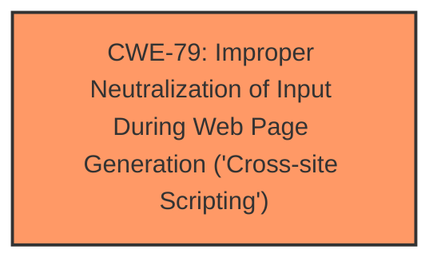

# Raw Analyzer Response for CVE-2024-4632

# Summary
| CWE ID | CWE Name | Confidence | CWE Abstraction Level | CWE Vulnerability Mapping Label | CWE-Vulnerability Mapping Notes |
|---|---|---|---|---|---|
| CWE-79 | Improper Neutralization of Input During Web Page Generation ('Cross-site Scripting') | 1.0 | Base | Allowed | Primary CWE |

## Evidence and Confidence

*   **Confidence Score:** 1.0
*   **Evidence Strength:** HIGH

## Relationship Analysis
The primary relationship that influenced my decision was the direct match of the vulnerability description to the CWE-79 description. While other CWEs were considered, CWE-79 directly addresses the **insufficient input sanitization and output escaping** that leads to Cross-Site Scripting (XSS). The abstraction level of Base is also appropriate as it directly describes the weakness.

## Vulnerability Chain
The vulnerability chain starts with **insufficient input sanitization and output escaping** (CWE-79), which allows an attacker to inject arbitrary web scripts into pages. When a user accesses an injected page, the script executes, leading to potential malicious actions.
  - Root Cause: CWE-79
  - Impact: Execution of arbitrary web scripts

## Summary of Analysis
The vulnerability description clearly states that the root cause is **insufficient input sanitization and output escaping**, leading to a Cross-Site Scripting (XSS) vulnerability. The CVE Reference Links Content Summary supports this by explicitly stating "The vulnerability stems from insufficient input sanitization and output escaping" and "The plugin does not properly sanitize user-supplied input when handling allowed mime types" and "The plugin does not properly escape output when generating web pages."

CWE-79's description, "The product does not neutralize or incorrectly neutralizes user-controllable input before it is placed in output that is used as a web page that is served to other users," directly matches the vulnerability. The impact, as stated in the description, is the ability for authenticated attackers to inject arbitrary web scripts, which aligns with the typical impact of XSS vulnerabilities.

I considered other CWEs from the Retriever Results, such as CWE-352 (Cross-Site Request Forgery (CSRF)), CWE-116 (Improper Encoding or Escaping of Output), and CWE-434 (Unrestricted Upload of File with Dangerous Type). However, these did not directly address the root cause of **insufficient input sanitization and output escaping** leading to XSS. CWE-79 is at the optimal level of specificity, as it directly describes the weakness.

Relevant CWE Information:

# Enhanced Context (25 CWEs)
The following CWEs were identified as potentially relevant to this vulnerability:

## CWE-79: Improper Neutralization of Input During Web Page Generation ('Cross-site Scripting')
**Abstraction Level**: Base
**Similarity Score**: 1581.12
**Source**: sparse

**Description**:
The product does not neutralize or incorrectly neutralizes user-controllable input before it is placed in output that is used as a web page that is served to other users.

**Mapping Guidance**:
- Usage: Allowed
- Rationale: This CWE entry is at the Base level of abstraction, which is a preferred level of abstraction for mapping to the root causes of vulnerabilities.