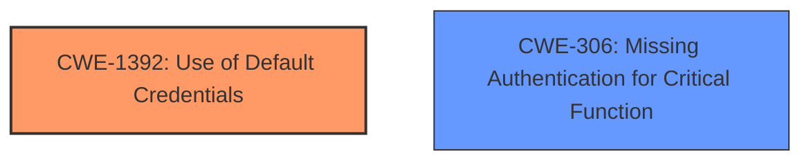

# Analysis Report for CVE-2024-46433

# Vulnerability Analysis Report: CVE-2024-46433

## Description

A **default credentials** vulnerability in Tenda W18E V16.01.0.8(1625) allows unauthenticated remote attackers to access the web management portal using the default rzadmin account with administrative privileges.

## Vulnerability Description Key Phrases

- **Rootcause:** default credentials
- **Impact:** access the web management portal
- **Attacker:** unauthenticated remote attackers
- **Product:** Tenda W18E
- **Version:** V16.01.0.8(1625)

## Analysis (with Relationship Data)

# Summary
| CWE ID | CWE Name | Confidence | CWE Abstraction Level | CWE Vulnerability Mapping Label | CWE-Vulnerability Mapping Notes |
|---|---|---|---|---|---|
| CWE-1392 | Use of Default Credentials | 1.0 | Base | Allowed | Primary CWE |
| CWE-306 | Missing Authentication for Critical Function | 0.8 | Base | Allowed | Secondary Candidate |

## Evidence and Confidence

*   **Confidence Score:** 0.9
*   **Evidence Strength:** HIGH

## Relationship Analysis
The primary relationship influencing the CWE selection is that CWE-1392 "Use of Default Credentials" directly addresses the **rootcause** described in the vulnerability, while CWE-306 "Missing Authentication for Critical Function" represents a potential secondary weakness. CWE-1392 is a Base level CWE which is a preferred level.



## Vulnerability Chain
The vulnerability chain starts with the **use of default credentials** (CWE-1392), which allows unauthenticated remote attackers to access the web management portal with administrative privileges. This could lead to further exploitation and compromise of the system. If authentication was in place, the **default credentials** would not be a vulnerability, thus, CWE-306 "Missing Authentication for Critical Function" is a secondary weakness.

## Summary of Analysis
The initial analysis identified CWE-1392 as the primary weakness due to the **use of default credentials**. The vulnerability description explicitly states this **rootcause**. The retriever results also list CWE-1392 as a strong candidate. The presence of **default credentials** allows unauthenticated remote attackers to gain access. The analysis considered the relationships between CWEs, particularly how CWE-1392 and CWE-306 might be related, with **default credentials** being the more direct and specific cause. The final decision favors CWE-1392 because it directly addresses the vulnerability's **rootcause** as stated in the description.

Relevant CWE Information:

# Enhanced Context (25 CWEs)
The following CWEs were identified as potentially relevant to this vulnerability:

## CWE-1392: Use of Default Credentials
**Abstraction Level**: Base
**Similarity Score**: 0.79
**Source**: dense

**Description**:
The product uses default credentials (such as passwords or cryptographic keys) for potentially critical functionality.

**Mapping Guidance**:
- Usage: Allowed
- Rationale: This CWE entry is at the Base level of abstraction, which is a preferred level of abstraction for mapping to the root causes of vulnerabilities.

## CWE-306: Missing Authentication for Critical Function
**Abstraction Level**: base
**Similarity Score**: 2.40
**Source**: graph

**Description**:
CWE-306: Missing Authentication for Critical Function

**Mapping Guidance**:
- Usage: Allowed
- Rationale: This CWE entry is at the Base level of abstraction, which is a preferred level of abstraction for mapping to the root causes of vulnerabilities.

**Relationships**:
- PARENTOF -> CWE-322
- PARENTOF -> CWE-288
- CHILDOF -> CWE-287
- CHILDOF -> CWE-287
- CHILDOF -> CWE-306

# Complete CWE Specifications

CWE-1392: Use of Default Credentials
The product uses default credentials (such as passwords or cryptographic keys) for potentially critical functionality.

CWE-306: Missing Authentication for Critical Function
The product does not require authentication for a function that requires it.

---

**CWE-1392: Use of Default Credentials**
*   **Technical Explanation:** The Tenda W18E router is configured with a default username and password combination that is widely known or easily guessed. An attacker can use these **default credentials** to bypass authentication and gain unauthorized access to the system.
*   **Security Implications:** This vulnerability allows unauthenticated attackers to access the web management portal with administrative privileges, potentially leading to full system compromise, data theft, or denial of service.
*   **Relationship Analysis:** This is a Base level CWE which is a preferred level of abstraction.
*   **Mapping Guidance Influence:** The MITRE mapping guidance allows the usage of this CWE. The description of the vulnerability matches the description of the CWE.
*   **Evidence:** The vulnerability description explicitly mentions a "**default credentials** vulnerability" affecting the Tenda W18E router.
*   **Confidence:** 1.0

**CWE-306: Missing Authentication for Critical Function**
*   **Technical Explanation:** The Tenda W18E router's web management portal **lacks proper authentication mechanisms**, allowing unauthorized access to critical functions. Attackers can directly access the portal without providing any credentials if they are on the same network. The presence of **default credentials** makes this attack even easier.
*   **Security Implications:** This vulnerability allows unauthenticated attackers to access critical functions of the router, potentially leading to configuration changes, firmware updates, or other malicious activities.
*   **Relationship Analysis:** This is a Base level CWE, but might be more accurately reflect the lack of access control that exacerbates the impact of **default credentials**.
*   **Mapping Guidance Influence:** The MITRE mapping guidance allows the usage of this CWE.
*   **Evidence:** While the primary issue is **default credentials**, the fact that these credentials grant immediate access suggests a **missing authentication** layer to protect the web management portal.
*   **Confidence:** 0.8

**CWEs Considered But Not Used:**
*   CWE-798 (Use of Hard-coded Credentials): While similar to **default credentials**, the vulnerability specifically mentions **default** rather than hard-coded credentials.
*   CWE-259 (Use of Hard-coded Password): Same reasoning as CWE-798.
*   CWE-1393 (Use of Default Password): Similar to CWE-1392, but CWE-1392 is broader and encompasses both username and password.
*   CWE-425 (Direct Request ('Forced Browsing')): This could be a consequence, but the **rootcause** is the **default credentials**.
*   CWE-1188 (Initialization of a Resource with an Insecure Default): This could be a contributing factor, but the core issue is the **use** of those **default credentials**.


## CWE Relationship Analysis

Current CWEs represent these abstraction levels: .


### Vulnerability Chain Analysis

**Chain starting from CWE-288:**
- 288 (Authentication Bypass Using an Alternate Path or Channel) - ROOT


**Chain starting from CWE-306:**
- 306 (Missing Authentication for Critical Function) - ROOT


### CWE Relationship Diagram

```mermaid
graph TD
    classDef primary fill:#f96,stroke:#333,stroke-width:2px
    classDef secondary fill:#69f,stroke:#333
    classDef tertiary fill:#9e9,stroke:#333
```


*Report generated on 2025-07-13 17:27:25*
