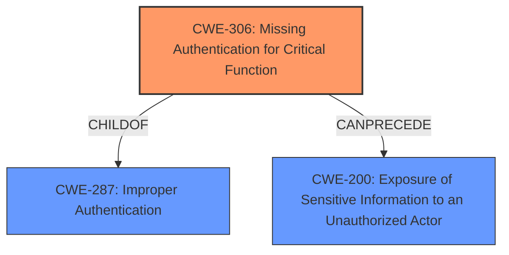

# Enhanced Analysis for CVE-2024-46437

# Summary

| CWE ID | CWE Name | Confidence | CWE Abstraction Level | CWE Vulnerability Mapping Label | CWE-Vulnerability Mapping Notes |
|---|---|---|---|---|---|
| CWE-306 | Missing Authentication for Critical Function | 0.9 | Base | Primary | Allowed |
| CWE-200 | Exposure of Sensitive Information to an Unauthorized Actor | 0.7 | Class | Secondary | Discouraged |

## Evidence and Confidence

*   **Confidence Score:** 0.8
*   **Evidence Strength:** HIGH

## Relationship Analysis
The primary relationship is that CWE-306 [CWE-306: Missing Authentication for Critical Function] can lead to CWE-200 [CWE-200: Exposure of Sensitive Information to an Unauthorized Actor]. CWE-306 [CWE-306: Missing Authentication for Critical Function] is a child of CWE-287 [CWE-287: Improper Authentication], while CWE-200 [CWE-200: Exposure of Sensitive Information to an Unauthorized Actor] is a class-level CWE. The choice of CWE-306 [CWE-306: Missing Authentication for Critical Function] is preferred as it is more specific and at the Base level of abstraction, directly reflecting the **missing authentication** issue.



## Vulnerability Chain
The vulnerability chain starts with **missing authentication** for a critical function (CWE-306 [CWE-306: Missing Authentication for Critical Function]). This leads directly to the **exposure of sensitive information** (CWE-200 [CWE-200: Exposure of Sensitive Information to an Unauthorized Actor]) to an unauthenticated attacker. The root cause is clearly the lack of authentication.

## Summary of Analysis
The primary assessment is based on the vulnerability description indicating that an unauthenticated remote attacker can retrieve sensitive configuration information by sending a specially crafted HTTP POST request to the `getQuickCfgWifiAndLogin` function, **bypassing authentication checks**.

The key phrase "bypassing authentication checks" directly supports the selection of CWE-306 [CWE-306: Missing Authentication for Critical Function]. This is further supported by the guidance: "If you **know no login happened**, lean toward **authentication** → CWE-306".

CWE-200 [CWE-200: Exposure of Sensitive Information to an Unauthorized Actor] is a secondary consideration as it describes the impact of the **missing authentication**, but it is less specific than CWE-306 [CWE-306: Missing Authentication for Critical Function], which represents the root cause.

Other CWEs like CWE-425 [CWE-425: Direct Request ('Forced Browsing')] and CWE-862 [CWE-862: Missing Authorization] were considered but not selected because the vulnerability explicitly states that authentication checks are bypassed, making CWE-306 [CWE-306: Missing Authentication for Critical Function] the most accurate representation of the **root cause**.

Relevant CWE Information:

**CWE-306: Missing Authentication for Critical Function**
The product does not perform any authentication for functionality that requires a provable user identity or consumes a significant amount of resources.

**CWE-200: Exposure of Sensitive Information to an Unauthorized Actor**
The product exposes sensitive information to an actor that is not explicitly authorized to have access to that information.


## CWE Relationship Analysis

Current CWEs represent these abstraction levels: .


### Vulnerability Chain Analysis

**Chain starting from CWE-862:**
- 862 (Missing Authorization) - ROOT


**Chain starting from CWE-306:**
- 306 (Missing Authentication for Critical Function) - ROOT


### CWE Relationship Diagram

```mermaid
graph TD
    classDef primary fill:#f96,stroke:#333,stroke-width:2px
    classDef secondary fill:#69f,stroke:#333
    classDef tertiary fill:#9e9,stroke:#333
```