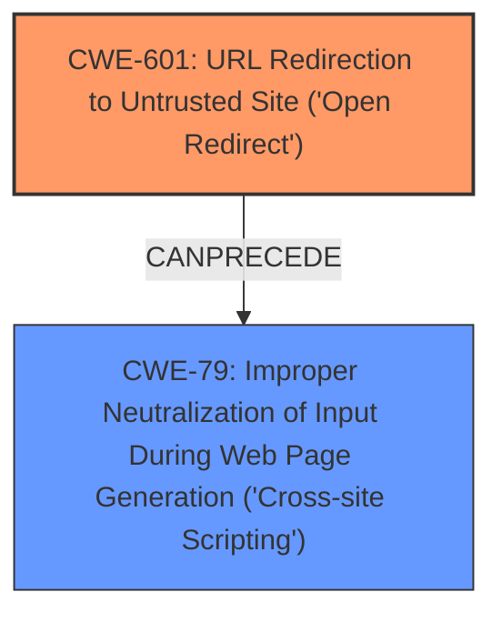

# Analysis for CVE-2024-46481

# Summary
| CWE ID | CWE Name | Confidence | CWE Abstraction Level | CWE Vulnerability Mapping Label | CWE-Vulnerability Mapping Notes |
|---|---|---|---|---|---|
| CWE-601 | URL Redirection to Untrusted Site ('Open Redirect') | 0.9 | Base | Allowed | Primary CWE. The application accepts a user-controlled input that specifies a link to an external site, and uses that link in a redirect. |
| CWE-79 | Improper Neutralization of Input During Web Page Generation ('Cross-site Scripting') | 0.9 | Base | Allowed | Secondary CWE. The application does not neutralize or incorrectly neutralizes user-controllable input before it is placed in output that is used as a web page that is served to other users. |

## Evidence and Confidence

*   **Confidence Score:** 0.9
*   **Evidence Strength:** HIGH

## Relationship Analysis
The primary weakness is CWE-601, which allows redirection to untrusted sites. This can be exploited to perform reflected XSS (CWE-79) by redirecting the user to a malicious site with crafted JavaScript in the URL. CWE-601 is the root cause, and CWE-79 is the resulting vulnerability due to the open redirect.

## Vulnerability Chain
The vulnerability chain starts with an **open redirect** (CWE-601) on the login page, which allows an attacker to redirect the user to an arbitrary URL. If the attacker crafts a malicious URL containing JavaScript, the login page may **fail to neutralize** this input, leading to **reflected XSS** (CWE-79).

## Summary of Analysis
The vulnerability description clearly states that the login page is vulnerable to **open redirect** leading to reflected **XSS**.

The primary weakness is CWE-601 (URL Redirection to Untrusted Site ('Open Redirect')). The description states, "The login page of Venki Supravizio BPM up to 18.1.1 is vulnerable to **open redirect** leading to reflected XSS." This directly aligns with the definition of CWE-601, where a web application accepts a user-controlled input and uses it in a redirect.

The secondary weakness is CWE-79 (Improper Neutralization of Input During Web Page Generation ('Cross-site Scripting')). The description mentions that the **open redirect** leads to reflected **XSS**, implying that the application **does not properly neutralize** user-controllable input in the redirected URL.

The relationship analysis reveals that CWE-601 can precede CWE-79 because the **open redirect** can be exploited to deliver a malicious payload that triggers the **XSS** vulnerability.

Other CWEs were considered but deemed less relevant:
*   CWE-352 (Cross-Site Request Forgery (CSRF)): While CSRF is a web application vulnerability, it is not the primary issue described in the vulnerability description. The focus is on **open redirect** and **XSS**, not CSRF.
*   CWE-80 (Improper Neutralization of Script-Related HTML Tags in a Web Page (Basic XSS)): This is a more specific variant of XSS. While it could be applicable, CWE-79 is more general and appropriate as the description doesn't specify the exact type of **XSS**.
*   CWE-116 (Improper Encoding or Escaping of Output): This is related to output handling, but the core issue is the **lack of neutralization** of input, making CWE-79 more relevant.
*   CWE-89 (Improper Neutralization of Special Elements used in an SQL Command ('SQL Injection')): This is specific to SQL injection, which is not mentioned in the vulnerability description.

Based on the evidence and relationship analysis, CWE-601 and CWE-79 are the most appropriate CWEs for this vulnerability. CWE-601 represents the root cause (**open redirect**), and CWE-79 represents the resulting vulnerability (reflected **XSS**).