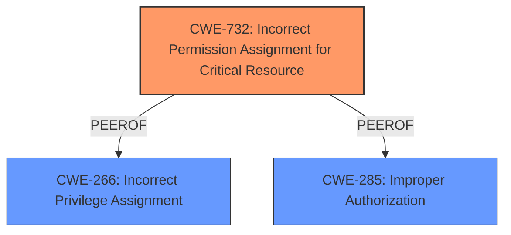

# Analysis for CVE-2024-46511

# Summary
| CWE ID | CWE Name | Confidence | CWE Abstraction Level | CWE Vulnerability Mapping Label | CWE-Vulnerability Mapping Notes |
|---|---|---|---|---|---|
| CWE-732 | Incorrect Permission Assignment for Critical Resource | 0.9 | Class | Allowed-with-Review | Primary CWE |
| CWE-266 | Incorrect Privilege Assignment | 0.6 | Base | Allowed | Secondary Candidate |
| CWE-285 | Improper Authorization | 0.5 | Class | Discouraged | Secondary Candidate |

## Evidence and Confidence

*   **Confidence Score:** 0.8
*   **Evidence Strength:** HIGH

## Relationship Analysis
The primary CWE selected is CWE-732, "Incorrect Permission Assignment for Critical Resource," which is a Class-level CWE. While more specific Base-level CWEs exist (e.g., CWE-266), the description indicates that the **insecure permissions** are specifically related to "critical resources" (Lambda functions and IAM roles), making CWE-732 a strong fit.

CWE-266 "Incorrect Privilege Assignment" was also considered because the vulnerability involves the assignment of roles. However, since the core issue is the permissions granted to Lambda functions, and how those permissions impact critical AWS resources, CWE-732 is a more precise classification.

CWE-285 "Improper Authorization" was considered because the functions are not properly authorized. Since a more specific CWE related to permissions is available, CWE-285 is not the best fit.

## Vulnerability Chain
The vulnerability chain starts with the **insecure permissions** assigned to the Lambda functions. This leads to a privilege escalation vulnerability, where an attacker with the ability to modify the Lambda function can gain excessive permissions and access protected AWS resources.

Insecure Permissions (CWE-732) -> Privilege Escalation (Impact) -> Arbitrary Code Execution (Impact)

## Summary of Analysis
The analysis is based on the vulnerability description and the provided CVE reference link content summary. The vulnerability involves **insecure permissions** assigned to Lambda functions, allowing attackers to escalate privileges and execute arbitrary code.

The retriever results indicate that CWE-732, "Incorrect Permission Assignment for Critical Resource," is a relevant CWE. The content summary states, "The LoadLogic and LoadZilla applications create Lambda functions (LogicLoadEc2DeployLambda and CredsGenFunction) with overly permissive IAM and STS actions," and "Improper permission management in Lambda functions." This aligns with the description of CWE-732, which focuses on incorrect permission assignments for security-critical resources.

The CWE guidance on privileges vs. permissions was helpful in distinguishing between privilege escalation (impact) and permission issues (root cause). The **root cause** is the **incorrect assignment of permissions** to the Lambda functions, rather than a general privilege management issue.

CWE-732 is at the Class level. While it would be ideal to have a more specific Base level CWE, none of the other candidates are a better fit. CWE-266, "Incorrect Privilege Assignment" is close, but the issue is with permissions on a resource (Lambda function), rather than privileges assigned to a user.

The selection of CWE-732 is also supported by the "Mapping Guidance" which states "While the name itself indicates an assignment of permissions for resources, this is often misused for vulnerabilities in which 'permissions' are not checked, which is an 'authorization' weakness (CWE-285 or descendants) within CWE's model [REF-1287]." However, in this case, permissions *are* being assigned, but they are assigned incorrectly.