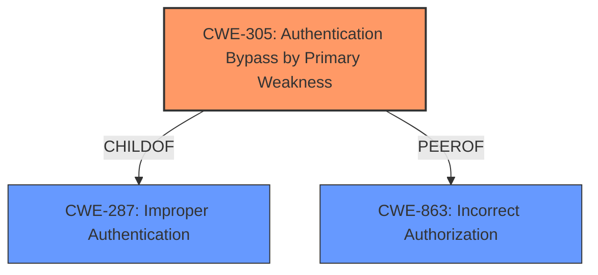

# Analysis for CVE-2024-46607

# Summary
| CWE ID | CWE Name | Confidence | CWE Abstraction Level | CWE Vulnerability Mapping Label | CWE-Vulnerability Mapping Notes |
|---|---|---|---|---|---|
| CWE-305 | Authentication Bypass by Primary Weakness | 0.9 | Base | Allowed | Primary CWE: The vulnerability allows bypassing authentication due to a flawed password verification logic. |
| CWE-287 | Improper Authentication | 0.6 | Class | Discouraged | Secondary candidate: The system fails to properly authenticate users, but the root cause is more specific than a general authentication failure. |
| CWE-863 | Incorrect Authorization | 0.5 | Class | Allowed-with-Review | Secondary candidate: Although access control is affected, the primary issue is with authentication, not authorization. |

## Evidence and Confidence

*   **Confidence Score:** 0.9
*   **Evidence Strength:** HIGH

## Relationship Analysis
The primary weakness is **CWE-305 (Authentication Bypass by Primary Weakness)**, which describes a scenario where authentication is bypassed due to a specific flaw. This is related to **CWE-287 (Improper Authentication)**, which is a broader class of authentication failures, and **CWE-863 (Incorrect Authorization)**, which deals with authorization issues. The hierarchical relationship shows CWE-305 as a more specific type of CWE-287.

## Vulnerability Chain
The vulnerability chain begins with a **flawed password verification** (`verifyPassword` method incorrectly compares hashed password with plaintext password), leading to **CWE-305 (Authentication Bypass by Primary Weakness)**, which results in **unauthorized access** to the admin panel and potentially **full control of the system**.
  - Initial Flaw: Flawed `verifyPassword` method
  - Root Cause: CWE-305 Authentication Bypass by Primary Weakness
  - Impact: Unauthorized Access and potential full system control

## Summary of Analysis
The initial analysis identified **incorrect access control** as the key phrase. However, the deeper analysis of the CVE reference links content summary clearly points to a **flawed password verification** mechanism that directly results in **authentication bypass**. The `verifyPassword` method's incorrect comparison between hashed and plaintext passwords allows attackers to bypass authentication using arbitrary credentials.

**CWE-305 (Authentication Bypass by Primary Weakness)** is the most appropriate choice because it accurately describes the root cause: authentication is bypassed due to a specific weakness in the password verification logic. While **CWE-287 (Improper Authentication)** is a related, broader category, CWE-305 provides a more precise classification of the vulnerability. **CWE-863 (Incorrect Authorization)** is less relevant because the primary issue lies in the authentication phase, not in authorization checks after authentication. The evidence from the CVE description supports this: "The vulnerability stems from a logical error in the `loginAdmin` method... The `verifyPassword` method incorrectly compares the encrypted password stored in the database with the plaintext password entered by the user."

The retriever results also support this, with **CWE-305 (Authentication Bypass by Primary Weakness)**, **CWE-287 (Improper Authentication)**, and **CWE-863 (Incorrect Authorization)** being listed as potential candidates. The provided guidance on Authentication vs Authorization vs Access Control further clarifies that when the issue is a bypass of login checks, CWE-305 is the most relevant choice.

The selection of CWE-305 is at the optimal level of specificity (Base) and is supported by direct evidence from the vulnerability description.

Relevant CWE Information:
- **CWE-305:** Authentication Bypass by Primary Weakness
- **CWE-287:** Improper Authentication
- **CWE-863:** Incorrect Authorization