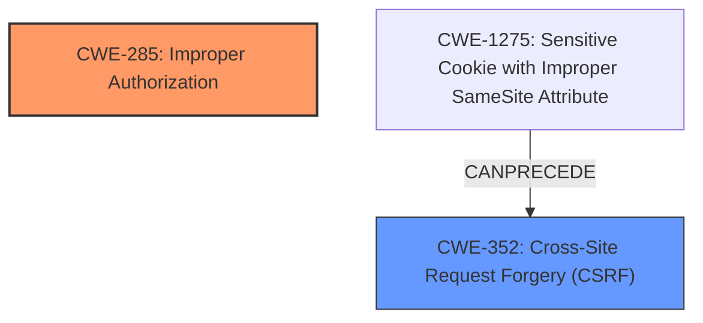

# Analysis Report for CVE-2024-4665

# Vulnerability Analysis Report: CVE-2024-4665

## Description

The EventPrime WordPress plugin before 3.5.0 **does not properly validate permissions** when updating bookings, allowing users to change/cancel bookings for other users. Additionally, the feature is lacking a nonce.

## Vulnerability Description Key Phrases

- **Rootcause:** does not properly validate permissions
- **Impact:** change/cancel bookings for other users
- **Attacker:** users
- **Product:** EventPrime WordPress plugin
- **Version:** before 3.5.0

## Analysis (with Relationship Data)

# Summary
| CWE ID | CWE Name | Confidence | CWE Abstraction Level | CWE Vulnerability Mapping Label | CWE-Vulnerability Mapping Notes |
|---|---|---|---|---|---|
| CWE-285 | Improper Authorization | 0.85 | Class | Primary | Allowed-with-Review |
| CWE-352 | Cross-Site Request Forgery (CSRF) | 0.75 | Compound | Secondary | Allowed |

## Evidence and Confidence

*   **Confidence Score:** 0.80
*   **Evidence Strength:** HIGH

## Relationship Analysis
The primary relationship that influenced the decision was the parent-child relationship between CWE-285 and its potential base-level children. While the description indicates an authorization issue, the provided information does not give enough detail to pinpoint a specific base-level CWE. There is also the CANPRECEDE relationship between CWE-352 and CWE-1275. CWE-1275 is not directly applicable, but does provide insight into the CWE-352 selection. The abstraction levels were considered, with preference given to the base level where possible, but the lack of specific details led to the selection of a class-level CWE for the primary mapping.



## Vulnerability Chain
The vulnerability chain starts with **improper authorization**, where the system **does not properly validate permissions**. This leads to the impact of users being able to change/cancel bookings for other users. Additionally, the vulnerability description states the feature is lacking a nonce, which introduces the potential for Cross-Site Request Forgery (CSRF).

## Summary of Analysis
The initial assessment focused on identifying the root cause of the vulnerability. The description clearly states that the plugin **does not properly validate permissions**, which is a key indicator of an authorization issue. Given the information, the most suitable primary CWE is CWE-285 Improper Authorization. The additional information about the missing nonce indicates a potential for CSRF attacks, leading to the inclusion of CWE-352 as a secondary weakness. The selection of CWE-285 is further supported by the "Privileges vs Permissions Guidance", which suggests CWE-285 when "Permissions are improperly checked" due to "Flawed logic".

Relevant CWE Information:

# Enhanced Context (25 CWEs)
The following CWEs were identified as potentially relevant to this vulnerability:

*   CWE-266: Incorrect Privilege Assignment
*   CWE-472: External Control of Assumed-Immutable Web Parameter
*   CWE-267: Privilege Defined With Unsafe Actions
*   CWE-425: Direct Request ('Forced Browsing')
*   CWE-639: Authorization Bypass Through User-Controlled Key
*   CWE-280: Improper Handling of Insufficient Permissions or Privileges
*   CWE-274: Improper Handling of Insufficient Privileges
*   CWE-668: Exposure of Resource to Wrong Sphere
*   CWE-1390: Weak Authentication
*   CWE-178: Improper Handling of Case Sensitivity
*   CWE-863: Incorrect Authorization
*   CWE-285: Improper Authorization
*   CWE-862: Missing Authorization
*   CWE-269: Improper Privilege Management
*   CWE-266: Incorrect Privilege Assignment
*   CWE-1275: Sensitive Cookie with Improper SameSite Attribute
*   CWE-471: Modification of Assumed-Immutable Data (MAID)
*   CWE-352: Cross-Site Request Forgery (CSRF)
*   CWE-250: Execution with Unnecessary Privileges
*   CWE-472: External Control of Assumed-Immutable Web Parameter
*   CWE-306: Missing Authentication for Critical Function
*   CWE-79: Improper Neutralization of Input During Web Page Generation ('Cross-site Scripting')
*   CWE-613: Insufficient Session Expiration
*   CWE-98: Improper Control of Filename for Include/Require Statement in PHP Program ('PHP Remote File Inclusion')
*   CWE-266: Incorrect Privilege Assignment

## Vulnerability Details and CWE Mapping

### 1. CWE-285 Improper Authorization

*   **Technical Explanation:** The vulnerability description indicates that the EventPrime WordPress plugin **does not properly validate permissions**. This means that the authorization check is present, but it is flawed, allowing users to perform actions they should not be able to, such as changing or canceling bookings for other users. CWE-285 (Improper Authorization) is the most appropriate CWE in this case, as it describes situations where the authorization logic is present but flawed.
*   **Security Implications:** An attacker can modify or cancel bookings of other users, leading to potential disruption of services or unauthorized access to sensitive information.
*   **Parent-Child Relationships:** CWE-285 is a class-level CWE. More specific base-level CWEs could be considered if more details about the specific authorization flaw were available.
*   **Primary/Secondary:** Primary
*   **Mapping Guidance Influence:** The "Privileges vs Permissions Guidance" specifically suggests CWE-285 when permissions are improperly checked due to flawed logic. The retriever results also lists CWE-285, further supporting this selection.
*   **Confidence:** 0.85

### 2. CWE-352 Cross-Site Request Forgery (CSRF)

*   **Technical Explanation:** The vulnerability description also states that the feature is **lacking a nonce**, a critical component for preventing CSRF attacks. This means an attacker could potentially craft a malicious request that, when triggered by an authenticated user, could perform unauthorized actions.
*   **Security Implications:** An attacker can trick a user into unknowingly performing actions on their behalf, such as changing or canceling bookings.
*   **Parent-Child Relationships:** CWE-352 is a compound CWE.
*   **Primary/Secondary:** Secondary
*   **Mapping Guidance Influence:** The presence of a missing nonce is a strong indicator of a potential CSRF vulnerability.
*   **Confidence:** 0.75

### CWEs Considered But Not Used

*   **CWE-862 Missing Authorization:** This CWE was considered but not chosen as the primary CWE because the vulnerability description explicitly states that the plugin "does not properly validate permissions," indicating that an authorization check exists, albeit a flawed one. CWE-862 would be more appropriate if there were no authorization checks at all.
*   **CWE-863 Incorrect Authorization:** This CWE was considered but not chosen as the primary CWE because CWE-285 is the preferred Class level to use.
*   **CWE-266 Incorrect Privilege Assignment:** This CWE was considered but deemed less suitable as the issue is not about assigning incorrect privileges but rather about the authorization logic being flawed during booking updates.
*   **CWE-306 Missing Authentication for Critical Function:** This CWE was not chosen because the description indicates that authentication is present, but the authorization is flawed.


## CWE Relationship Analysis

Current CWEs represent these abstraction levels: .


### Vulnerability Chain Analysis

**Chain starting from CWE-274:**
- 274 (Improper Handling of Insufficient Privileges) - ROOT


**Chain starting from CWE-471:**
- 471 (Modification of Assumed-Immutable Data (MAID)) - ROOT


### CWE Relationship Diagram

```mermaid
graph TD
    classDef primary fill:#f96,stroke:#333,stroke-width:2px
    classDef secondary fill:#69f,stroke:#333
    classDef tertiary fill:#9e9,stroke:#333
```


*Report generated on 2025-07-13 17:34:27*
