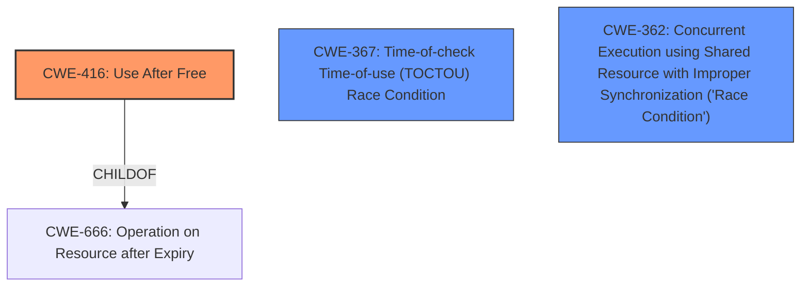

# Analysis Report for CVE-2024-46680

# Vulnerability Analysis Report: CVE-2024-46680

## Description

In the Linux kernel, the following vulnerability has been resolvedBluetooth btnxpuart Fix random crash seen while removing driverThis fixes the random kernel crash seen while removing the driver, whenrunning the load/unload test over multiple iterations.1) modprobe btnxpuart2) hciconfig hci0 reset3) hciconfig (check hci0 interface up with valid BD address)4) modprobe -r btnxpuartRepeat steps 1 to 4The ps_wakeup() call in btnxpuart_close() schedules the psdata->work(),which gets scheduled after module is removed, causing a kernel crash.This hidden issue got highlighted after enabling Power Save by defaultin 4183a7be7700 (Bluetooth btnxpuart Enable Power Save feature onstartup)The new ps_cleanup() deasserts UART break immediately while closingserdev device, cancels any scheduled ps_work and destroys the ps_lockmutex.[ 85.884604] Unable to handle kernel paging request at virtual address ffffd4a61638f258[ 85.884624] Mem abort info[ 85.884625] ESR = 0x0000000086000007[ 85.884628] EC = 0x21 IABT (current EL), IL = 32 bits[ 85.884633] SET = 0, FnV = 0[ 85.884636] EA = 0, S1PTW = 0[ 85.884638] FSC = 0x07 level 3 translation fault[ 85.884642] swapper pgtable 4k pages, 48-bit VAs, pgdp=0000000041dd0000[ 85.884646] [ffffd4a61638f258] pgd=1000000095fff003, p4d=1000000095fff003, pud=100000004823d003, pmd=100000004823e003, pte=0000000000000000[ 85.884662] Internal error Oops 0000000086000007

## Vulnerability Description Key Phrases

- **Rootcause:** ps_wakeup() call in btnxpuart_close() schedules psdata->work() after module is removed
- **Impact:** ['Oops', 'kernel crash']
- **Vector:** ["['modprobe btnxpuart'", "'hciconfig hci0 reset'", "'hciconfig'", "'modprobe -r btnxpuart']"]
- **Product:** Linux kernel
- **Component:** Bluetooth btnxpuart driver

## Analysis (with Relationship Data)

# Summary
| CWE ID | CWE Name | Confidence | CWE Abstraction Level | CWE Vulnerability Mapping Label | CWE-Vulnerability Mapping Notes |
|---|---|---|---|---|---|
| CWE-416 | Use After Free | 0.9 | Variant |  Primary CWE | Allowed |
| CWE-367 | Time-of-check Time-of-use (TOCTOU) Race Condition | 0.7 | Base | Secondary Candidate | Allowed |
| CWE-362 | Concurrent Execution using Shared Resource with Improper Synchronization ('Race Condition') | 0.6 | Class | Secondary Candidate | Allowed-with-Review |

## Evidence and Confidence

*   **Confidence Score:** 0.8
*   **Evidence Strength:** HIGH

## Relationship Analysis
The primary relationship influencing the CWE selection is the parent-child relationship where **CWE-416 (Use After Free)** is a variant of **CWE-666 (Operation on Resource after Expiry)**. Also, **CWE-367 (Time-of-check Time-of-use (TOCTOU) Race Condition)** and **CWE-362 (Concurrent Execution using Shared Resource with Improper Synchronization ('Race Condition'))** are related to concurrency issues which is present in this vulnerability. The abstraction levels were considered to choose the most specific CWE.



## Vulnerability Chain
The vulnerability chain starts with scheduling a work item after the module is removed, leading to a **CWE-416 (Use After Free)**. The race condition aspect contributes to the timing issue, making **CWE-367 (Time-of-check Time-of-use (TOCTOU) Race Condition)** and **CWE-362 (Concurrent Execution using Shared Resource with Improper Synchronization ('Race Condition'))** relevant.

## Summary of Analysis
The analysis indicates that the primary vulnerability is a **CWE-416 (Use After Free)**, stemming from scheduling a work item after the module is removed. The supporting evidence is strong, with detailed descriptions and root cause analysis provided in the vulnerability description and CVE reference summary. The race condition aspects are captured by **CWE-367 (Time-of-check Time-of-use (TOCTOU) Race Condition)** and **CWE-362 (Concurrent Execution using Shared Resource with Improper Synchronization ('Race Condition'))**, but these are secondary to the primary **Use After Free**.

Relevant CWE Information:

# Enhanced Context (25 CWEs)
The following CWEs were identified as potentially relevant to this vulnerability:

## CWE-362: Concurrent Execution using Shared Resource with Improper Synchronization ('Race Condition')
**Abstraction Level**: Class
**Similarity Score**: 0.78
**Source**: dense

**Description**:
The product contains a concurrent code sequence that requires temporary, exclusive access to a shared resource, but a timing window exists in which the shared resource can be modified by another code sequence operating concurrently.

**Mapping Guidance**:
- Usage: Allowed-with-Review
- Rationale: This CWE entry is a Class and might have Base-level children that would be more appropriate


## CWE-755: Improper Handling of Exceptional Conditions
**Abstraction Level**: Class
**Similarity Score**: 0.77
**Source**: dense

**Description**:
The product does not handle or incorrectly handles an exceptional condition.

**Mapping Guidance**:
- Usage: Discouraged
- Rationale: This CWE entry is a level-1 Class (i.e., a child of a Pillar). It might have lower-level children that would be more appropriate


## CWE-667: Improper Locking
**Abstraction Level**: Class
**Similarity Score**: 0.77
**Source**: dense

**Description**:
The product does not properly acquire or release a lock on a resource, leading to unexpected resource state changes and behaviors.

**Mapping Guidance**:
- Usage: Allowed-with-Review
- Rationale: This CWE entry is a Class and might have Base-level children that would be more appropriate


## CWE-367: Time-of-check Time-of-use (TOCTOU) Race Condition
**Abstraction Level**: Base
**Similarity Score**: 0.76
**Source**: dense

**Description**:
The product checks the state of a resource before using that resource, but the resource's state can change between the check and the use in a way that invalidates the results of the check. This can cause the product to perform invalid actions when the resource is in an unexpected state.

**Mapping Guidance**:
- Usage: Allowed
- Rationale: This CWE entry is at the Base level of abstraction, which is a preferred level of abstraction for mapping to the root causes of vulnerabilities.


## CWE-824: Access of Uninitialized Pointer
**Abstraction Level**: Base
**Similarity Score**: 0.75
**Source**: dense

**Description**:
The product accesses or uses a pointer that has not been initialized.

**Mapping Guidance**:
- Usage: Allowed
- Rationale: This CWE entry is at the Base level of abstraction, which is a preferred level of abstraction for mapping to the root causes of vulnerabilities.


## CWE-754: Improper Check for Unusual or Exceptional Conditions
**Abstraction Level**: Class
**Similarity Score**: 0.75
**Source**: dense

**Description**:
The product does not check or incorrectly checks for unusual or exceptional conditions that are not expected to occur frequently during day to day operation of the product.

**Mapping Guidance**:
- Usage: Allowed-with-Review
- Rationale: This CWE entry is a Class and might have Base-level children that would be more appropriate


## CWE-1285: Improper Validation of Specified Index, Position, or Offset in Input
**Abstraction Level**: Base
**Similarity Score**: 0.75
**Source**: dense

**Description**:
The product receives input that is expected to specify an index, position, or offset into an indexable resource such as a buffer or file, but it does not validate or incorrectly validates that the specified index/position/offset has the required properties.

**Mapping Guidance**:
- Usage: Allowed
- Rationale: This CWE entry is at the Base level of abstraction, which is a preferred level of abstraction for mapping to the root causes of vulnerabilities.


## CWE-131: Incorrect Calculation of Buffer Size
**Abstraction Level**: Base
**Similarity Score**: 0.75
**Source**: dense

**Description**:
The product does not correctly calculate the size to be used when allocating a buffer, which could lead to a buffer overflow.

**Mapping Guidance**:
- Usage: Allowed
- Rationale: This CWE entry is at the Base level of abstraction, which is a preferred level of abstraction for mapping to the root causes of vulnerabilities.


## CWE-248: Uncaught Exception
**Abstraction Level**: Base
**Similarity Score**: 0.74
**Source**: dense

**Description**:
An exception is thrown from a function, but it is not caught.

**Mapping Guidance**:
- Usage: Allowed
- Rationale: This CWE entry is at the Base level of abstraction, which is a preferred level of abstraction for mapping to the root causes of vulnerabilities.


## CWE-119: Improper Restriction of Operations within the Bounds of a Memory Buffer
**Abstraction Level**: Class
**Similarity Score**: 0.74
**Source**: dense

**Description**:
The product performs operations on a memory buffer, but it reads from or writes to a memory location outside the buffer's intended boundary. This may result in read or write operations on unexpected memory locations that could be linked to other variables, data structures, or internal program data.

**Mapping Guidance**:
- Usage: Discouraged
- Rationale: CWE-119 is commonly misused in low-information vulnerability reports when lower-level CWEs could be used instead, or when more details about the vulnerability are available.


## CWE-362: Concurrent Execution using Shared Resource with Improper Synchronization ('Race Condition')
**Abstraction Level**: Class
**Similarity Score**: 1138.31
**Source**: sparse

**Description**:
The product contains a concurrent code sequence that requires temporary, exclusive access to a shared resource, but a timing window exists in which the shared resource can be modified by another code sequence operating concurrently.

**Mapping Guidance**:
- Usage: Allowed-with-Review
- Rationale: This CWE entry is a Class and might have Base-level children that would be more appropriate


## CWE-667: Improper Locking
**Abstraction


## CWE Relationship Analysis

Current CWEs represent these abstraction levels: .


### Vulnerability Chain Analysis

**Chain starting from CWE-416:**
- 416 (Use After Free) - ROOT


**Chain starting from CWE-666:**
- 666 (Operation on Resource in Wrong Phase of Lifetime) - ROOT


### CWE Relationship Diagram

```mermaid
graph TD
    classDef primary fill:#f96,stroke:#333,stroke-width:2px
    classDef secondary fill:#69f,stroke:#333
    classDef tertiary fill:#9e9,stroke:#333
```


*Report generated on 2025-07-13 17:35:29*
