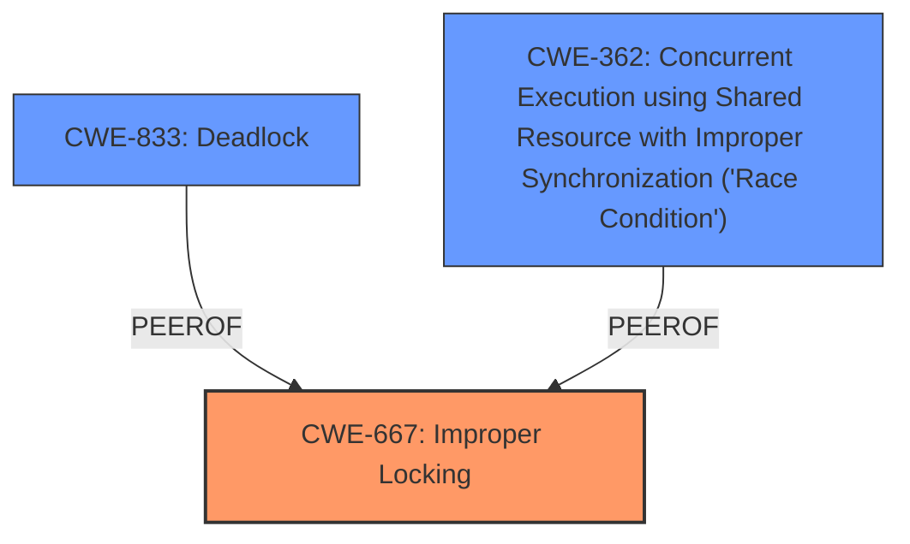

# Enhanced Analysis for CVE-2024-46750

# Summary
| CWE ID | CWE Name | Confidence | CWE Abstraction Level | CWE Vulnerability Mapping Label | CWE-Vulnerability Mapping Notes |
|---|---|---|---|---|---|
| CWE-667 | Improper Locking | 1.0 | Class | Primary | Allowed-with-Review |
| CWE-833 | Deadlock | 0.7 | Base | Secondary | Allowed |
| CWE-362 | Concurrent Execution using Shared Resource with Improper Synchronization ('Race Condition') | 0.6 | Class | Secondary | Allowed-with-Review |

## Evidence and Confidence

*   **Confidence Score:** 0.9
*   **Evidence Strength:** HIGH

## Relationship Analysis
The primary weakness is **CWE-667 Improper Locking**. It is a class-level CWE, which can be related to **CWE-833 Deadlock** and **CWE-362 Race Condition**. The vulnerability description highlights a **missing bridge lock** leading to unlocked secondary bus resets, which aligns with the concept of improper locking. **CWE-833 Deadlock** and **CWE-362 Race Condition** are potential consequences of the **missing lock** because of the unlocked secondary bus resets that occurred.



## Vulnerability Chain
The vulnerability chain starts with the **missing bridge lock** (**CWE-667**), leading to unlocked secondary bus resets. This can result in a **race condition** (**CWE-362**) where multiple threads access the shared resource (PCI bus) concurrently without proper synchronization. In some cases, this could lead to a **deadlock** (**CWE-833**) if threads are waiting for each other to release locks.

## Summary of Analysis
The primary CWE is **CWE-667 Improper Locking** because the root cause of the vulnerability is the **missing bridge lock** in the `pci_bus_lock()` function. The vulnerability description and CVE reference links content summary both explicitly mention the **missing lock** as the cause of the issue. The lockdep warnings also indicate a locking issue.
**CWE-833 Deadlock** and **CWE-362 Race Condition** are included as potential consequences of the **missing lock**, but they are secondary to the main issue.

The CWEs that were considered but not used include **CWE-787 Out-of-bounds Write**, **CWE-119 Improper Restriction of Operations within the Bounds of a Memory Buffer**, **CWE-129 Improper Validation of Array Index**, and **CWE-1285 Improper Validation of Specified Index, Position, or Offset in Input**. These CWEs were not chosen because the vulnerability is not related to buffer overflows, array indexing, or input validation. The core issue is the **missing lock**, which allows for concurrent access to shared resources without proper synchronization.

The selected CWEs are at the optimal level of specificity because they accurately represent the root cause and potential consequences of the vulnerability. **CWE-667 Improper Locking** is a Class, but accurately reflects the **missing lock** root cause. **CWE-833 Deadlock** and **CWE-362 Race Condition** describe the potential consequences of the **missing lock**.

Relevant CWE Information:

# Enhanced Context (25 CWEs)
The following CWEs were identified as potentially relevant to this vulnerability:

## CWE-667: Improper Locking
**Abstraction Level**: Class
**Similarity Score**: 0.74
**Source**: dense

**Description**:
The product does not properly acquire or release a lock on a resource, leading to unexpected resource state changes and behaviors.

**Mapping Guidance**:
- Usage: Allowed-with-Review
- Rationale: This CWE entry is a Class and might have Base-level children that would be more appropriate

**EVIDENCE:** The vulnerability description explicitly states "**missing bridge lock**". The description of CWE-667 states "The product does not properly acquire or release a lock on a resource, leading to unexpected resource state changes and behaviors.".

## CWE-833: Deadlock
**Abstraction Level**: Base
**Similarity Score**: 0.71
**Source**: dense

**Description**:
The product contains multiple threads or executable segments that are waiting for each other to release a necessary lock, resulting in deadlock.

**Mapping Guidance**:
- Usage: Allowed
- Rationale: This CWE entry is at the Base level of abstraction, which is a preferred level of abstraction for mapping to the root causes of vulnerabilities.

**EVIDENCE:** The vulnerability description mentions a "recursive locking deadlock fix". This suggests that a deadlock could potentially occur as a result of the **missing lock**.

## CWE-362: Concurrent Execution using Shared Resource with Improper Synchronization ('Race Condition')
**Abstraction Level**: Class
**Similarity Score**: 0.70
**Source**: dense

**Description**:
The product contains a concurrent code sequence that requires temporary, exclusive access to a shared resource, but a timing window exists in which the shared resource can be modified by another code sequence operating concurrently.

**Mapping Guidance**:
- Usage: Allowed-with-Review
- Rationale: This CWE entry is a Class and might have Base-level children that would be more appropriate

**EVIDENCE:** The CVE Reference Links Content Summary mentions "This missing lock leads to a race condition where code paths, such as `pci_reset_bus()` which are users of secondary bus resets, can operate on the PCI bus hierarchy without the necessary bridge lock.". The **missing lock** creates a race condition scenario.


## CWE Relationship Analysis

Current CWEs represent these abstraction levels: .


### Vulnerability Chain Analysis

**Chain starting from CWE-667:**
- 667 (Improper Locking) - ROOT


**Chain starting from CWE-833:**
- 833 (Deadlock) - ROOT


### CWE Relationship Diagram

```mermaid
graph TD
    classDef primary fill:#f96,stroke:#333,stroke-width:2px
    classDef secondary fill:#69f,stroke:#333
    classDef tertiary fill:#9e9,stroke:#333
```