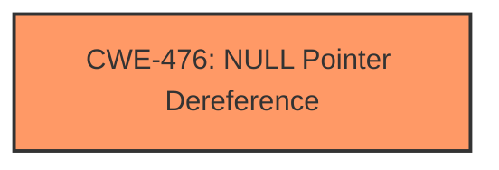

# Analysis Report for CVE-2024-46795

# Vulnerability Analysis Report: CVE-2024-46795

## Description

In the Linux kernel, the following vulnerability has been resolved ksmbd unset the binding mark of a reused connection Steve French reported **null pointer dereference** error from sha256 lib. cifs.ko can send session setup requests on reused connection. If reused connection is used for binding session, conn->binding can still remain true and generate_preauth_hash() will not set sess->Preauth_HashValue and it will be NULL. It is used as a material to create an encryption key in ksmbd_gen_smb311_encryptionkey. ->Preauth_HashValue cause **null pointer dereference** error from crypto_shash_update(). BUG kernel NULL pointer dereference, address 0000000000000000 #PF supervisor read access in kernel mode #PF error_code(0x0000) - not-present page PGD 0 P4D 0 Oops 0000 [#1] PREEMPT SMP PTI CPU 8 PID 429254 Comm kworker/839 Hardware name LENOVO 20MAS08500/20MAS08500, BIOS N2CET69W (1.52 ) Workqueue ksmbd-io handle_ksmbd_work [ksmbd] RIP 0010lib_sha256_base_do_update.isra.0+0x11e/0x1d0 [sha256_ssse3] ? show_regs+0x6d/0x80 ? __die+0x24/0x80 ? page_fault_oops+0x99/0x1b0 ? do_user_addr_fault+0x2ee/0x6b0 ? exc_page_fault+0x83/0x1b0 ? asm_exc_page_fault+0x27/0x30 ? __pfx_sha256_transform_rorx+0x10/0x10 [sha256_ssse3] ? lib_sha256_base_do_update.isra.0+0x11e/0x1d0 [sha256_ssse3] ? __pfx_sha256_transform_rorx+0x10/0x10 [sha256_ssse3] ? __pfx_sha256_transform_rorx+0x10/0x10 [sha256_ssse3] _sha256_update+0x77/0xa0 [sha256_ssse3] sha256_avx2_update+0x15/0x30 [sha256_ssse3] crypt

## Vulnerability Description Key Phrases

- **Rootcause:** null pointer dereference
- **Impact:** ['Oops', 'denial of service', 'read access']
- **Vector:** session setup requests on reused connection
- **Product:** Linux kernel
- **Component:** cifs.ko

## Analysis (with Relationship Data)

# Summary
| CWE ID  | CWE Name                                                                        | Confidence | CWE Abstraction Level | CWE Vulnerability Mapping Label | CWE-Vulnerability Mapping Notes |
| :-------- | :------------------------------------------------------------------------------ | :---------- | :-------------------- | :------------------------------ | :------------------------------ |
| CWE-476 | CWE-476: NULL Pointer Dereference                                             | 1.0         | Base                  | Primary CWE                     | Allowed                       |

## Evidence and Confidence

*   **Confidence Score:** 1.0
*   **Evidence Strength:** HIGH

## Relationship Analysis
The primary relationship influencing the CWE selection is the direct identification of a **null pointer dereference** as the root cause of the vulnerability. This directly corresponds to CWE-476. While other CWEs like CWE-252 (Unchecked Return Value) or CWE-665 (Improper Initialization) might be related, they are not the direct cause of the crash as described. The selection of CWE-476 is at the Base level, providing sufficient specificity.



## Vulnerability Chain
The vulnerability chain starts with **incorrect `conn->binding` flag management**, which leads to `sess->Preauth_HashValue` being NULL. Subsequently, using this NULL value in `crypto_shash_update()` results in a **null pointer dereference**, causing a kernel crash. Therefore, the chain is: Incorrect Flag Management -> NULL `Preauth_HashValue` -> **NULL Pointer Dereference** -> Kernel Crash.

## Summary of Analysis
The analysis is based on the explicit description of a **null pointer dereference** error within the provided vulnerability description and CVE reference links content summary. The description clearly states, "Steve French reported **null pointer dereference** error from sha256 lib" and "->Preauth_HashValue cause **null pointer dereference** error from crypto_shash_update()." This direct evidence makes CWE-476 the most appropriate mapping. The Retriever Results also highlight CWE-476 as the top candidate. All the evidence points towards a clear-cut case of a **null pointer dereference**, justifying the selection of CWE-476.

Relevant CWE Information:

# Enhanced Context (25 CWEs)
The following CWEs were identified as potentially relevant to this vulnerability:

## CWE-476: NULL Pointer Dereference
**Abstraction Level**: Base
**Similarity Score**: 0.75
**Source**: dense

**Description**:
The product dereferences a pointer that it expects to be valid but is NULL.

**Mapping Guidance**:
- Usage: Allowed
- Rationale: This CWE entry is at the Base level of abstraction, which is a preferred level of abstraction for mapping to the root causes of vulnerabilities.


## CWE-824: Access of Uninitialized Pointer
**Abstraction Level**: Base
**Similarity Score**: 0.75
**Source**: dense

**Description**:
The product accesses or uses a pointer that has not been initialized.

**Mapping Guidance**:
- Usage: Allowed
- Rationale: This CWE entry is at the Base level of abstraction, which is a preferred level of abstraction for mapping to the root causes of vulnerabilities.


## CWE-667: Improper Locking
**Abstraction Level**: Class
**Similarity Score**: 0.74
**Source**: dense

**Description**:
The product does not properly acquire or release a lock on a resource, leading to unexpected resource state changes and behaviors.

**Mapping Guidance**:
- Usage: Allowed-with-Review
- Rationale: This CWE entry is a Class and might have Base-level children that would be more appropriate


## CWE-755: Improper Handling of Exceptional Conditions
**Abstraction Level**: Class
**Similarity Score**: 0.74
**Source**: dense

**Description**:
The product does not handle or incorrectly handles an exceptional condition.

**Mapping Guidance**:
- Usage: Discouraged
- Rationale: This CWE entry is a level-1 Class (i.e., a child of a Pillar). It might have lower-level children that would be more appropriate


## CWE-252: Unchecked Return Value
**Abstraction Level**: Base
**Similarity Score**: 0.74
**Source**: dense

**Description**:
The product does not check the return value from a method or function, which can prevent it from detecting unexpected states and conditions.

**Mapping Guidance**:
- Usage: Allowed
- Rationale: This CWE entry is at the Base level of abstraction, which is a preferred level of abstraction for mapping to the root causes of vulnerabilities.


## CWE-822: Untrusted Pointer Dereference
**Abstraction Level**: Base
**Similarity Score**: 0.74
**Source**: dense

**Description**:
The product obtains a value from an untrusted source, converts this value to a pointer, and dereferences the resulting pointer.

**Mapping Guidance**:
- Usage: Allowed
- Rationale: This CWE entry is at the Base level of abstraction, which is a preferred level of abstraction for mapping to the root causes of vulnerabilities.


## CWE-665: Improper Initialization
**Abstraction Level**: Class
**Similarity Score**: 0.73
**Source**: dense

**Description**:
The product does not initialize or incorrectly initializes a resource, which might leave the resource in an unexpected state when it is accessed or used.

**Mapping Guidance**:
- Usage: Discouraged
- Rationale: This CWE entry is a level-1 Class (i.e., a child of a Pillar). It might have lower-level children that would be more appropriate


## CWE-362: Concurrent Execution using Shared Resource with Improper Synchronization ('Race Condition')
**Abstraction Level**: Class
**Similarity Score**: 0.73
**Source**: dense

**Description**:
The product contains a concurrent code sequence that requires temporary, exclusive access to a shared resource, but a timing window exists in which the shared resource can be modified by another code sequence operating concurrently.

**Mapping Guidance**:
- Usage: Allowed-with-Review
- Rationale: This CWE entry is a Class and might have Base-level children that would be more appropriate


## CWE-1285: Improper Validation of Specified Index, Position, or Offset in Input
**Abstraction Level**: Base
**Similarity Score**: 0.73
**Source**: dense

**Description**:
The product receives input that is expected to specify an index, position, or offset into an indexable resource such as a buffer or file, but it does not validate or incorrectly validates that the specified index/position/offset has the required properties.

**Mapping Guidance**:
- Usage: Allowed
- Rationale: This CWE entry is at the Base level of abstraction, which is a preferred level of abstraction for mapping to the root causes of vulnerabilities.


## CWE-131: Incorrect Calculation of Buffer Size
**Abstraction Level**: Base
**Similarity Score**: 0.73
**Source**: dense

**Description**:
The product does not correctly calculate the size to be used when allocating a buffer, which could lead to a buffer overflow.

**Mapping Guidance**:
- Usage: Allowed
- Rationale: This CWE entry is at the Base level of abstraction, which is a preferred level of abstraction for mapping to the root causes of vulnerabilities.


## CWE-476: NULL Pointer Dereference
**Abstraction Level**: Base
**Similarity Score**: 1297.68
**Source**: sparse

**Description**:
The product dereferences a pointer that it expects to be valid but is NULL.

**Mapping Guidance**:
- Usage: Allowed
- Rationale: This CWE entry is at the Base level of abstraction, which is a preferred level of abstraction for mapping to the root causes of vulnerabilities.


## CWE-824: Access of Uninitialized Pointer
**Abstraction Level**: Base
**Similarity Score**: 1197.27
**Source**: sparse

**Description**:
The product accesses or uses a pointer that has not been initialized.

**Mapping Guidance**:
- Usage: Allowed
- Rationale: This CWE entry is at the Base level of abstraction, which is a preferred level of abstraction for mapping to the root causes of vulnerabilities.


## CWE-252: Unchecked Return Value
**Abstraction Level**: Base
**Similarity Score**: 1189.84
**Source**: sparse

**Description**:
The product does not check the return value from a method or function, which can prevent it from detecting unexpected states and conditions.

**Mapping Guidance**:
- Usage: Allowed
- Rationale: This CWE entry is at the Base level of abstraction, which is a preferred level of abstraction for mapping to the root causes of vulnerabilities.


## CWE-908: Use of Uninitialized Resource
**Abstraction Level**: Base
**Similarity Score**: 1164.25
**Source**: sparse

**Description**:
The product uses or accesses a resource that has not been initialized.

**Mapping Guidance**:
- Usage: Allowed
- Rationale: This CWE entry is at the Base level of abstraction, which is a preferred level of abstraction for mapping to the root causes of vulnerabilities.


## CWE-665: Improper Initialization
**Abstraction Level**: Class
**Similarity Score**: 11


## CWE Relationship Analysis

Current CWEs represent these abstraction levels: .


### Vulnerability Chain Analysis

**Chain starting from CWE-476:**
- 476 (NULL Pointer Dereference) - ROOT


**Chain starting from CWE-131:**
- 131 (Incorrect Calculation of Buffer Size) - ROOT


### CWE Relationship Diagram

```mermaid
graph TD
    classDef primary fill:#f96,stroke:#333,stroke-width:2px
    classDef secondary fill:#69f,stroke:#333
    classDef tertiary fill:#9e9,stroke:#333
```


*Report generated on 2025-07-13 17:38:38*
