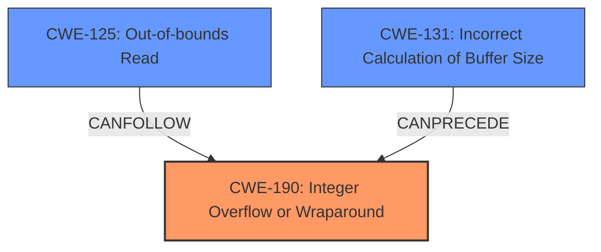

# Analysis Report for CVE-2024-46828

# Vulnerability Analysis Report: CVE-2024-46828

## Description

In the Linux kernel, the following vulnerability has been resolved sched sch_cake fix bulk flow accounting logic for host fairness In sch_cake, we keep track of the count of active bulk flows per host, when running in dst/src host fairness mode, which is used as the round-robin weight when iterating through flows. The count of active bulk flows is updated whenever a flow changes state. This has a peculiar interaction with the **hash collision** handling when a **hash collision** occurs (after the set-associative hashing), the state of the hash bucket is simply updated to match the new packet that collided, and if host fairness is enabled, that also means assigning new per-host state to the flow. For this reason, the bulk flow counters of the host(s) assigned to the flow are decremented, before new state is assigned (and the counters, which may not belong to the same host anymore, are incremented again). Back when this code was introduced, the host fairness mode was always enabled, so the decrement was unconditional. When the configuration flags were introduced the *increment* was made conditional, but the *decrement* was not. Which of course can lead to a **spurious decrement** (and associated wrap-around to U16_MAX). AFAICT, when host fairness is disabled, the decrement and wrap-around happens as soon as a **hash collision** occurs (which is not that common in itself, due to the set-associative hashing). However, in most cases this is harmless, as the value is only used when host f

## Vulnerability Description Key Phrases

- **Rootcause:** hash collision
- **Weakness:** spurious decrement
- **Impact:** wrap-around to U16_MAX
- **Product:** Linux kernel
- **Component:** sched sch_cake

## Analysis (with Relationship Data)

# Summary
| CWE ID | CWE Name | Confidence | CWE Abstraction Level | CWE Vulnerability Mapping Label | CWE-Vulnerability Mapping Notes |
|---|---|---|---|---|---|
| CWE-190 | Integer Overflow or Wraparound | 0.9 | Base |  Primary CWE | Allowed |
| CWE-131 | Incorrect Calculation of Buffer Size | 0.6 | Base | Secondary Candidate | Allowed |
| CWE-125 | Out-of-bounds Read | 0.5 | Base | Secondary Candidate | Allowed |

## Evidence and Confidence

*   **Confidence Score:** 0.8
*   **Evidence Strength:** MEDIUM

## Relationship Analysis
The primary weakness identified is CWE-190 Integer Overflow or Wraparound. This is a base-level CWE, representing a specific type of programming error. While the vulnerability description also mentions a potential out-of-bounds access, the root cause is the integer wraparound. The description indicates that the **spurious decrement** leads to a wrap-around to U16_MAX. If host fairness is re-enabled, the wrapped value is used as an index to an array, resulting in an out-of-bounds access.



## Vulnerability Chain
The vulnerability chain starts with a **hash collision** leading to a **spurious decrement** of a counter. This decrement causes an integer overflow/wraparound (CWE-190). Subsequently, the wrapped-around value is used as an array index, leading to an out-of-bounds read (CWE-125) and, potentially, a crash. There is also a potential for incorrect buffer size calculation (CWE-131).
  - The root cause is **spurious decrement**
  - The primary weakness is Integer Overflow or Wraparound (CWE-190).
  - The impact is Out-of-bounds Read (CWE-125).

## Summary of Analysis
The primary CWE is CWE-190 Integer Overflow or Wraparound, since the **spurious decrement** leads to a wrap-around to U16_MAX. This is supported by the vulnerability description: "Which of course can lead to a **spurious decrement** (and associated wrap-around to U16_MAX)". While there are other potential issues such as out-of-bounds read (CWE-125), these are consequences of the integer overflow.

The retriever suggested CWE-190 with high similarity score, supporting this assessment. Also, based on the CVE Reference Links Content Summary, specifically this phrase "When host fairness is re-enabled after a wrap-around, the wrapped-around value is used as an index to an array, resulting in an out-of-bounds access", confirms the integer overflow.

I considered CWE-125 (Out-of-bounds Read), but the root cause is the integer overflow that causes the index to be out of bounds. CWE-131 was also considered since an out-of-bounds read can be associated with an incorrect buffer size, but the description doesn't explicitly state that the buffer size was incorrectly calculated.

The selected CWEs are at the optimal level of specificity because they accurately reflect the root cause and direct consequences of the vulnerability based on available information.


## CWE Relationship Analysis

Current CWEs represent these abstraction levels: .


### Vulnerability Chain Analysis

**Chain starting from CWE-190:**
- 190 (Integer Overflow or Wraparound) - ROOT


**Chain starting from CWE-131:**
- 131 (Incorrect Calculation of Buffer Size) - ROOT


### CWE Relationship Diagram

```mermaid
graph TD
    classDef primary fill:#f96,stroke:#333,stroke-width:2px
    classDef secondary fill:#69f,stroke:#333
    classDef tertiary fill:#9e9,stroke:#333
```


*Report generated on 2025-07-13 17:39:41*
