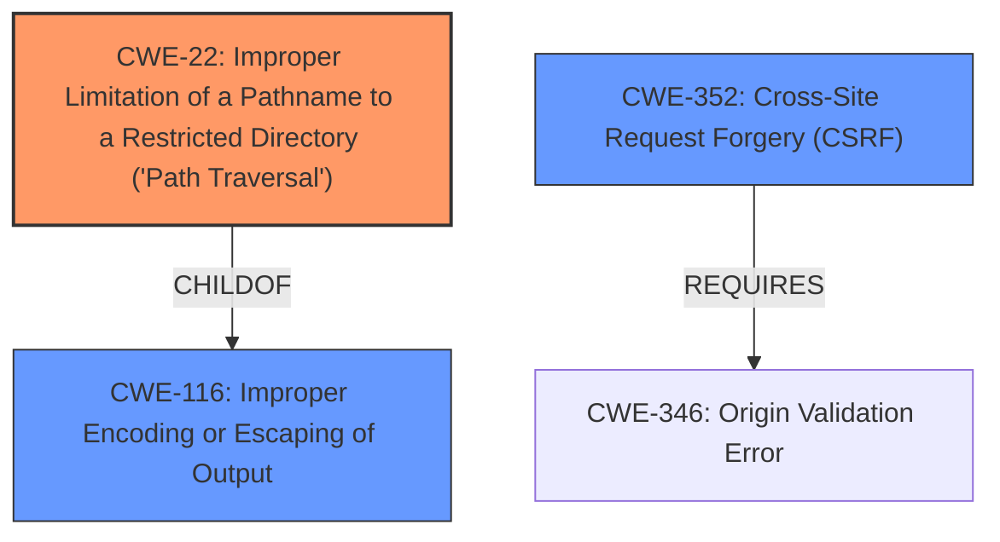

# Analysis Report for CVE-2024-46872

# Vulnerability Analysis Report: CVE-2024-46872

## Description

Mattermost versions 9.10.x <= 9.10.2, 9.11.x <= 9.11.1, 9.5.x <= 9.5.9 **fail to sanitize user inputs in the frontend** that are used for redirection which allows for a one-click **client-side path traversal** that is leading to CSRF in Playbooks

## Vulnerability Description Key Phrases

- **Rootcause:** fail to sanitize user inputs in the frontend
- **Weakness:** client-side path traversal
- **Impact:** CSRF
- **Product:** Mattermost
- **Version:** 9.10.x <= 9.10.2, 9.11.x <= 9.11.1, 9.5.x <= 9.5.9

## Analysis (with Relationship Data)

# Summary
| CWE ID | CWE Name | Confidence | CWE Abstraction Level | CWE Vulnerability Mapping Label | CWE-Vulnerability Mapping Notes |
|---|---|---|---|---|---|
| CWE-22 | Improper Limitation of a Pathname to a Restricted Directory ('Path Traversal') | 0.9 | Base | Primary | Allowed |
| CWE-352 | Cross-Site Request Forgery (CSRF) | 0.7 | Compound | Secondary | Allowed |
| CWE-116 | Improper Encoding or Escaping of Output | 0.6 | Class | Secondary | Allowed-with-Review |

## Evidence and Confidence

*   **Confidence Score:** 0.8
*   **Evidence Strength:** MEDIUM

## Relationship Analysis
The primary CWE is CWE-22, which describes the core issue of path traversal. CWE-116 is a parent of CWE-22, but CWE-22 is more specific. CWE-352 is a compound CWE representing Cross-Site Request Forgery (CSRF), which is the observed impact of the vulnerability. CWE-22 can precede CWE-73 (External Control of File Name or Path), but that is not relevant here as the path traversal is client-side.



## Vulnerability Chain
The vulnerability chain starts with **failure to sanitize user inputs in the frontend**, leading to a **client-side path traversal**, which ultimately results in CSRF in Playbooks.

1.  **Improper Input Sanitization:** Input is not properly sanitized.
2.  **Client-Side Path Traversal (CWE-22):** The unsanitized input allows for path traversal on the client side.
3.  **Cross-Site Request Forgery (CSRF) (CWE-352):** The path traversal vulnerability allows an attacker to perform CSRF attacks within Playbooks.

## Summary of Analysis
The vulnerability lies in the **failure to sanitize user inputs in the frontend** and the resulting **client-side path traversal**, leading to CSRF.

CWE-22 (Improper Limitation of a Pathname to a Restricted Directory ('Path Traversal')) is the primary CWE because the vulnerability description explicitly mentions a "client-side path traversal." This CWE accurately reflects the core weakness. The retriever results also give this a high score.

CWE-352 (Cross-Site Request Forgery (CSRF)) is a secondary CWE because the path traversal leads to CSRF in Playbooks. This CWE describes the eventual impact of the path traversal vulnerability.

CWE-116 (Improper Encoding or Escaping of Output) is a secondary CWE. The description mentions **fail to sanitize user inputs in the frontend**, which relates to improperly encoding or escaping output. While the evidence is less direct than for CWE-22, the **root cause** is specifically tied to the **failure to sanitize user inputs in the frontend**.

The selected CWEs are at the optimal level of specificity, with CWE-22 being a Base-level CWE that accurately describes the path traversal vulnerability and CWE-352 being a Compound-level CWE that accurately describes the CSRF impact.

Relevant CWE Information:

# Enhanced Context (25 CWEs)
The following CWEs were identified as potentially relevant to this vulnerability:

## CWE-918: Server-Side Request Forgery (SSRF)
**Abstraction Level**: Base
**Similarity Score**: 0.74
**Source**: dense

**Description**:
The web server receives a URL or similar request from an upstream component and retrieves the contents of this URL, but it does not sufficiently ensure that the request is being sent to the expected destination.

**Mapping Guidance**:
- Usage: Allowed
- Rationale: This CWE entry is at the Base level of abstraction, which is a preferred level of abstraction for mapping to the root causes of vulnerabilities.

*   Not Selected: The vulnerability description focuses on client-side path traversal and CSRF, not server-side request issues.

## CWE-346: Origin Validation Error
**Abstraction Level**: Class
**Similarity Score**: 0.74
**Source**: dense

**Description**:
The product does not properly verify that the source of data or communication is valid.

**Mapping Guidance**:
- Usage: Allowed-with-Review
- Rationale: This CWE entry is a Class and might have Base-level children that would be more appropriate

*   Not Selected: While origin validation errors can contribute to CSRF, the core vulnerability here is the client-side path traversal.

## CWE-212: Improper Removal of Sensitive Information Before Storage or Transfer
**Abstraction Level**: Base
**Similarity Score**: 0.74
**Source**: dense

**Description**:
The product stores, transfers, or shares a resource that contains sensitive information, but it does not properly remove that information before the product makes the resource available to unauthorized actors.

**Mapping Guidance**:
- Usage: Allowed
- Rationale: This CWE entry is at the Base level of abstraction, which is a preferred level of abstraction for mapping to the root causes of vulnerabilities.

*   Not Selected: This CWE is not relevant as the vulnerability does not involve the storage or transfer of sensitive information.

## CWE-294: Authentication Bypass by Capture-replay
**Abstraction Level**: Base
**Similarity Score**: 0.74
**Source**: dense

**Description**:
A capture-replay flaw exists when the design of the product makes it possible for a malicious user to sniff network traffic and bypass authentication by replaying it to the server in question to the same effect as the original message (or with minor changes).

**Mapping Guidance**:
- Usage: Allowed
- Rationale: This CWE entry is at the Base level of abstraction, which is a preferred level of abstraction for mapping to the root causes of vulnerabilities.

*   Not Selected: This CWE is not relevant as the vulnerability does not involve authentication bypass via capture-replay.

## CWE-201: Insertion of Sensitive Information Into Sent Data
**Abstraction Level**: Base
**Similarity Score**: 0.73
**Source**: dense

**Description**:
The code transmits data to another actor, but a portion of the data includes sensitive information that should not be accessible to that actor.

**Mapping Guidance**:
- Usage: Allowed
- Rationale: This CWE entry is at the Base level of abstraction, which is a preferred level of abstraction for mapping to the root causes of vulnerabilities.

*   Not Selected: This CWE is not relevant as the vulnerability does not involve the insertion of sensitive information into sent data.

## CWE-923: Improper Restriction of Communication Channel to Intended Endpoints
**Abstraction Level**: Class
**Similarity Score**: 0.73
**Source**: dense

**Description**:
The product establishes a communication channel to (or from) an endpoint for privileged or protected operations, but it does not properly ensure that it is communicating with the correct endpoint.

**Mapping Guidance**:
- Usage: Allowed-with-Review
- Rationale: This CWE entry is a Class and might have Base-level children that would be more appropriate

*   Not Selected: This CWE is not relevant as the vulnerability does not involve communication channel restrictions.

## CWE-807: Reliance on Untrusted Inputs in a Security Decision
**Abstraction Level**: Base
**Similarity Score**: 0.73
**Source**: dense

**Description**:
The product uses a protection mechanism that relies on the existence or values of an input, but the input can be modified by an untrusted actor in a way that bypasses the protection mechanism.

**Mapping Guidance**:
- Usage: Allowed
- Rationale: This CWE entry is at the Base level of abstraction, which is a preferred level of abstraction for mapping to the root causes of vulnerabilities.

*   Not Selected: Although the vulnerability uses untrusted inputs, the path traversal aspect is more prominent and accurately described by CWE-22.

## CWE-303: Incorrect Implementation of Authentication Algorithm
**Abstraction Level**: Base
**Similarity Score**: 0.73
**Source**: dense

**Description**:
The requirements for the product dictate the use of an established authentication algorithm, but the implementation of the algorithm is incorrect.

**Mapping Guidance**:
- Usage: Allowed
- Rationale: This CWE entry is at the Base level of abstraction, which is a preferred level of abstraction for mapping to the root causes of vulnerabilities.

*   Not Selected: This CWE is not relevant as the vulnerability does not involve the incorrect implementation of an authentication algorithm.

## CWE-209: Generation of Error Message Containing Sensitive Information
**Abstraction


## CWE Relationship Analysis

Current CWEs represent these abstraction levels: .


### Vulnerability Chain Analysis

**Chain starting from CWE-807:**
- 807 (Reliance on Untrusted Inputs in a Security Decision) - ROOT


**Chain starting from CWE-116:**
- 116 (Improper Encoding or Escaping of Output) - ROOT


### CWE Relationship Diagram

```mermaid
graph TD
    classDef primary fill:#f96,stroke:#333,stroke-width:2px
    classDef secondary fill:#69f,stroke:#333
    classDef tertiary fill:#9e9,stroke:#333
```


*Report generated on 2025-07-13 17:41:28*
