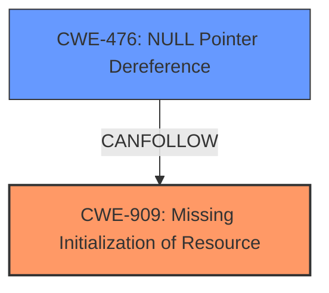

# Enhanced Analysis for CVE-2024-46896

# Summary
| CWE ID | CWE Name | Confidence | CWE Abstraction Level | CWE Vulnerability Mapping Label | CWE-Vulnerability Mapping Notes |
|---|---|---|---|---|---|
| CWE-909 | Missing Initialization of Resource | 0.75 | Class | Primary | Allowed-with-Review |
| CWE-476 | NULL Pointer Dereference | 0.6 | Base | Secondary | Allowed |

## Evidence and Confidence

*   **Confidence Score:** 0.7
*   **Evidence Strength:** MEDIUM

## Relationship Analysis
The primary relationship influencing the decision is that a **missing initialization** (CWE-909) can lead to a **NULL pointer dereference** (CWE-476). CWE-909 is a Class, while CWE-476 is a Base. The description indicates that the `job->base.sched` is being overwritten by `memset` after being initialized in `amdgpu_job_alloc`.



## Vulnerability Chain
The vulnerability chain starts with a **missing initialization** due to the `memset` overwriting a previously initialized value. This leads to a bogus ring value and ultimately a **NULL pointer dereference**, causing the machine to crash.

Missing Initialization -> NULL Pointer Dereference -> Crash

## Summary of Analysis
The initial analysis focused on the **root cause**, which is the **overwriting of the initialized value**. The fact that the `memset` operation effectively un-initializes the resource led to the selection of CWE-909 as the primary weakness. The crash results from the NULL pointer dereference, so CWE-476 is a secondary concern. The evidence, "accessing job->base.sched can produce unexpected results as the initialisation of (*job)->base.sched done in amdgpu_job_alloc is overwritten by the memset," directly supports this assessment. The relationship graph shows how the missing initialization can lead to the NULL pointer dereference. CWE-909 is used because the resource is initialized at one point, but then the initialization is lost.

Relevant CWE Information:

# Enhanced Context (25 CWEs)
The following CWEs were identified as potentially relevant to this vulnerability:

## CWE-667: Improper Locking
**Abstraction Level**: Class
**Similarity Score**: 0.75
**Source**: dense

**Description**:
The product does not properly acquire or release a lock on a resource, leading to unexpected resource state changes and behaviors.

**Mapping Guidance**:
- Usage: Allowed-with-Review
- Rationale: This CWE entry is a Class and might have Base-level children that would be more appropriate


## CWE-362: Concurrent Execution using Shared Resource with Improper Synchronization ('Race Condition')
**Abstraction Level**: Class
**Similarity Score**: 0.73
**Source**: dense

**Description**:
The product contains a concurrent code sequence that requires temporary, exclusive access to a shared resource, but a timing window exists in which the shared resource can be modified by another code sequence operating concurrently.

**Mapping Guidance**:
- Usage: Allowed-with-Review
- Rationale: This CWE entry is a Class and might have Base-level children that would be more appropriate


## CWE-1285: Improper Validation of Specified Index, Position, or Offset in Input
**Abstraction Level**: Base
**Similarity Score**: 0.73
**Source**: dense

**Description**:
The product receives input that is expected to specify an index, position, or offset into an indexable resource such as a buffer or file, but it does not validate or incorrectly validates that the specified index/position/offset has the required properties.

**Mapping Guidance**:
- Usage: Allowed
- Rationale: This CWE entry is at the Base level of abstraction, which is a preferred level of abstraction for mapping to the root causes of vulnerabilities.


## CWE-909: Missing Initialization of Resource
**Abstraction Level**: Class
**Similarity Score**: 0.73
**Source**: dense

**Description**:
The product does not initialize a critical resource.

**Mapping Guidance**:
- Usage: Allowed-with-Review
- Rationale: This CWE entry is a Class and might have Base-level children that would be more appropriate

## Technical Explanation for CWE-909: Missing Initialization of Resource
- **How it matches:** The vulnerability description states that the **memset** overwrites the initialization of `job->base.sched`, effectively causing it to be uninitialized at a later point in the code. This leads to unexpected results and a crash.
- **Security Implications:** The **missing initialization** leads to incorrect program behavior and can ultimately lead to a crash, as seen in this vulnerability.
- **Parent-Child Relationships:** While CWE-909 is a Class, there aren't more specific children that precisely fit the scenario of an overwrite causing a missing initialization.
- **Primary/Secondary:** Primary, as it is the **root cause** of the vulnerability.
- **MITRE Mapping Guidance:** The usage is "Allowed-with-Review," which is acceptable since there isn't a more specific Base or Variant available.

## Technical Explanation for CWE-476: NULL Pointer Dereference
- **How it matches:** The uninitialized `ring` value leads to a NULL pointer being passed to `amdgpu_ib_free()`, resulting in a crash.
- **Security Implications:** A NULL pointer dereference leads to a crash, causing a denial of service.
- **Parent-Child Relationships:** CWE-476 is a Base-level CWE, which is a suitable level of abstraction.
- **Primary/Secondary:** Secondary, as it is a consequence of the **missing initialization**.
- **MITRE Mapping Guidance:** The usage is "Allowed," indicating it's a valid mapping.

**CWEs Considered but Not Used:**

*   **CWE-911: Improper Update of Reference Count:** While this CWE has a high retriever score, it doesn't accurately represent the **root cause**. The issue is not about incorrect reference counting but about the initialization being overwritten.
*   **CWE-835: Loop with Unreachable Exit Condition ('Infinite Loop'):** This CWE is not relevant to the vulnerability.
*   **CWE-824: Access of Uninitialized Pointer:** This is similar to CWE-476, but CWE-476 is more specific because the code dereferences a NULL pointer.
*   **CWE-667: Improper Locking:** This is not relevant, as the vulnerability doesn't involve locking issues.
*   **CWE-665: Improper Initialization:** Although the issue involves initialization, the **root cause** is not that something was never initialized but that it was initialized and then overwritten, which is closer to Missing Initialization.


## CWE Relationship Analysis

Current CWEs represent these abstraction levels: .


### Vulnerability Chain Analysis

**Chain starting from CWE-476:**
- 476 (NULL Pointer Dereference) - ROOT


**Chain starting from CWE-911:**
- 911 (Improper Update of Reference Count) - ROOT


### CWE Relationship Diagram

```mermaid
graph TD
    classDef primary fill:#f96,stroke:#333,stroke-width:2px
    classDef secondary fill:#69f,stroke:#333
    classDef tertiary fill:#9e9,stroke:#333
```