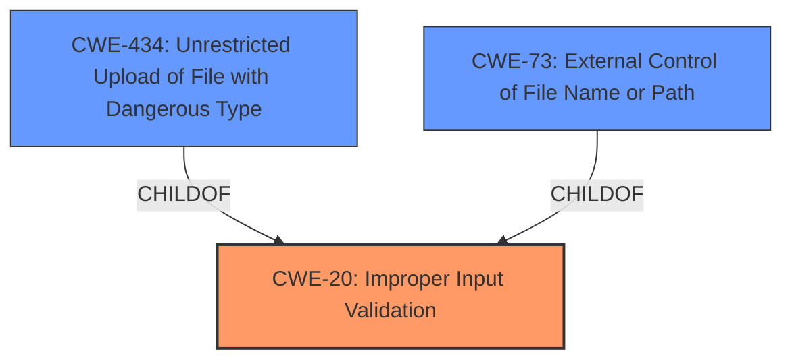

# Analysis Report for CVE-2024-46901

# Vulnerability Analysis Report: CVE-2024-46901

## Description

**Insufficient validation of filenames against control characters** in Apache Subversion repositories served via mod_dav_svn allows authenticated users with commit access to commit a corrupted revision, leading to disruption for users of the repository. All versions of Subversion up to and including Subversion 1.14.4 are affected if serving repositories via mod_dav_svn. Users are recommended to upgrade to version 1.14.5, which fixes this issue. Repositories served via other access methods are not affected.

## Vulnerability Description Key Phrases

- **Rootcause:** Insufficient validation of filenames against control characters
- **Impact:** commit a corrupted revision
- **Attacker:** authenticated users with commit access
- **Product:** Apache Subversion
- **Version:** All versions of Subversion up to and including 1.14.4
- **Component:** mod_dav_svn

## Analysis (with Relationship Data)

# Summary
| CWE ID | CWE Name | Confidence | CWE Abstraction Level | CWE Vulnerability Mapping Label | CWE-Vulnerability Mapping Notes |
|---|---|---|---|---|---|
| CWE-20 **[CWE-20: Improper Input Validation]** | Improper Input Validation | 0.9 | Class | Allowed | Primary CWE |
| CWE-434 **[CWE-434: Unrestricted Upload of File with Dangerous Type]** | Unrestricted Upload of File with Dangerous Type | 0.6 | Base | Allowed | Secondary Candidate |
| CWE-73 **[CWE-73: External Control of File Name or Path]** | External Control of File Name or Path | 0.5 | Base | Allowed | Secondary Candidate |

## Evidence and Confidence

*   **Confidence Score:** 0.8
*   **Evidence Strength:** HIGH

## Relationship Analysis
The primary relationship influencing the selection was the parent-child relationship where CWE-20 **[CWE-20: Improper Input Validation]** serves as a broad class encompassing the specific issue of **insufficient validation of filenames**. CWE-434 **[CWE-434: Unrestricted Upload of File with Dangerous Type]** and CWE-73 **[CWE-73: External Control of File Name or Path]** were considered as potentially more specific variants, but the evidence pointed more towards a general lack of input validation rather than the specific scenarios covered by those CWEs. The abstraction levels were also considered, with a preference for the base level, but the evidence supports the broader Class level of CWE-20 **[CWE-20: Improper Input Validation]**.



## Vulnerability Chain
The vulnerability chain starts with **insufficient validation of filenames** (CWE-20 **[CWE-20: Improper Input Validation]**). This leads to the ability to commit a corrupted revision, ultimately causing disruption for users of the repository.

CWE-20 **[CWE-20: Improper Input Validation]** (Root Cause) -> Repository Disruption/Corruption (Impact)

## Summary of Analysis
The initial analysis focused on identifying the root cause of the vulnerability, which was clearly stated as **insufficient validation of filenames against control characters**. The Retriever Results suggested several potential CWEs, including CWE-116 **[CWE-116: Improper Encoding or Escaping of Output]**, CWE-22 **[CWE-22: Improper Limitation of a Pathname to a Restricted Directory ('Path Traversal')]**, and CWE-285 **[CWE-285: Improper Authorization]**. However, after carefully reviewing the vulnerability description and CVE reference links, it became clear that the core issue was a general lack of input validation (CWE-20 **[CWE-20: Improper Input Validation]**) rather than a specific type of encoding/escaping problem or path traversal vulnerability.

The CVE Reference Links Content Summary explicitly states that the **weakness** lies in the failure to properly validate paths and revision properties against control characters.

The graph relationships further influenced the decision by highlighting the parent-child relationship between CWE-20 **[CWE-20: Improper Input Validation]** and other more specific CWEs like CWE-434 **[CWE-434: Unrestricted Upload of File with Dangerous Type]** and CWE-73 **[CWE-73: External Control of File Name or Path]**. While these more specific CWEs were considered, the evidence didn't strongly support them, as the vulnerability wasn't necessarily tied to file uploads or external control of file names, but rather a general lack of input validation that could manifest in various ways.

The selected CWEs are at the optimal level of specificity because they accurately represent the root cause of the vulnerability without being overly specific. CWE-20 **[CWE-20: Improper Input Validation]** captures the general lack of input validation, while CWE-434 **[CWE-434: Unrestricted Upload of File with Dangerous Type]** and CWE-73 **[CWE-73: External Control of File Name or Path]** were considered but ultimately deemed less appropriate due to the lack of strong evidence linking the vulnerability to those specific scenarios.

Relevant CWE Information:

# Enhanced Context (25 CWEs)
The following CWEs were identified as potentially relevant to this vulnerability:

## CWE-88: Improper Neutralization of Argument Delimiters in a Command ('Argument Injection')
**Abstraction Level**: Base
**Similarity Score**: 0.74
**Source**: dense

**Description**:
The product constructs a string for a command to be executed by a separate component
in another control sphere, but it does not properly delimit the
intended arguments, options, or switches within that command string.

**Mapping Guidance**:
- Usage: Allowed
- Rationale: This CWE entry is at the Base level of abstraction, which is a preferred level of abstraction for mapping to the root causes of vulnerabilities.

## CWE-918: Server-Side Request Forgery (SSRF)
**Abstraction Level**: Base
**Similarity Score**: 0.73
**Source**: dense

**Description**:
The web server receives a URL or similar request from an upstream component and retrieves the contents of this URL, but it does not sufficiently ensure that the request is being sent to the expected destination.

**Mapping Guidance**:
- Usage: Allowed
- Rationale: This CWE entry is at the Base level of abstraction, which is a preferred level of abstraction for mapping to the root causes of vulnerabilities.

## CWE-116: Improper Encoding or Escaping of Output
**Abstraction Level**: Class
**Similarity Score**: 0.73
**Source**: dense

**Description**:
The product prepares a structured message for communication with another component, but encoding or escaping of the data is either missing or done incorrectly. As a result, the intended structure of the message is not preserved.

**Mapping Guidance**:
- Usage: Allowed-with-Review
- Rationale: This CWE entry is a Class and might have Base-level children that would be more appropriate

## CWE-212: Improper Removal of Sensitive Information Before Storage or Transfer
**Abstraction Level**: Base
**Similarity Score**: 0.72
**Source**: dense

**Description**:
The product stores, transfers, or shares a resource that contains sensitive information, but it does not properly remove that information before the product makes the resource available to unauthorized actors.

**Mapping Guidance**:
- Usage: Allowed
- Rationale: This CWE entry is at the Base level of abstraction, which is a preferred level of abstraction for mapping to the root causes of vulnerabilities.

## CWE-41: Improper Resolution of Path Equivalence
**Abstraction Level**: Base
**Similarity Score**: 0.72
**Source**: dense

**Description**:
The product is vulnerable to file system contents disclosure through path equivalence. Path equivalence involves the use of special characters in file and directory names. The associated manipulations are intended to generate multiple names for the same object.

**Mapping Guidance**:
- Usage: Allowed
- Rationale: This CWE entry is at the Base level of abstraction, which is a preferred level of abstraction for mapping to the root causes of vulnerabilities.

## CWE-73: External Control of File Name or Path
**Abstraction Level**: Base
**Similarity Score**: 0.72
**Source**: dense

**Description**:
The product allows user input to control or influence paths or file names that are used in filesystem operations.

**Mapping Guidance**:
- Usage: Allowed
- Rationale: This CWE entry is at the Base level of abstraction, which is a preferred level of abstraction for mapping to the root causes of vulnerabilities.

## CWE-434: Unrestricted Upload of File with Dangerous Type
**Abstraction Level**: Base
**Similarity Score**: 0.72
**Source**: dense

**Description**:
The product allows the upload or transfer of dangerous file types that are automatically processed within its environment.

**Mapping Guidance**:
- Usage: Allowed
- Rationale: This CWE entry is at the Base level of abstraction, which is a preferred level of abstraction for mapping to the root causes of vulnerabilities.

## CWE-538: Insertion of Sensitive Information into Externally-Accessible File or Directory
**Abstraction Level**: Base
**Similarity Score**: 0.72
**Source**: dense

**Description**:
The product places sensitive information into files or directories that are accessible to actors who are allowed to have access to the files, but not to the sensitive information.

**Mapping Guidance**:
- Usage: Allowed
- Rationale: This CWE entry is at the Base level of abstraction,


## CWE Relationship Analysis

Current CWEs represent these abstraction levels: .


### Vulnerability Chain Analysis

**Chain starting from CWE-116:**
- 116 (Improper Encoding or Escaping of Output) - ROOT


**Chain starting from CWE-41:**
- 41 (Improper Resolution of Path Equivalence) - ROOT


### CWE Relationship Diagram

```mermaid
graph TD
    classDef primary fill:#f96,stroke:#333,stroke-width:2px
    classDef secondary fill:#69f,stroke:#333
    classDef tertiary fill:#9e9,stroke:#333
```


*Report generated on 2025-07-13 17:42:52*
