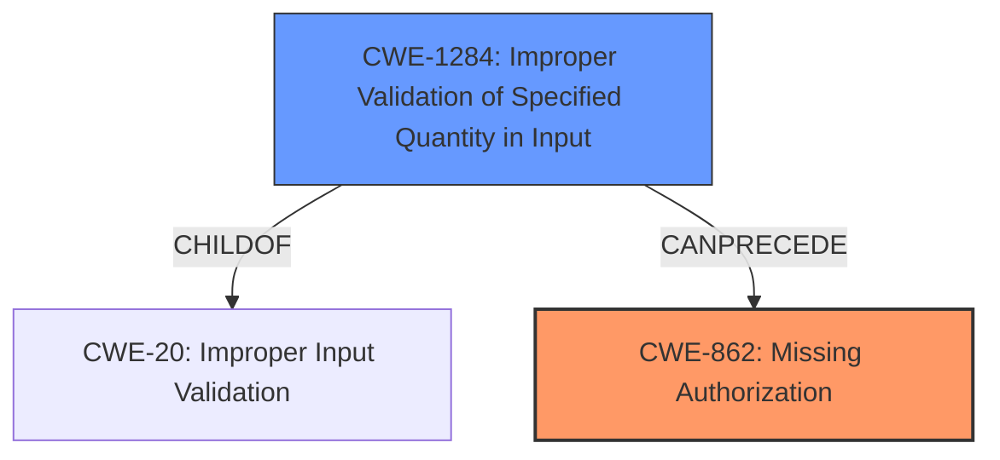

# Raw Analyzer Response for CVE-2024-4692

# Summary

| CWE ID  | CWE Name                                                                 | Confidence | CWE Abstraction Level | CWE Vulnerability Mapping Label | CWE-Vulnerability Mapping Notes |
| ------- | ------------------------------------------------------------------------ | ---------- | --------------------- | ------------------------------- | ------------------------------- |
| CWE-862 | Missing Authorization                                                    | 0.9        | Class                 | Primary                         | Allowed-with-Review             |
| CWE-1284 | Improper Validation of Specified Quantity in Input                       | 0.6        | Base                  | Secondary                       | Allowed                         |

## Evidence and Confidence

*   **Confidence Score:** 0.8
*   **Evidence Strength:** MEDIUM

## Relationship Analysis

The primary relationship influencing the decision is that CWE-862 *Missing Authorization* is a class-level CWE, whereas the vulnerability description indicates a specific missing authorization check. However, there isn't enough information to determine which Base-level child of CWE-862 is most appropriate, so the Class-level CWE is used.

## Vulnerability Chain

The vulnerability chain starts with **Improper Validation of Specified Quantity in Input** (CWE-1284), which then leads to **Missing Authorization** (CWE-862) on Service Virtualization config. The impact of this is the ability for users with Overall/Read permissions to enumerate Service Virtualization server names, thus "Exploiting Incorrectly Configured Access Control Security Levels."

## Summary of Analysis

The initial analysis considered the provided vulnerability description, the retriever results, and the enhanced context for similar CVE descriptions. The description highlights "**Improper Validation of Specified Quantity in Input, Multiple missing permission checks**" as a root cause and "Exploiting Incorrectly Configured Access Control Security Levels" as an impact.

Based on the retriever results, CWE-862 *Missing Authorization* and CWE-1284 *Improper Validation of Specified Quantity in Input* are the top candidates. According to the Authentication vs Authorization vs Access Control Guidance, since there are missing permission checks, it is an authorization issue. The vulnerability description states “Multiple **missing** permission checks - Service Virtualization config has been discovered in in OpenText Application Automation Tools.” leading to selection of **CWE-862** as the primary CWE.

CWE-1284 *Improper Validation of Specified Quantity in Input* is considered as a secondary CWE because it is also listed as a root cause in the Vulnerability Description Key Phrases. This suggests that an input related to Service Virtualization config wasn't properly validated, which then led to the missing permission check.

The relationship graph shows that CWE-1284 is a child of CWE-20 *Improper Input Validation*. This relationship further strengthens the selection of CWE-1284 as a possible secondary weakness.

The selected CWEs are at an appropriate level of specificity. CWE-862 is a Class-level CWE, as there isn't sufficient evidence to determine a more specific Base-level CWE. CWE-1284 is at the Base level of abstraction.

Relevant CWE Information:

# Enhanced Context (25 CWEs)
The following CWEs were identified as potentially relevant to this vulnerability:

## CWE-266: Incorrect Privilege Assignment
**Abstraction Level**: Base
**Similarity Score**: 0.75
**Source**: dense

**Description**:
A product incorrectly assigns a privilege to a particular actor, creating an unintended sphere of control for that actor.

**Mapping Guidance**:
- Usage: Allowed
- Rationale: This CWE entry is at the Base level of abstraction, which is a preferred level of abstraction for mapping to the root causes of vulnerabilities.

*Not Selected:* This is not an issue of assigning incorrect privileges, but rather of missing authorization checks and improper input validation.

## CWE-280: Improper Handling of Insufficient Permissions or Privileges
**Abstraction Level**: Base
**Similarity Score**: 0.74
**Source**: dense

**Description**:
The product does not handle or incorrectly handles when it has insufficient privileges to access resources or functionality as specified by their permissions. This may cause it to follow unexpected code paths that may leave the product in an invalid state.

**Mapping Guidance**:
- Usage: Allowed
- Rationale: This CWE entry is at the Base level of abstraction, which is a preferred level of abstraction for mapping to the root causes of vulnerabilities.

*Not Selected:* This CWE is too general. The vulnerability description indicates missing permission checks (CWE-862) and improper input validation (CWE-1284), which are more specific.

## CWE-267: Privilege Defined With Unsafe Actions
**Abstraction Level**: Base
**Similarity Score**: 0.74
**Source**: dense

**Description**:
A particular privilege, role, capability, or right can be used to perform unsafe actions that were not intended, even when it is assigned to the correct entity.

**Mapping Guidance**:
- Usage: Allowed
- Rationale: This CWE entry is at the Base level of abstraction, which is a preferred level of abstraction for mapping to the root causes of vulnerabilities.

*Not Selected:* Not applicable. The vulnerability is not about unsafe actions associated with a defined privilege, but about missing authorization checks.

## CWE-274: Improper Handling of Insufficient Privileges
**Abstraction Level**: Base
**Similarity Score**: 0.73
**Source**: dense

**Description**:
The product does not handle or incorrectly handles when it has insufficient privileges to perform an operation, leading to resultant weaknesses.

**Mapping Guidance**:
- Usage: Discouraged
- Rationale: This CWE entry could be deprecated in a future version of CWE.

*Not Selected:* This CWE is too general. The vulnerability description indicates missing permission checks (CWE-862) and improper input validation (CWE-1284), which are more specific. Also, the guidance discourages using this CWE.

## CWE-668: Exposure of Resource to Wrong Sphere
**Abstraction Level**: Class
**Similarity Score**: 0.73
**Source**: dense

**Description**:
The product exposes a resource to the wrong control sphere, providing unintended actors with inappropriate access to the resource.

**Mapping Guidance**:
- Usage: Discouraged
- Rationale: CWE-668 is high-level and is often misused as a catch-all when lower-level CWE IDs might be applicable. It is sometimes used for low-information vulnerability reports [REF-1287]. It is a level-1 Class (i.e., a child of a Pillar). It is not useful for trend analysis.

*Not Selected:* This CWE is too high-level and discouraged. More specific CWEs like CWE-862 and CWE-1284 are more appropriate.

## CWE-41: Improper Resolution of Path Equivalence
**Abstraction Level**: Base
**Similarity Score**: 0.72
**Source**: dense

**Description**:
The product is vulnerable to file system contents disclosure through path equivalence. Path equivalence involves the use of special characters in file and directory names. The associated manipulations are intended to generate multiple names for the same object.

**Mapping Guidance**:
- Usage: Allowed
- Rationale: This CWE entry is at the Base level of abstraction, which is a preferred level of abstraction for mapping to the root causes of vulnerabilities.

*Not Selected:* Not applicable. This vulnerability is not related to path equivalence or file system manipulation.

## CWE-807: Reliance on Untrusted Inputs in a Security Decision
**Abstraction Level**: Base
**Similarity Score**: 0.72
**Source**: dense

**Description**:
The product uses a protection mechanism that relies on the existence or values of an input, but the input can be modified by an untrusted actor in a way that bypasses the protection mechanism.

**Mapping Guidance**:
- Usage: Allowed
- Rationale: This CWE entry is at the Base level of abstraction, which is a preferred level of abstraction for mapping to the root causes of vulnerabilities.

*Not Selected:* Although untrusted input is part of the vulnerability (CWE-1284), the primary issue is the missing authorization (CWE-862).

## CWE-472: External Control of Assumed-Immutable Web Parameter
**Abstraction Level**: Base
**Similarity Score**: 0.72
**Source**: dense

**Description**:
The web application does not sufficiently verify inputs that are assumed to be immutable but are actually externally controllable, such as hidden form fields.

**Mapping Guidance**:
- Usage: Allowed
- Rationale: This CWE entry is at the Base level of abstraction, which is a preferred level of abstraction for mapping to the root causes of vulnerabilities.

*Not Selected:* The description doesn't provide