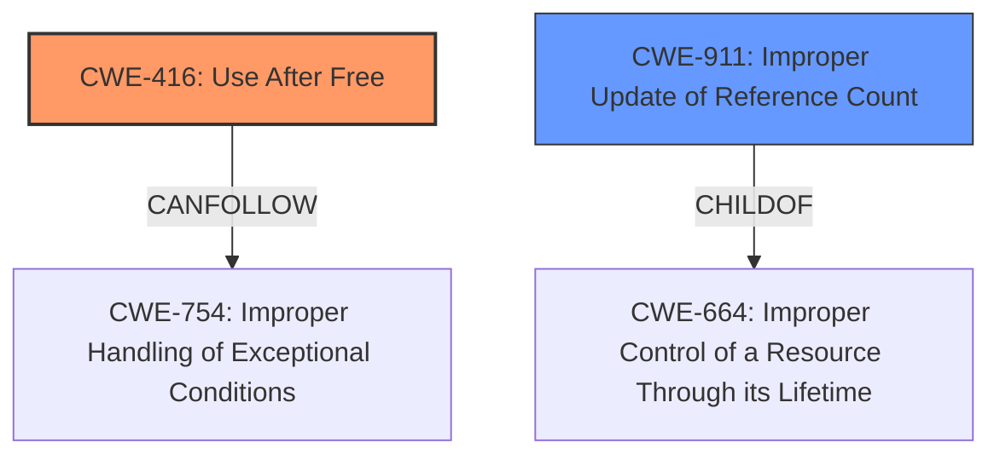

# Enhanced Analysis for CVE-2024-46972

# Summary
| CWE ID | CWE Name | Confidence | CWE Abstraction Level | CWE Vulnerability Mapping Label | CWE-Vulnerability Mapping Notes |
|---|---|---|---|---|---|
| CWE-416 | Use After Free | 1.0 | Variant | Allowed | Primary CWE. The vulnerability description explicitly mentions a "use-after-free" condition. |
| CWE-911 | Improper Update of Reference Count | 0.7 | Base | Allowed | Secondary CWE. The CVE Reference Links Content Summary indicates that the root cause is a "Reference count overflow". |

## Evidence and Confidence

*   **Confidence Score:** 0.85
*   **Evidence Strength:** MEDIUM

## Relationship Analysis
The primary CWE is CWE-416, which is a variant-level CWE. CWE-416 can be caused by a variety of issues, including improper update of reference counts (CWE-911). This relationship influenced the decision to include CWE-911 as a secondary CWE.



## Vulnerability Chain
The vulnerability chain starts with an **improper update of a reference count** (CWE-911) which leads to a **use-after-free** condition (CWE-416). The **use-after-free** allows a non-privileged user to conduct improper GPU system calls to trigger kernel exceptions.

## Summary of Analysis
The primary weakness is a **use-after-free** (CWE-416) vulnerability, which is explicitly stated in the vulnerability description. The root cause is identified in the CVE Reference Links Content Summary as a "Reference count overflow". This maps to CWE-911, "Improper Update of Reference Count", which is included as a secondary CWE. The confidence is high because there is explicit mention of **use-after-free** in the description and the root cause is a reference count overflow. The selection of CWE-416 is at the variant level, which is appropriate given the specific nature of the vulnerability as explicitly stated in the description.

CWEs considered but not used:

*   CWE-415: Double Free - While related to memory management issues, the description specifies **use-after-free**, not a double free.
*   CWE-362, CWE-367, CWE-667, CWE-364: These CWEs relate to race conditions and concurrency issues. While concurrency issues can sometimes lead to use-after-free vulnerabilities, there isn't sufficient evidence to suggest that a race condition is directly involved in this case.
*   CWE-131: Incorrect Calculation of Buffer Size - No evidence of buffer size miscalculation is present.
*   CWE-123: Write-what-where Condition - While a potential consequence of use-after-free, it is not the primary weakness.
*   CWE-1256: Improper Restriction of Software Interfaces to Hardware Features - This is a more general CWE and less applicable than the explicit use-after-free.


## CWE Relationship Analysis

Current CWEs represent these abstraction levels: .


### Vulnerability Chain Analysis

**Chain starting from CWE-123:**
- 123 (Write-what-where Condition) - ROOT


**Chain starting from CWE-416:**
- 416 (Use After Free) - ROOT


### CWE Relationship Diagram

```mermaid
graph TD
    classDef primary fill:#f96,stroke:#333,stroke-width:2px
    classDef secondary fill:#69f,stroke:#333
    classDef tertiary fill:#9e9,stroke:#333
```