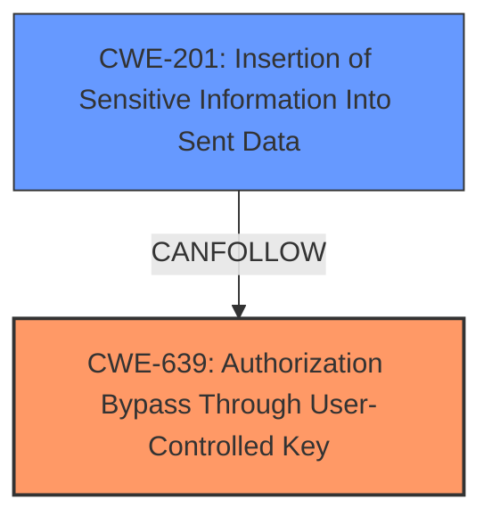

# Analysis Report for CVE-2024-46979

# Vulnerability Analysis Report: CVE-2024-46979

## Description

XWiki Platform is a generic wiki platform offering runtime services for applications built on top of it. Its possible to get access to notification filters of any user by using a URL such as `xwiki/bin/get/XWiki/Notifications/Code/NotificationFilterPreferenceLivetableResults?outputSyntax=plain&type=custom&user=`. This vulnerability impacts all versions of XWiki since 13.2-rc-1. The filters do not provide much information (they mainly contain references which are public data in XWiki), though some info could be used in combination with other vulnerabilities. This vulnerability has been patched in XWiki 14.10.21, 15.5.5, 15.10.1, 16.0RC1. The patch consists in checking the rights of the user when sending the data. Users are advised to upgrade. Its possible to workaround the vulnerability by applying manually the patch its possible for an administrator to edit directly the document `XWiki.Notifications.Code.NotificationFilterPreferenceLivetableResults` to apply the same changes as in the patch. See commit c8c6545f9bde6f5aade994aa5b5903a67b5c2582.

## Vulnerability Description Key Phrases

- **Impact:** access notification filters of any user
- **Product:** XWiki Platform
- **Version:** since 13.2-rc-1

## Analysis (with Relationship Data)

# Summary

| CWE ID | CWE Name | Confidence | CWE Abstraction Level | CWE Vulnerability Mapping Label | CWE-Vulnerability Mapping Notes |
|---|---|---|---|---|---|
| CWE-639 | Authorization Bypass Through User-Controlled Key | 0.9 | Base | Allowed | Primary CWE. The application uses user-supplied input to access user-specific data without proper authorization checks. |
| CWE-201 | Insertion of Sensitive Information Into Sent Data | 0.7 | Base | Allowed | Secondary candidate. Information is being leaked to an unauthorized actor. |

## Evidence and Confidence

*   **Confidence Score:** 0.8
*   **Evidence Strength:** HIGH

## Relationship Analysis

The primary CWE is CWE-639, Authorization Bypass Through User-Controlled Key. This is a base-level CWE that directly addresses the **root cause** of the vulnerability: the system's authorization functionality doesn't prevent one user from gaining access to another user's data by modifying the key value identifying the data.

CWE-201, Insertion of Sensitive Information Into Sent Data, is a related CWE because the lack of authorization leads to the exposure of sensitive data. It's a consequence of the authorization bypass.



## Vulnerability Chain

The vulnerability chain starts with the **lack of proper authorization checks** (CWE-639), which leads to the **exposure of sensitive information** (CWE-201) in the notification filters.

## Summary of Analysis

The analysis is based on the provided evidence, including the vulnerability description and the CVE reference link content summary. The **root cause** is clearly identified as a **missing authorization check**, allowing unauthorized access to user data.

The CVE Reference Links Content Summary states: "The vulnerability stems from a **lack of proper authorization checks** in the `NotificationFilterPreferenceLivetableResults` endpoint. Specifically, the code did not verify if the requesting user had the necessary permissions to access the notification filters of other users." This statement directly supports the selection of CWE-639.

The selection of CWE-639 is at the optimal level of specificity because it directly describes the **root cause** of the vulnerability, which is the **authorization bypass**.

Relevant CWE Information:

# Enhanced Context (25 CWEs)
The following CWEs were identified as potentially relevant to this vulnerability:

## CWE-116: Improper Encoding or Escaping of Output
**Abstraction Level**: Class
**Similarity Score**: 0.78
**Source**: dense

**Description**:
The product prepares a structured message for communication with another component, but encoding or escaping of the data is either missing or done incorrectly. As a result, the intended structure of the message is not preserved.

**Mapping Guidance**:
- Usage: Allowed-with-Review
- Rationale: This CWE entry is a Class and might have Base-level children that would be more appropriate

*This CWE is not applicable because the vulnerability does not involve encoding or escaping issues.*

## CWE-201: Insertion of Sensitive Information Into Sent Data
**Abstraction Level**: Base
**Similarity Score**: 0.77
**Source**: dense

**Description**:
The code transmits data to another actor, but a portion of the data includes sensitive information that should not be accessible to that actor.

**Mapping Guidance**:
- Usage: Allowed
- Rationale: This CWE entry is at the Base level of abstraction, which is a preferred level of abstraction for mapping to the root causes of vulnerabilities.

*This CWE applies as a secondary issue because the lack of authorization results in sending data to unauthorized actors.*

## CWE-639: Authorization Bypass Through User-Controlled Key
**Abstraction Level**: Base
**Similarity Score**: 0.75
**Source**: dense

**Description**:
The system's authorization functionality does not prevent one user from gaining access to another user's data or record by modifying the key value identifying the data.

**Mapping Guidance**:
- Usage: Allowed
- Rationale: This CWE entry is at the Base level of abstraction, which is a preferred level of abstraction for mapping to the root causes of vulnerabilities.

*This CWE is the primary issue since the vulnerability allows bypassing authorization controls.*

## CWE-425: Direct Request ('Forced Browsing')
**Abstraction Level**: Base
**Similarity Score**: 0.75
**Source**: dense

**Description**:
The web application does not adequately enforce appropriate authorization on all restricted URLs, scripts, or files.

**Mapping Guidance**:
- Usage: Allowed
- Rationale: This CWE entry is at the Base level of abstraction, which is a preferred level of abstraction for mapping to the root causes of vulnerabilities.

*CWE-425 is similar to CWE-639, but CWE-639 is more specific to the user-controlled key aspect.*

## CWE-202: Exposure of Sensitive Information Through Data Queries
**Abstraction Level**: Base
**Similarity Score**: 0.74
**Source**: dense

**Description**:
When trying to keep information confidential, an attacker can often infer some of the information by using statistics.

**Mapping Guidance**:
- Usage: Allowed
- Rationale: This CWE entry is at the Base level of abstraction, which is a preferred level of abstraction for mapping to the root causes of vulnerabilities.

*CWE-202 is not as direct as CWE-201, as it focuses on information inference rather than direct data exposure.*

## CWE-209: Generation of Error Message Containing Sensitive Information
**Abstraction Level**: Base
**Similarity Score**: 0.74
**Source**: dense

**Description**:
The product generates an error message that includes sensitive information about its environment, users, or associated data.

**Mapping Guidance**:
- Usage: Allowed
- Rationale: This CWE entry is at the Base level of abstraction, which is a preferred level of abstraction for mapping to the root causes of vulnerabilities.

*This CWE is not applicable as the vulnerability does not involve error messages.*

## CWE-472: External Control of Assumed-Immutable Web Parameter
**Abstraction Level**: Base
**Similarity Score**: 0.74
**Source**: dense

**Description**:
The web application does not sufficiently verify inputs that are assumed to be immutable but are actually externally controllable, such as hidden form fields.

**Mapping Guidance**:
- Usage: Allowed
- Rationale: This CWE entry is at the Base level of abstraction, which is a preferred level of abstraction for mapping to the root causes of vulnerabilities.

*This CWE is not as relevant since the parameter isn't necessarily assumed to be immutable, just that it's not properly authorized.*

## CWE-79: Improper Neutralization of Input During Web Page Generation ('Cross-site Scripting')
**Abstraction Level**: Base
**Similarity Score**: 0.74
**Source**: dense

**Description**:
The product does not neutralize or incorrectly neutralizes user-controllable input before it is placed in output that is used as a web page that is served to other users.

**Mapping Guidance**:
- Usage: Allowed
- Rationale: This CWE entry is at the Base level of abstraction, which is a preferred level of abstraction for mapping to the root causes of vulnerabilities.

*This CWE is not applicable because the vulnerability does not involve XSS.*

## CWE-267: Privilege Defined With Unsafe Actions
**Abstraction Level**: Base
**Similarity Score**: 0.74
**Source**: dense

**Description**:
A particular privilege, role, capability, or right can be used to perform unsafe actions that were not intended, even when it is assigned to the correct entity.

**Mapping Guidance**:
- Usage: Allowed
- Rationale: This CWE entry is at the Base level of abstraction, which is a preferred level of abstraction for mapping to the root causes of vulnerabilities.

*This CWE doesn't fit well as it is more about privileges being misused.*

## CWE-497: Exposure of Sensitive System Information to an Unauthorized Control Sphere
**Abstraction Level**: Base
**Similarity Score**: 0.74
**Source**: dense

**Description**:
The product does not properly prevent sensitive system-level information from being accessed by unauthorized actors who do not have the same level of access to the underlying system as the product does.

**Mapping Guidance**:
- Usage: Allowed
- Rationale: This CWE entry is at the Base level of abstraction, which is a preferred level of abstraction for mapping to the root causes of vulnerabilities.

*This CWE is more general and doesn't fit as well as CWE-201.*

## CWE-116: Improper Encoding or Escaping of Output
**Abstraction Level**: Class
**Similarity Score**: 1384.38
**Source**: sparse

**Description**:
The product prepares a structured message for communication with another component, but encoding or escaping of the data is either missing or done incorrectly. As a result, the intended


## CWE Relationship Analysis

Current CWEs represent these abstraction levels: .


### Vulnerability Chain Analysis

**Chain starting from CWE-116:**
- 116 (Improper Encoding or Escaping of Output) - ROOT


**Chain starting from CWE-639:**
- 639 (Authorization Bypass Through User-Controlled Key) - ROOT


### CWE Relationship Diagram

```mermaid
graph TD
    classDef primary fill:#f96,stroke:#333,stroke-width:2px
    classDef secondary fill:#69f,stroke:#333
    classDef tertiary fill:#9e9,stroke:#333
```


*Report generated on 2025-07-13 17:49:44*
