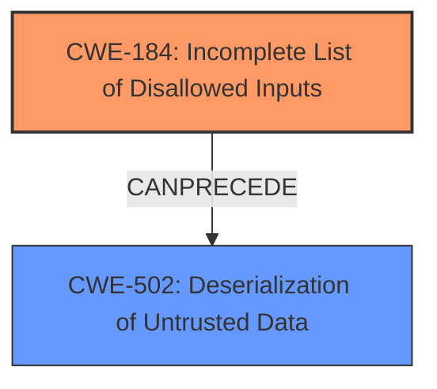

# Analysis Report for CVE-2024-46983

# Vulnerability Analysis Report: CVE-2024-46983

## Description

sofa-hessian is an internal improved version of Hessian3/4 powered by Ant Group CO., Ltd. The SOFA Hessian protocol uses a blacklist mechanism to restrict **deserialization** of potentially dangerous classes for security protection. But there is a gadget chain that can **bypass the SOFA Hessian blacklist protection mechanism**, and this gadget chain only relies on JDK and does not rely on any third-party components. This issue is fixed by an update to the blacklist, users can upgrade to sofahessian version 3.5.5 to avoid this issue. Users unable to upgrade may maintain a blacklist themselves in the directory `external/serialize.blacklist`.

## Vulnerability Description Key Phrases

- **Weakness:** ['bypass the SOFA Hessian blacklist protection mechanism', 'deserialization']
- **Product:** SOFA Hessian protocol

## Analysis (with Relationship Data)

# Summary
| CWE ID | CWE Name | Confidence | CWE Abstraction Level | CWE Vulnerability Mapping Label | CWE-Vulnerability Mapping Notes |
|---|---|---|---|---|---|
| CWE-184 | Incomplete List of Disallowed Inputs | 1.0 | Base | Primary | Allowed |
| CWE-502 | Deserialization of Untrusted Data | 0.8 | Base | Secondary | Allowed |

## Evidence and Confidence

*   **Confidence Score:** 0.9
*   **Evidence Strength:** HIGH

## Relationship Analysis
The primary relationship is that CWE-184 [Incomplete List of Disallowed Inputs] is often a prerequisite for CWE-502 [Deserialization of Untrusted Data] vulnerabilities. The blacklist is intended to prevent deserialization of dangerous classes (CWE-502), but the **incomplete list** (CWE-184) allows bypasses. CWE-184 is a base CWE, which is at the preferred level of abstraction. CWE-502 is also a base CWE.



## Vulnerability Chain
The vulnerability chain starts with an **incomplete list of disallowed inputs** (CWE-184). This allows an attacker to provide input that should have been blocked. The **deserialization** process (CWE-502) then processes this malicious input, leading to a potential security breach.

## Summary of Analysis
The primary weakness is the **incomplete blacklist** that allows certain inputs to bypass security restrictions. This directly corresponds to CWE-184 [Incomplete List of Disallowed Inputs]. The fact that this bypass leads to **deserialization** of untrusted data (CWE-502) makes CWE-502 a secondary concern, as it's the consequence of the bypass. The vulnerability description explicitly mentions the "SOFA Hessian blacklist protection mechanism" being bypassed, which is direct evidence for CWE-184.

Relevant CWE Information:

# Enhanced Context (25 CWEs)
The following CWEs were identified as potentially relevant to this vulnerability:

## CWE-303: Incorrect Implementation of Authentication Algorithm
**Abstraction Level**: Base
**Similarity Score**: 0.70
**Source**: dense

**Description**:
The requirements for the product dictate the use of an established authentication algorithm, but the implementation of the algorithm is incorrect.
- Not selected. This vulnerability is about an incomplete list for deserialization, not authentication.

## CWE-1391: Use of Weak Credentials
**Abstraction Level**: Class
**Similarity Score**: 0.70
**Source**: dense

**Description**:
The product uses weak credentials (such as a default key or hard-coded password) that can be calculated, derived, reused, or guessed by an attacker.
- Not selected. This vulnerability is about an incomplete list for deserialization, not weak credentials.

## CWE-807: Reliance on Untrusted Inputs in a Security Decision
**Abstraction Level**: Base
**Similarity Score**: 0.70
**Source**: dense

**Description**:
The product uses a protection mechanism that relies on the existence or values of an input, but the input can be modified by an untrusted actor in a way that bypasses the protection mechanism.
- Not selected. While there is reliance on untrusted inputs, the more specific CWE-184 is a better fit since there is a blacklist in place that is incomplete.

## CWE-657: Violation of Secure Design Principles
**Abstraction Level**: Class
**Similarity Score**: 0.69
**Source**: dense

**Description**:
The product violates well-established principles for secure design.
- Not selected. This is a very general CWE and doesn't accurately reflect the specific weakness.

## CWE-345: Insufficient Verification of Data Authenticity
**Abstraction Level**: Class
**Similarity Score**: 0.69
**Source**: dense

**Description**:
The product does not sufficiently verify the origin or authenticity of data, in a way that causes it to accept invalid data.
- Not selected. While related to **deserialization**, it is not the root cause. The root cause is the **incomplete blacklist**.

## CWE-696: Incorrect Behavior Order
**Abstraction Level**: Class
**Similarity Score**: 0.69
**Source**: dense

**Description**:
The product performs multiple related behaviors, but the behaviors are performed in the wrong order in ways which may produce resultant weaknesses.
- Not selected. This vulnerability is not related to incorrect behavior order.

## CWE-183: Permissive List of Allowed Inputs
**Abstraction Level**: Base
**Similarity Score**: 0.68
**Source**: dense

**Description**:
The product implements a protection mechanism that relies on a list of inputs (or properties of inputs) that are explicitly allowed by policy because the inputs are assumed to be safe, but the list is too permissive - that is, it allows an input that is unsafe, leading to resultant weaknesses.
- Not selected. The description mentions a blacklist, so CWE-184 is a better fit than CWE-183.

## CWE-294: Authentication Bypass by Capture-replay
**Abstraction Level**: Base
**Similarity Score**: 0.68
**Source**: dense

**Description**:
A capture-replay flaw exists when the design of the product makes it possible for a malicious user to sniff network traffic and bypass authentication by replaying it to the server in question to the same effect as the original message (or with minor changes).
- Not selected. This vulnerability is not related to authentication bypass by capture-replay.

## CWE-703: Improper Check or Handling of Exceptional Conditions
**Abstraction Level**: Pillar
**Similarity Score**: 0.68
**Source**: dense

**Description**:
The product does not properly anticipate or handle exceptional conditions that rarely occur during normal operation of the product.
- Not selected. This is a very general CWE (Pillar) and doesn't accurately reflect the specific weakness.

## CWE-138: Improper Neutralization of Special Elements
**Abstraction Level**: Class
**Similarity Score**: 0.68
**Source**: dense

**Description**:
The product receives input from an upstream component, but it does not neutralize or incorrectly neutralizes special elements that could be interpreted as control elements or syntactic markers when they are sent to a downstream component.
- Not selected. While related to **deserialization**, it is not the root cause. The root cause is the **incomplete blacklist**.

## CWE-184: Incomplete List of Disallowed Inputs
**Abstraction Level**: Base
**Similarity Score**: 1445.65
**Source**: sparse

**Description**:
The product implements a protection mechanism that relies on a list of inputs (or properties of inputs) that are not allowed by policy or otherwise require other action to neutralize before additional processing takes place, but the list is incomplete.
- Selected as the primary CWE. The vulnerability description highlights that the "SOFA Hessian protocol uses a blacklist mechanism" and that the vulnerability involves a bypass of this mechanism.

## CWE-863: Incorrect Authorization
**Abstraction Level**: Class
**Similarity Score**: 1306.26
**Source**: sparse

**Description**:
The product performs an authorization check when an actor attempts to access a resource or perform an action, but it does not correctly perform the check.
- Not selected. This vulnerability is about an incomplete list for deserialization, not incorrect authorization.

## CWE-807: Reliance on Untrusted Inputs in a Security Decision
**Abstraction Level**: Base
**Similarity Score**: 1290.82
**Source**: sparse

**Description**:
The product uses a protection mechanism that relies on the existence or values of an input, but the input can be modified by an untrusted actor in a way that bypasses the protection mechanism.
- Not selected. While there is reliance on untrusted inputs, the more specific CWE-184 is a better fit since there is a blacklist in place that is incomplete.

## CWE-285: Improper Authorization
**Abstraction Level**: Class
**Similarity Score**: 1285.71
**Source**: sparse

**Description**:
The product does not perform or incorrectly performs an authorization check when an actor attempts to access a resource or perform an action.
- Not selected. This vulnerability is about an incomplete list for deserialization, not improper authorization.

## CWE-502: Deserialization of Untrusted Data
**Abstraction Level**: Base
**Similarity Score**: 1261.10
**Source**: sparse

**Description**:
The product deserializes untrusted data without sufficiently ensuring that the resulting data will be valid.
- Selected as a secondary CWE. The vulnerability description mentions "deserialization" and a bypass of the blacklist, which allows the **deserialization of potentially dangerous classes**.

## CWE-49


## CWE Relationship Analysis

Current CWEs represent these abstraction levels: .


### Vulnerability Chain Analysis

**Chain starting from CWE-183:**
- 183 (Permissive List of Allowed Inputs) - ROOT


**Chain starting from CWE-502:**
- 502 (Deserialization of Untrusted Data) - ROOT


### CWE Relationship Diagram

```mermaid
graph TD
    classDef primary fill:#f96,stroke:#333,stroke-width:2px
    classDef secondary fill:#69f,stroke:#333
    classDef tertiary fill:#9e9,stroke:#333
```


*Report generated on 2025-07-13 17:50:02*
