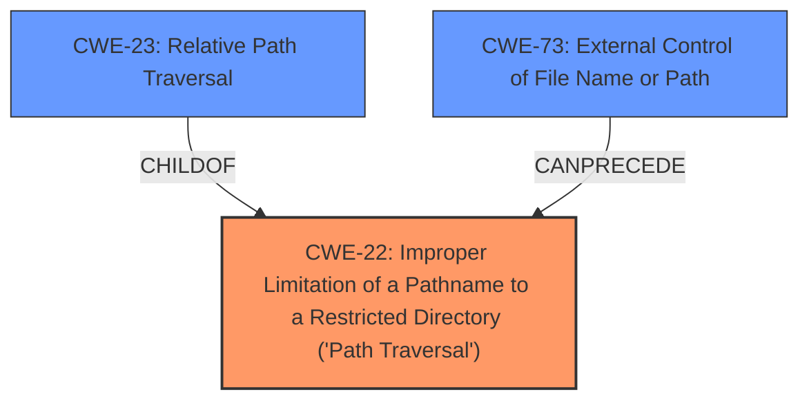

# Analysis for CVE-2024-46987

# Summary

| CWE ID  | CWE Name                                                                    | Confidence | CWE Abstraction Level | CWE Vulnerability Mapping Label | CWE-Vulnerability Mapping Notes |
| ------- | --------------------------------------------------------------------------- | ---------- | --------------------- | ------------------------------- | ------------------------------- |
| CWE-22  | Improper Limitation of a Pathname to a Restricted Directory ('Path Traversal') | 1          | Base                  | Primary                         | Allowed                         |

## Evidence and Confidence

*   **Confidence Score:** 1
*   **Evidence Strength:** HIGH

## Relationship Analysis

The primary CWE identified is CWE-22, which is a Base level CWE. Several other CWEs were considered, including CWE-23 (Relative Path Traversal) and CWE-73 (External Control of File Name or Path). CWE-22 was selected because it directly addresses the **improper limitation of a pathname to a restricted directory**. The vulnerability description explicitly mentions a "**path traversal vulnerability**" and the ability for authenticated users to download arbitrary files, indicating a failure to properly restrict the path. CWE-23 is a child of CWE-22 and specifies the relative path traversal. CWE-73 can precede CWE-22 in a vulnerability chain.

## Vulnerability Chain

The vulnerability chain starts with **improper input validation** of the file parameter, leading to **Path Traversal (CWE-22)**. This, in turn, results in **Information Disclosure**, as attackers can access sensitive files outside the intended directory.

## Summary of Analysis

The analysis is based on the provided vulnerability description and the CVE Reference Links Content Summary. The vulnerability description explicitly states a "**path traversal vulnerability**" exists. The CVE Reference Links Content Summary confirms that the vulnerability stems from a lack of proper input validation and sanitization, leading to **Path Traversal (CWE-22)** and subsequent Information Disclosure. The PoC uses a URL like `https:///admin/media/download_private_file?file=../../../../../../etc/passwd` to retrieve the `/etc/passwd` file.

The choice of CWE-22 is also supported by the Retriever Results, which lists it as the top candidate. The selection is further justified by the CWE's description, which aligns perfectly with the vulnerability's characteristics. CWE-22 is at the optimal level of specificity (Base) for this vulnerability.

Other CWEs Considered:

*   CWE-23 (Relative Path Traversal): Considered as a more specific variant of CWE-22, but the description doesn't explicitly mention relative path traversal, so it was not selected as the primary CWE.
*   CWE-73 (External Control of File Name or Path): This CWE describes the broader issue of user-controlled file paths. While relevant, CWE-22 more accurately captures the specific vulnerability of path traversal.
*   CWE-41 (Improper Resolution of Path Equivalence): Similar to CWE-22, but more specific to path equivalence issues. Since the vulnerability is primarily path traversal, CWE-22 is a better fit.
*   CWE-285 (Improper Authorization): Though authenticated users are required, the primary issue is **lack of proper path validation**, not authorization.

Relevant CWE Information:

# Enhanced Context (25 CWEs)

## CWE-41: Improper Resolution of Path Equivalence

**Abstraction Level**: Base
**Similarity Score**: 0.80
**Source**: dense

**Description**:
The product is vulnerable to file system contents disclosure through path equivalence. Path equivalence involves the use of special characters in file and directory names. The associated manipulations are intended to generate multiple names for the same object.

**Mapping Guidance**:
- Usage: Allowed
- Rationale: This CWE entry is at the Base level of abstraction, which is a preferred level of abstraction for mapping to the root causes of vulnerabilities.

## CWE-23: Relative Path Traversal

**Abstraction Level**: Base
**Similarity Score**: 0.80
**Source**: dense

**Description**:
The product uses external input to construct a pathname that should be within a restricted directory, but it does not properly neutralize sequences such as ".." that can resolve to a location that is outside of that directory.

**Mapping Guidance**:
- Usage: Allowed
- Rationale: This CWE entry is at the Base level of abstraction, which is a preferred level of abstraction for mapping to the root causes of vulnerabilities.

## CWE-267: Privilege Defined With Unsafe Actions

**Abstraction Level**: Base
**Similarity Score**: 0.80
**Source**: dense

**Description**:
A particular privilege, role, capability, or right can be used to perform unsafe actions that were not intended, even when it is assigned to the correct entity.

**Mapping Guidance**:
- Usage: Allowed
- Rationale: This CWE entry is at the Base level of abstraction, which is a preferred level of abstraction for mapping to the root causes of vulnerabilities.

## CWE-73: External Control of File Name or Path

**Abstraction Level**: Base
**Similarity Score**: 0.79
**Source**: dense

**Description**:
The product allows user input to control or influence paths or file names that are used in filesystem operations.

**Mapping Guidance**:
- Usage: Allowed
- Rationale: This CWE entry is at the Base level of abstraction, which is a preferred level of abstraction for mapping to the root causes of vulnerabilities.

## CWE-425: Direct Request ('Forced Browsing')

**Abstraction Level**: Base
**Similarity Score**: 0.79
**Source**: dense

**Description**:
The web application does not adequately enforce appropriate authorization on all restricted URLs, scripts, or files.

**Mapping Guidance**:
- Usage: Allowed
- Rationale: This CWE entry is at the Base level of abstraction, which is a preferred level of abstraction for mapping to the root causes of vulnerabilities.

## CWE-266: Incorrect Privilege Assignment

**Abstraction Level**: Base
**Similarity Score**: 0.78
**Source**: dense

**Description**:
A product incorrectly assigns a privilege to a particular actor, creating an unintended sphere of control for that actor.

**Mapping Guidance**:
- Usage: Allowed
- Rationale: This CWE entry is at the Base level of abstraction, which is a preferred level of abstraction for mapping to the root causes of vulnerabilities.

## CWE-668: Exposure of Resource to Wrong Sphere

**Abstraction Level**: Class
**Similarity Score**: 0.78
**Source**: dense

**Description**:
The product exposes a resource to the wrong control sphere, providing unintended actors with inappropriate access to the resource.

**Mapping Guidance**:
- Usage: Discouraged
- Rationale: CWE-668 is high-level and is often misused as a catch-all when lower-level CWE IDs might be applicable. It is sometimes used for low-information vulnerability reports [REF-1287]. It is a level-1 Class (i.e., a child of a Pillar). It is not useful for trend analysis.

## CWE-59: Improper Link Resolution Before File Access ('Link Following')

**Abstraction Level**: Base
**Similarity Score**: 0.78
**Source**: dense

**Description**:
The product attempts to access a file based on the filename, but it does not properly prevent that filename from identifying a link or shortcut that resolves to an unintended resource.

**Mapping Guidance**:
- Usage: Allowed
- Rationale: This CWE entry is at the Base level of abstraction, which is a preferred level of abstraction for mapping to the root causes of vulnerabilities.

## CWE-472: External Control of Assumed-Immutable Web Parameter

**Abstraction Level**: Base
**Similarity Score**: 0.78
**Source**: dense

**Description**:
The web application does not sufficiently verify inputs that are assumed to be immutable but are actually externally controllable, such as hidden form fields.

**Mapping Guidance**:
- Usage: Allowed
- Rationale: This CWE entry is at the Base level of abstraction, which is a preferred level of abstraction for mapping to the root causes of vulnerabilities.

## CWE-552: Files or Directories Accessible to External Parties

**Abstraction Level**: Base
**Similarity Score**: 0.78
**Source**: dense

**Description**:
The product makes files or directories accessible to unauthorized actors, even though they should not be.

**Mapping Guidance**:
- Usage: Allowed
- Rationale: This CWE entry is at the Base level of abstraction, which is a preferred level of abstraction for mapping to the root causes of vulnerabilities.

## CWE-22: Improper Limitation of a Pathname to a Restricted Directory ('Path Traversal