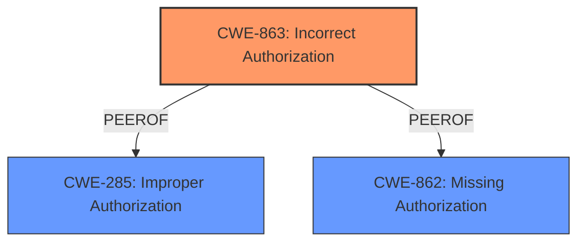

# Analysis for CVE-2024-46989

# Summary
| CWE ID | CWE Name | Confidence | CWE Abstraction Level | CWE Vulnerability Mapping Label | CWE-Vulnerability Mapping Notes |
|---|---|---|---|---|---|
| CWE-863 | Incorrect Authorization | 0.9 | Class | Allowed-with-Review | Primary CWE. The product performs an authorization check, but it does not correctly perform the check. |

## Evidence and Confidence

*   **Confidence Score:** 0.9
*   **Evidence Strength:** HIGH

## Relationship Analysis
The primary CWE selected is CWE-863, which is a Class-level CWE. The vulnerability description highlights that the system's authorization mechanism fails to properly evaluate multiple caveats, leading to incorrect permission results. While CWE-863 is a Class-level CWE, it encapsulates the core issue of flawed authorization logic. No child CWEs of CWE-863 provide a more precise description of the vulnerability. Other CWEs considered, such as CWE-862 (Missing Authorization) and CWE-285 (Improper Authorization), were deemed less suitable. CWE-862 doesn't apply because the system *does* perform authorization checks, albeit incorrectly. CWE-285 is a more generic Improper Authorization. CWE-863 is also related to CWE-942 (Permissive Cross-domain Policy with Untrusted Domains) through a ChildOf relationship, but CWE-942 is not applicable here as cross-domain policies are irrelevant.

## Vulnerability Chain
The vulnerability chain starts with the **incorrect handling of multiple caveats** on the same indirect subject type and relation. This **root cause** leads to the **impact** of the `CheckPermission` API returning `NO_PERMISSION` when `PERMISSION` is expected. The chain is direct:

1.  **Incorrect Handling of Multiple Caveats (CWE-863)**
2.  Incorrect Permission Check Result (Impact)

## Summary of Analysis
The initial assessment identified several candidate CWEs, including CWE-863, CWE-862, and CWE-285. However, based on a closer examination of the vulnerability description and the guidance provided, CWE-863 (Incorrect Authorization) was selected as the most appropriate primary CWE. The vulnerability involves an existing authorization mechanism that fails to handle multiple caveats correctly, leading to an incorrect permission being returned.

The evidence supporting this decision is derived from the following vulnerability description snippets:

*   "**Multiple caveats over the same indirect subject type on the same relation** can result in no permission being returned when permission is expected."
*   "Permission is returned as NO_PERMISSION when PERMISSION is expected on the CheckPermission API."

This demonstrates that an authorization check exists, but it's implemented incorrectly, aligning perfectly with CWE-863.

The retriever results also ranked CWE-863 as the top candidate.

Other CWEs Considered:

*   CWE-862 (Missing Authorization): Not applicable because authorization checks *are* performed, but they are flawed.
*   CWE-285 (Improper Authorization): A more generic authorization failure, but CWE-863 is more specific.
*   CWE-201, CWE-212, CWE-226, CWE-256, CWE-281, CWE-367, CWE-732: These CWEs are not related to authorization, and so were not considered.

The decision to classify this vulnerability as CWE-863 is based on the evidence that the authorization logic is present but **incorrect**, leading to the wrong permissions being granted. This classification is at the appropriate level of specificity, as it directly reflects the root cause of the vulnerability.