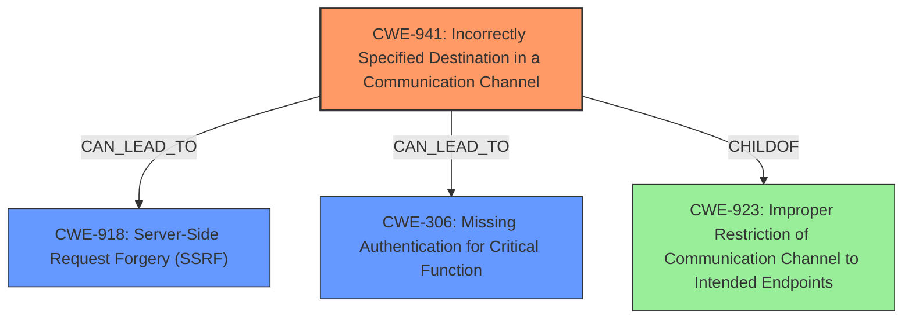

# Analysis Report for CVE-2024-46990

# Vulnerability Analysis Report: CVE-2024-46990

## Description

Directus is a real-time API and App dashboard for managing SQL database content. When relying on blocking access to localhost using the default `0.0.0.0` filter a user may bypass this block by using other registered loopback devices (like `127.0.0.2` - `127.127.127.127`). This issue has been addressed in release versions 10.13.3 and 11.1.0. Users are advised to upgrade. Users unable to upgrade may block this bypass by manually adding the `127.0.0.0/8` CIDR range which will block access to any `127.X.X.X` ip instead of just `127.0.0.1`.

## Vulnerability Description Key Phrases

- **Rootcause:** default 0.0.0.0 filter bypass
- **Impact:** bypass access block
- **Vector:** using other registered loopback devices
- **Attacker:** user
- **Product:** Directus

## Analysis (with Relationship Data)

# Summary
| CWE ID | CWE Name | Confidence | CWE Abstraction Level | CWE Vulnerability Mapping Label | CWE-Vulnerability Mapping Notes |
|---|---|---|---|---|---|
| CWE-941 | Incorrectly Specified Destination in a Communication Channel | 0.85 | Base | Allowed | Primary CWE. The application **incorrectly specifies the destination** by not blocking all loopback IP addresses. |
| CWE-918 | Server-Side Request Forgery (SSRF) | 0.75 | Base | Allowed | Secondary CWE. The **impact** of the vulnerability allows for potential Server Side Request Forgery (SSRF). |
| CWE-306 | Missing Authentication for Critical Function | 0.60 | Base | Allowed | Secondary CWE. The vulnerability could allow bypassing authentication to internal services due to **missing authentication** on the loopback interface. |

## Evidence and Confidence

*   **Confidence Score:** 0.80
*   **Evidence Strength:** HIGH

## Relationship Analysis
The primary weakness is the incorrect specification of the destination, CWE-941, which is a Base level CWE. This leads to potential SSRF, CWE-918. While CWE-923 (Improper Restriction of Communication Channel to Intended Endpoints) is a related Class-level CWE, CWE-941 is more specific in describing the **incorrect specification of the destination** within the communication channel. CWE-306 (Missing Authentication for Critical Function) is added as another secondary weakness because the attacker can potentially bypass authentication to internal services through the SSRF.



## Vulnerability Chain
The vulnerability chain starts with the **incorrectly specified destination** (CWE-941), leading to a bypass of intended loopback access restrictions. This allows for potential SSRF (CWE-918) attacks and potentially bypasses authentication (CWE-306) to internal services. The **root cause** is the insufficient filtering of IP addresses, specifically the failure to block all loopback addresses.

## Summary of Analysis
The initial analysis focused on the **default 0.0.0.0 filter bypass**, which led to considering CWEs related to authentication bypass and improper restriction of communication channels. However, the core issue is the **incorrect specification of the destination** IP address in the communication channel, making CWE-941 the most accurate primary CWE. The "CVE Reference Links Content Summary" confirms this, stating that the "vulnerability stems from an insufficient IP address filtering mechanism" and the "IP address filter only checked for an exact match against 0.0.0.0 instead of validating against the entire loopback range." This aligns perfectly with the description of CWE-941. The potential for SSRF (CWE-918) and authentication bypass (CWE-306) are secondary impacts of this **incorrect specification**.

The graph relationships and retriever results were helpful in considering alternative CWEs, but the detailed analysis of the vulnerability description and the "CVE Reference Links Content Summary" provided strong evidence for selecting CWE-941 as the primary CWE. The selected CWEs are at the optimal level of specificity, with CWE-941 being a Base level CWE that directly addresses the **root cause** of the vulnerability.

I considered CWE-306, CWE-288, and CWE-923, but they were not selected as the primary CWE.
*   CWE-306: considered due to impact of bypassing authentication to internal services, but not root cause.
*   CWE-288: Authentication Bypass Using an Alternate Path or Channel, is similar, but is too broad.
*   CWE-923: Improper Restriction of Communication Channel to Intended Endpoints, is similar, but CWE-941 is more specific.


## CWE Relationship Analysis

Current CWEs represent these abstraction levels: .


### Vulnerability Chain Analysis

**Chain starting from CWE-288:**
- 288 (Authentication Bypass Using an Alternate Path or Channel) - ROOT


**Chain starting from CWE-306:**
- 306 (Missing Authentication for Critical Function) - ROOT


### CWE Relationship Diagram

```mermaid
graph TD
    classDef primary fill:#f96,stroke:#333,stroke-width:2px
    classDef secondary fill:#69f,stroke:#333
    classDef tertiary fill:#9e9,stroke:#333
```


*Report generated on 2025-07-13 17:51:44*
