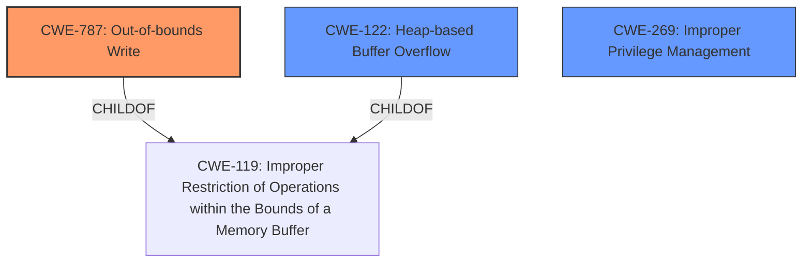

# Analysis Report for CVE-2024-47032

# Vulnerability Analysis Report: CVE-2024-47032

## Description

In construct_transaction_from_cmd of lwis_ioctl.c, there is a possible out of bounds write due to a heap buffer overflow. This could lead to local escalation of privilege with no additional execution privileges needed. User interaction is not needed for exploitation.

## Vulnerability Description Key Phrases

- **Component:** construct_transaction_from_cmd of lwis_ioctl.c
- **Weakness:** heap buffer overflow, out of bounds write
- **Impact:** local escalation of privilege

## Analysis (with Relationship Data)

# Summary
| CWE ID | CWE Name | Confidence | CWE Abstraction Level | CWE Vulnerability Mapping Label | CWE-Vulnerability Mapping Notes |
|---|---|---|---|---|---|
| CWE-787 | Out-of-bounds Write | 0.9 | Base | Primary | Allowed |
| CWE-122 | Heap-based Buffer Overflow | 0.8 | Variant | Secondary | Allowed |
| CWE-269 | Improper Privilege Management | 0.6 | Class | Secondary | Discouraged |

## Evidence and Confidence

*   **Confidence Score:** 0.8
*   **Evidence Strength:** MEDIUM

## Relationship Analysis
The primary CWE is CWE-787, which is a base-level CWE that accurately reflects the **out-of-bounds write**. CWE-787 is a child of CWE-119 (Improper Restriction of Operations within the Bounds of a Memory Buffer), indicating that the write occurs outside the allocated buffer. CWE-122 (Heap-based Buffer Overflow) is included as a variant since the vulnerability description mentions a **heap buffer overflow**. CWE-122 is a more specific type of buffer overflow. Finally, CWE-269 (Improper Privilege Management) is a class-level weakness that covers the resulting privilege escalation impact.



## Vulnerability Chain
The vulnerability chain starts with a **heap buffer overflow** leading to an **out-of-bounds write**, which results in a local escalation of privilege.
  - **Root Cause**: Heap Buffer Overflow
  - **Weakness**: Out-of-bounds Write
  - **Impact**: Local Escalation of Privilege

## Summary of Analysis
The analysis is based on the provided vulnerability description and the associated key phrases. The description clearly indicates an **out-of-bounds write** due to a **heap buffer overflow**. The primary CWE, CWE-787 (Out-of-bounds Write), is chosen because it directly represents the root cause of the vulnerability. The supporting evidence is the "Vulnerability Description Key Phrases" section. CWE-122 (Heap-based Buffer Overflow) is added since the vulnerability description explicitly mentions it. CWE-269 (Improper Privilege Management) is also added since the impact of the vulnerability leads to privilege escalation.

The selected CWEs are at the optimal level of specificity. CWE-787 and CWE-122 are more specific than the more general CWE-119 (Improper Restriction of Operations within the Bounds of a Memory Buffer), and they accurately reflect the nature of the **out-of-bounds write** and **heap buffer overflow**. Although CWE-269 is discouraged for privilege escalation, it is used here because the description does not provide a more specific root cause of the privilege escalation beyond the buffer overflow.

Relevant CWE Information:

# Enhanced Context (25 CWEs)
The following CWEs were identified as potentially relevant to this vulnerability:

## CWE-787: Out-of-bounds Write
**Abstraction Level**: Base
**Similarity Score**: N/A

**Description**: The product writes data past the end, or before the beginning, of the intended buffer. The write can occur when the size of the data exceeds the buffer's boundaries, or when the memory pointer used to write to the buffer is incremented or decremented to a position outside of the buffer.

**Mapping Guidance**:
- Usage: Allowed

## CWE-122: Heap-based Buffer Overflow
**Abstraction Level**: Variant
**Similarity Score**: N/A

**Description**: A heap-based buffer overflow condition is a condition where a buffer overflow occurs in the heap portion of memory. The heap is the memory pool in which dynamic memory allocation usually occurs.

**Mapping Guidance**:
- Usage: Allowed

## CWE-269: Improper Privilege Management
**Abstraction Level**: Class
**Similarity Score**: N/A

**Description**: The product does not properly assign, modify, track, or check privileges for an actor, creating an unintended sphere of control for that actor.

**Mapping Guidance**:
- Usage: Discouraged
- Rationale: CWE-269 is commonly misused. It can be conflated with "privilege escalation," which is a technical impact that is listed in many low-information vulnerability reports [REF-1287]. It is not useful for trend analysis.


## CWE Relationship Analysis

Current CWEs represent these abstraction levels: .


### Vulnerability Chain Analysis

**Chain starting from CWE-119:**
- 119 (Improper Restriction of Operations within the Bounds of a Memory Buffer) - ROOT


**Chain starting from CWE-787:**
- 787 (Out-of-bounds Write) - ROOT


### CWE Relationship Diagram

```mermaid
graph TD
    classDef primary fill:#f96,stroke:#333,stroke-width:2px
    classDef secondary fill:#69f,stroke:#333
    classDef tertiary fill:#9e9,stroke:#333
```


*Report generated on 2025-07-13 17:54:12*
