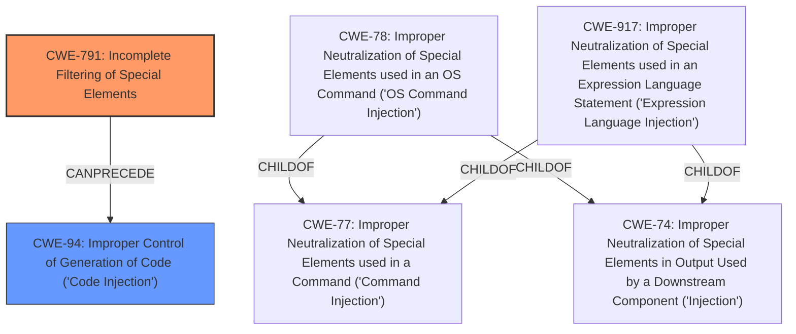

# Raw Analyzer Response for CVE-2024-47076

# Summary
| CWE ID | CWE Name | Confidence | CWE Abstraction Level | CWE Vulnerability Mapping Label | CWE-Vulnerability Mapping Notes |
|---|---|---|---|---|---|
| CWE-791 | Incomplete Filtering of Special Elements | 0.8 | Base | Allowed | Primary CWE. The **lack of sanitization of IPP attributes** is the root cause. |
| CWE-94 | Improper Control of Generation of Code ('Code Injection') | 0.6 | Base | Allowed-with-Review | Secondary CWE. The **attacker controlled data** is provided to the rest of the CUPS system, which enables code injection. |

## Evidence and Confidence

*   **Confidence Score:** 0.7
*   **Evidence Strength:** MEDIUM

## Relationship Analysis
The primary CWE is CWE-791, "Incomplete Filtering of Special Elements," because the root cause of the vulnerability is the **lack of sanitization** of IPP attributes. CWE-94, "Improper Control of Generation of Code ('Code Injection')" is a secondary CWE because the unsanitized input leads to code injection in the CUPS printing system. CWE-791 is a base level CWE, which is the preferred level of abstraction.

## Vulnerability Chain
The vulnerability chain starts with the **lack of sanitization** of IPP attributes (CWE-791) by `cfGetPrinterAttributes5`. This leads to **attacker controlled data** being used to generate a PPD file, which can then be used to inject arbitrary commands (CWE-94).

## Summary of Analysis
The primary weakness is the **lack of input sanitization** in the `cfGetPrinterAttributes5` function, which allows for the injection of arbitrary data. This matches CWE-791, "Incomplete Filtering of Special Elements." The injected data then leads to code injection, making CWE-94, "Improper Control of Generation of Code ('Code Injection')" a secondary weakness.

The vulnerability description states: "The `cfGetPrinterAttributes5` function in `libcupsfilters` **does not sanitize IPP attributes** returned from an IPP server. When these IPP attributes are used, for instance, to generate a PPD file, this can lead to attacker controlled data to be provided to the rest of the CUPS system." This is direct evidence that the root cause is the **lack of sanitization**, and the impact is **attacker controlled data** being injected.

The retriever results also support the selection of CWE-791, with a dense score of 0.395.

CWE-78 "Improper Neutralization of Special Elements used in an OS Command ('OS Command Injection')" and CWE-79 "Improper Neutralization of Input During Web Page Generation ('Cross-site Scripting')" were considered but not used as they are more specific cases of injection that do not fully represent the general problem of **incomplete filtering of special elements**.