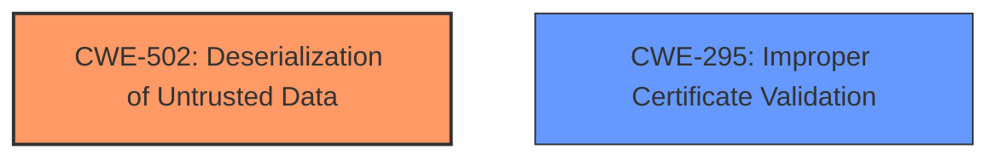

# Analysis Report for CVE-2024-47092

# Vulnerability Analysis Report: CVE-2024-47092

## Description

Insecure deserialization and improper certificate validation in Checkmk Exchange plugin check-mk-api prior to 5.8.1

## Vulnerability Description Key Phrases

- **Rootcause:** improper certificate validation, insecure deserialization
- **Product:** Checkmk Exchange plugin check-mk-api
- **Version:** prior to 5.8.1

## Analysis (with Relationship Data)

# Summary

| CWE ID | CWE Name | Confidence | CWE Abstraction Level | CWE Vulnerability Mapping Label | CWE-Vulnerability Mapping Notes |
|---|---|---|---|---|---|
| CWE-502 | Deserialization of Untrusted Data | 0.9 | Base | Allowed | Primary CWE: The code used `eval()` to deserialize data, which is unsafe. |
| CWE-295 | Improper Certificate Validation | 0.8 | Base | Allowed | Secondary CWE: The vulnerability description mentions "improper certificate validation". |

## Evidence and Confidence

*   **Confidence Score:** 0.85
*   **Evidence Strength:** HIGH

## Relationship Analysis

CWE-502 and CWE-295 are independent weaknesses. CWE-502, Deserialization of Untrusted Data, is the primary cause due to the use of `eval()`. CWE-295, Improper Certificate Validation, is listed in the vulnerability description, but there isn't any further information about it in the provided text.



## Vulnerability Chain

The vulnerability chain starts with **insecure deserialization** using `eval()` (CWE-502), which allows for potential Remote Code Execution (RCE). The second vulnerability is **improper certificate validation** (CWE-295).

## Summary of Analysis

The primary vulnerability is CWE-502, **Deserialization of Untrusted Data**, due to the usage of the `eval()` function which allows an attacker to execute arbitrary code. This is supported by the CVE Reference Links Content Summary that states "replaces eval() with ast.literal\_eval()". The secondary vulnerability is CWE-295, **Improper Certificate Validation**, as mentioned in the vulnerability description.

Relevant CWE Information:

# Enhanced Context (25 CWEs)
The following CWEs were identified as potentially relevant to this vulnerability:

## CWE-295: Improper Certificate Validation
**Abstraction Level**: Base
**Similarity Score**: 0.72
**Source**: dense

**Description**:
The product does not validate, or incorrectly validates, a certificate.

**Mapping Guidance**:
- Usage: Allowed
- Rationale: This CWE entry is at the Base level of abstraction, which is a preferred level of abstraction for mapping to the root causes of vulnerabilities.


## CWE-502: Deserialization of Untrusted Data
**Abstraction Level**: Base
**Similarity Score**: 0.72
**Source**: dense

**Description**:
The product deserializes untrusted data without sufficiently ensuring that the resulting data will be valid.

**Mapping Guidance**:
- Usage: Allowed
- Rationale: This CWE entry is at the Base level of abstraction, which is a preferred level of abstraction for mapping to the root causes of vulnerabilities.

### Other CWEs Considered:

*   CWE-94: Improper Control of Generation of Code ('Code Injection') - While `eval()` could lead to code injection, the more specific CWE-502 is a better fit as it identifies the **deserialization** of untrusted data as the root cause.
*   CWE-95: Improper Neutralization of Directives in Dynamically Evaluated Code ('Eval Injection') - Similar to CWE-94, this is related, but CWE-502 better captures the root cause of **deserialization** leading to the `eval()` call.
*   CWE-296, CWE-297, CWE-298, CWE-299, CWE-370: These are all related to certificate validation issues. CWE-295 is the most general and appropriate given the lack of specifics in the description. If there were details such as revocation, expiration, or host mismatch, then the other candidates would be more appropriate.


## CWE Relationship Analysis

Current CWEs represent these abstraction levels: .


### Vulnerability Chain Analysis

**Chain starting from CWE-502:**
- 502 (Deserialization of Untrusted Data) - ROOT


**Chain starting from CWE-299:**
- 299 (Improper Check for Certificate Revocation) - ROOT


### CWE Relationship Diagram

```mermaid
graph TD
    classDef primary fill:#f96,stroke:#333,stroke-width:2px
    classDef secondary fill:#69f,stroke:#333
    classDef tertiary fill:#9e9,stroke:#333
```


*Report generated on 2025-07-13 17:58:00*
