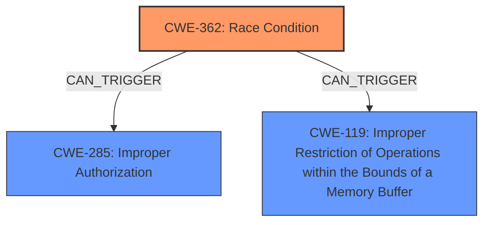

# Raw Analyzer Response for CVE-2024-47102

# Summary
| CWE ID  | CWE Name                                                                      | Confidence | CWE Abstraction Level | CWE Vulnerability Mapping Label | CWE-Vulnerability Mapping Notes |
| :------- | :---------------------------------------------------------------------------- | :--------- | :---------------------- | :------------------------------ | :------------------------------ |
| CWE-362 | Race Condition                                                                | 0.75       | Base                    | Primary                         | Allowed                         |
| CWE-285 | Improper Authorization                                                        | 0.5       | Class                   | Secondary                       | Discouraged                     |
| CWE-119 | Improper Restriction of Operations within the Bounds of a Memory Buffer | 0.4       | Class                   | Secondary                       | Discouraged                     |

## Evidence and Confidence

*   **Confidence Score:** 0.7
*   **Evidence Strength:** MEDIUM

## Relationship Analysis
The primary relationship that influenced the selection was the direct match from "CWE for similar CVE Descriptions" which listed CWE-362. The relationship analysis also considered other potential CWEs like CWE-119 due to the mention of kernel extensions, which could involve memory operations. However, the race condition aspect was more prominent in the description and previous CVE mappings.

## Vulnerability Chain
The vulnerability chain starts with a **race condition** (CWE-362) in the AIX perfstat kernel extension. This **race condition** can lead to **improper authorization** (CWE-285) or **improper restriction of operations within the bounds of a memory buffer** (CWE-119), eventually resulting in a denial of service. The root cause is the **race condition**, and the impacts are potential authorization bypass or memory corruption leading to denial of service.

## Summary of Analysis
The initial assessment was heavily influenced by the "CWE for similar CVE Descriptions" which pointed to CWE-362 as the primary candidate. The vulnerability description mentions a "**non-privileged local user** to exploit a vulnerability in the AIX perfstat kernel extension to cause a denial of service." This indicates that the vulnerability could be related to concurrency issues within the kernel extension, leading to a **race condition**.

The evidence from "CVE Reference Links Content Summary" says, "Vulnerabilities in the AIX TCP/IP and perfstat kernel extensions" and "Denial of service vulnerability in the AIX perfstat kernel extension." This confirms the vulnerable component and the impact.

The choice of CWE-362 is further justified by the fact that it is a Base level CWE, which is preferred. Other candidates like CWE-285 and CWE-119 were considered due to the potential for authorization issues or memory corruption arising from the **race condition**, but they are more likely to be secondary effects rather than the root cause.

The final selection prioritizes the **race condition** as the primary weakness, with potential impacts related to authorization or memory operations. This is based on the provided evidence and the relationships between CWEs, ensuring the selected CWEs are at the optimal level of specificity.

Relevant CWE Information:

# Enhanced Context (25 CWEs)

## CWE-755: Improper Handling of Exceptional Conditions
**Abstraction Level**: Class
**Similarity Score**: 0.74
**Source**: dense

**Description**:
The product does not handle or incorrectly handles an exceptional condition.

**Mapping Guidance**:
- Usage: Discouraged
- Rationale: This CWE entry is a level-1 Class (i.e., a child of a Pillar). It might have lower-level children that would be more appropriate

*Not Used:* This is a general error handling issue and doesn't specifically address the root cause.

## CWE-280: Improper Handling of Insufficient Permissions or Privileges
**Abstraction Level**: Base
**Similarity Score**: 0.73
**Source**: dense

**Description**:
The product does not handle or incorrectly handles when it has insufficient privileges to access resources or functionality as specified by their permissions. This may cause it to follow unexpected code paths that may leave the product in an invalid state.

**Mapping Guidance**:
- Usage: Allowed
- Rationale: This CWE entry is at the Base level of abstraction, which is a preferred level of abstraction for mapping to the root causes of vulnerabilities.

*Not Used:* While privilege issues might be a consequence, the root cause is the **race condition**.

## CWE-269: Improper Privilege Management
**Abstraction Level**: Class
**Similarity Score**: 0.73
**Source**: dense

**Description**:
The product does not properly assign, modify, track, or check privileges for an actor, creating an unintended sphere of control for that actor.

**Mapping Guidance**:
- Usage: Discouraged
- Rationale: CWE-269 is commonly misused. It can be conflated with "privilege escalation," which is a technical impact that is listed in many low-information vulnerability reports [REF-1287]. It is not useful for trend analysis.

*Not Used:* This is a high-level privilege issue, and the root cause is the **race condition**.

## CWE-274: Improper Handling of Insufficient Privileges
**Abstraction Level**: Base
**Similarity Score**: 0.72
**Source**: dense

**Description**:
The product does not handle or incorrectly handles when it has insufficient privileges to perform an operation, leading to resultant weaknesses.

**Mapping Guidance**:
- Usage: Discouraged
- Rationale: This CWE entry could be deprecated in a future version of CWE.

*Not Used:* This is related to privilege issues, but the root cause is the **race condition**.

## CWE-497: Exposure of Sensitive System Information to an Unauthorized Control Sphere
**Abstraction Level**: Base
**Similarity Score**: 0.72
**Source**: dense

**Description**:
The product does not properly prevent sensitive system-level information from being accessed by unauthorized actors who do not have the same level of access to the underlying system as the product does.

**Mapping Guidance**:
- Usage: Allowed
- Rationale: This CWE entry is at the Base level of abstraction, which is a preferred level of abstraction for mapping to the root causes of vulnerabilities.

*Not Used:* There's no indication of information exposure in the description.

## CWE-266: Incorrect Privilege Assignment
**Abstraction Level**: Base
**Similarity Score**: 0.72
**Source**: dense

**Description**:
A product incorrectly assigns a privilege to a particular actor, creating an unintended sphere of control for that actor.

**Mapping Guidance**:
- Usage: Allowed
- Rationale: This CWE entry is at the Base level of abstraction, which is a preferred level of abstraction for mapping to the root causes of vulnerabilities.

*Not Used:* While privilege issues might be a consequence, the root cause is the **race condition**.

## CWE-250: Execution with Unnecessary Privileges
**Abstraction Level**: Base
**Similarity Score**: 0.72
**Source**: dense

**Description**:
The product performs an operation at a privilege level that is higher than the minimum level required, which creates new weaknesses or amplifies the consequences of other weaknesses.

**Mapping Guidance**:
- Usage: Allowed
- Rationale: This CWE entry is at the Base level of abstraction, which is a preferred level of abstraction for mapping to the root causes of vulnerabilities.

*Not Used:* This is about unnecessary privileges, which is not the primary issue here. The root cause is the **race condition**.

## CWE-754: Improper Check for Unusual or Exceptional Conditions
**Abstraction Level**: Class
**Similarity Score**: 0.72
**Source**: dense

**Description**:
The product does not check or incorrectly checks for unusual or exceptional conditions that are not expected to occur frequently during day to day operation of the product.

**Mapping Guidance**:
- Usage: Allowed-with-Review
- Rationale: This CWE entry is a Class and might have Base-level children that would be more appropriate

*Not Used:* This is a general error checking issue and doesn't specifically address the **race condition**.

## CWE-1391: Use of Weak Credentials
**Abstraction Level**: Class
**Similarity Score**: 0.72
**Source**: dense

**Description**:
The product uses weak credentials (such as a default key or hard-coded password) that can be calculated, derived, reused, or guessed by an attacker.

**Mapping Guidance**:
- Usage: Allowed-with-Review
- Rationale: This CWE entry is a Class and might have Base-level children that would be more appropriate

*Not Used:* This is about weak credentials, which is not relevant to the vulnerability