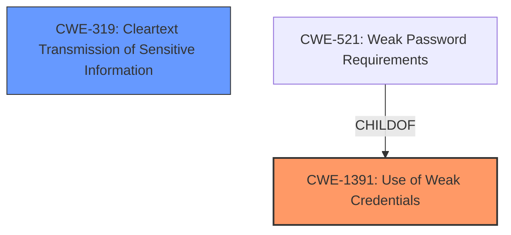

# Analysis Report for CVE-2024-47121

# Vulnerability Analysis Report: CVE-2024-47121

## Description

The goTenna Pro series uses a weak password for the QR broadcast message. If the QR broadcast message is captured over RF it is possible to decrypt it and use it to decrypt all future and past messages sent via encrypted broadcast.

## Vulnerability Description Key Phrases

- **Rootcause:** weak password for sharing encryption keys
- **Impact:** decrypt broadcasted encryption key
- **Vector:** ['key broadcast method', 'brute force attack on password']
- **Product:** goTenna Pro App

## Analysis (with Relationship Data)

# Summary
| CWE ID | CWE Name | Confidence | CWE Abstraction Level | CWE Vulnerability Mapping Label | CWE-Vulnerability Mapping Notes |
|---|---|---|---|---|---|
| CWE-1391 | Use of Weak Credentials | 0.8 | Class | Primary | Allowed-with-Review |
| CWE-319 | Cleartext Transmission of Sensitive Information | 0.6 | Base | Secondary | Allowed |

## Evidence and Confidence

*   **Confidence Score:** 0.7
*   **Evidence Strength:** MEDIUM

## Relationship Analysis
The primary CWE is CWE-1391 (Use of Weak Credentials), a Class-level CWE. Although it is a Class, the retriever results suggest this or a lower level. The vulnerability involves using a **weak password** for encryption keys, making this a relevant choice. CWE-1391 is related to CWE-521 (Weak Password Requirements) via ChildOf, which could be considered if more details on specific password requirements were provided.



## Vulnerability Chain
The vulnerability chain starts with the **use of a weak password** (CWE-1391) for encryption keys. This leads to the potential for an attacker to decrypt the broadcasted encryption key if captured over RF. A secondary weakness is transmitting the encryption key over RF which is essentially transmitting sensitive information (encryption key) in cleartext (CWE-319). This allows decryption of all future and past messages sent via encrypted broadcast with that particular key.

## Summary of Analysis
The primary weakness is the **use of a weak password** for encryption keys. The evidence indicates that the goTenna Pro App uses a weak password for sharing encryption keys via the key broadcast method. This aligns with CWE-1391 (Use of Weak Credentials). The impact is that an attacker can decrypt broadcasted encryption keys, leading to further decryption of past and future messages. The secondary weakness is that the encryption key is essentially being transmitted in cleartext (CWE-319).

The selection of CWE-1391 is based on the vulnerability description stating "**weak password for sharing encryption keys**". The retriever results also list CWE-1391 as a potentially relevant CWE.

CWE-319 (Cleartext Transmission of Sensitive Information) is considered a secondary weakness because the encryption key being sent is protected by a **weak password**, but the password is not strong enough. An attacker in proximity can capture the RF transmission, brute force the **weak password**, and then decrypt the messages.

CWE-922 (Insecure Storage of Sensitive Information) was listed as a primary CWE for similar CVE Descriptions, however, the evidence provided is that there is a **weak password** and the encryption keys are then decrypted, not that the encryption keys are stored insecurely.

Relevant CWE Information:

# Enhanced Context (25 CWEs)
The following CWEs were identified as potentially relevant to this vulnerability:

## CWE-1391: Use of Weak Credentials
**Abstraction Level**: Class
**Similarity Score**: 0.69
**Source**: dense

**Description**:
The product uses weak credentials (such as a default key or hard-coded password) that can be calculated, derived, reused, or guessed by an attacker.

**Mapping Guidance**:
- Usage: Allowed-with-Review
- Rationale: This CWE entry is a Class and might have Base-level children that would be more appropriate

## CWE-319: Cleartext Transmission of Sensitive Information
**Abstraction Level**: Base
**Similarity Score**: 0.67
**Source**: dense

**Description**:
The product transmits sensitive or security-critical data in cleartext in a communication channel that can be sniffed by unauthorized actors.

**Mapping Guidance**:
- Usage: Allowed
- Rationale: This CWE entry is at the Base level of abstraction, which is a preferred level of abstraction for mapping to the root causes of vulnerabilities.


## CWE Relationship Analysis

Current CWEs represent these abstraction levels: .


### Vulnerability Chain Analysis

**Chain starting from CWE-922:**
- 922 (Insecure Storage of Sensitive Information) - ROOT


**Chain starting from CWE-319:**
- 319 (Cleartext Transmission of Sensitive Information) - ROOT


### CWE Relationship Diagram

```mermaid
graph TD
    classDef primary fill:#f96,stroke:#333,stroke-width:2px
    classDef secondary fill:#69f,stroke:#333
    classDef tertiary fill:#9e9,stroke:#333
```


*Report generated on 2025-07-13 17:58:41*
