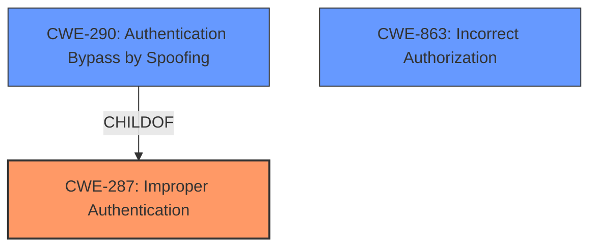

# Raw Analyzer Response for CVE-2024-47130

# Summary
| CWE ID | CWE Name | Confidence | CWE Abstraction Level | CWE Vulnerability Mapping Label | CWE-Vulnerability Mapping Notes |
|---|---|---|---|---|---|
| CWE-287 | Improper Authentication | 0.9 | Class | Primary | Allowed-with-Review |
| CWE-290 | Authentication Bypass by Spoofing | 0.7 | Base | Secondary | Allowed |
| CWE-863 | Incorrect Authorization | 0.6 | Class | Secondary | Allowed-with-Review |

## Evidence and Confidence

*   **Confidence Score:** 0.8
*   **Evidence Strength:** HIGH

## Relationship Analysis
The primary weakness is the **lack of authentication** which allows attackers to remotely update public keys. CWE-287 (Improper Authentication) is a Class-level CWE and a good starting point. However, the more specific CWE-290 (Authentication Bypass by Spoofing) is also relevant as it describes how the authentication is bypassed. CWE-863 (Incorrect Authorization) could be a secondary issue since updating public keys should require authorization in addition to authentication.

## Vulnerability Chain
The vulnerability chain starts with the **missing authentication** (CWE-287) allowing attackers to bypass authentication (CWE-290), leading to the ability to remotely update public keys, which should have required authorization (CWE-863), and ultimately compromising the confidentiality, integrity, and availability of communications.

## Summary of Analysis
The initial analysis pointed towards CWE-287 (Improper Authentication) due to the **lack of authentication** for remotely updating public keys. Further review and consideration of the relationships reveal that CWE-290 (Authentication Bypass by Spoofing) is also highly relevant, as the **missing authentication** allows for an authentication bypass via spoofing. The impact of remotely updating public keys also suggests a potential authorization issue (CWE-863).

The evidence is strong, supported by the vulnerability description, key phrases, and CVE reference summary, which clearly states that the goTenna Pro App lacks authentication for remotely updating local public keys. The provided information explicitly indicates that **unauthenticated attackers** can perform this action.

CWE-287 (Improper Authentication) is at the Class level, while CWE-290 (Authentication Bypass by Spoofing) is at the Base level. Since the evidence supports the bypass, CWE-290 is a good option to include as a secondary.

Other CWEs Considered:

*   CWE-321 (Use of Hard-coded Cryptographic Key), CWE-522 (Insufficiently Protected Credentials), and CWE-327 (Use of a Broken or Risky Cryptographic Algorithm): These are related to cryptographic issues, but the main issue is the **missing authentication** rather than a problem with the keys or algorithms themselves.
*   CWE-863 (Incorrect Authorization): This could be a secondary issue since updating public keys should require authorization in addition to authentication.
*   CWE-941 (Incorrectly Specified Destination in a Communication Channel): This is not relevant as the vulnerability is not about specifying the wrong destination, but about the **lack of authentication**.