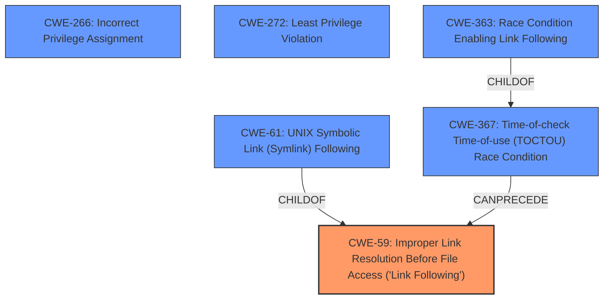

# Raw Analyzer Response for CVE-2024-47191

# Summary
| CWE ID    | CWE Name                                                              | Confidence | CWE Abstraction Level | CWE Vulnerability Mapping Label | CWE-Vulnerability Mapping Notes |
| :---------- | :-------------------------------------------------------------------- | :--------- | :-------------------- | :------------------------------ | :------------------------------ |
| CWE-59      | Improper Link Resolution Before File Access ('Link Following')        | 0.95       | Base                  | Primary                         | Allowed                       |
| CWE-266     | Incorrect Privilege Assignment                                        | 0.75       | Base                  | Secondary                       | Allowed                       |
| CWE-367     | Time-of-check Time-of-use (TOCTOU) Race Condition                    | 0.7        | Base                  | Secondary                       | Allowed                       |
| CWE-272     | Least Privilege Violation                                           | 0.65       | Base                  | Secondary                       | Allowed                       |

## Evidence and Confidence

*   **Confidence Score:** 0.8
*   **Evidence Strength:** HIGH

## Relationship Analysis
The primary CWE is CWE-59, representing the core issue of improper link resolution. CWE-367 is linked via a CANPRECEDE relationship to CWE-59. There is a CHILDOF relationship between CWE-61, CWE-363, and CWE-59. The other CWEs such as CWE-266 and CWE-272 are related to the privilege escalation aspect of the vulnerability.

## Vulnerability Chain
The vulnerability chain begins with the **mishandling of usersfile access** (CWE-59). The `fopen("w")` call without proper validation allows symlinks to be followed. This, combined with the PAM module running as root without dropping privileges and incorrect permission assignment, leads to arbitrary file overwrites and ultimately root privilege escalation.
1.  **CWE-59**: Improper Link Resolution Before File Access ('Link Following') - Root cause.
2.  **CWE-367**: Time-of-check Time-of-use (TOCTOU) Race Condition - Due to the time gap between path check and file opening.
3.  **CWE-266**: Incorrect Privilege Assignment - PAM module running as root.
4.  Impact: Root privilege escalation.

## Summary of Analysis
The analysis indicates that the primary vulnerability lies in the **mishandling of usersfile access**, specifically the improper resolution of symbolic links (CWE-59). The CVE description and summary clearly state that the code does not properly prevent filenames from identifying a link or shortcut that resolves to an unintended resource. This is compounded by the fact that the PAM module runs as root, leading to privilege escalation. The `fopen("w")` usage and lack of path sanitization are key contributing factors. The selection of CWE-59 is further supported by its high score in the retriever results. The other CWEs were selected based on the additional contributing factors.

*   **CWE-59**: The core issue is the improper handling of symbolic links, as the program does not validate the path and allows symlinks to be followed. This leads to writing to unintended locations.
    *   *"The product attempts to access a file based on the filename, but it does not properly prevent that filename from identifying a link or shortcut that resolves to an unintended resource."*
*   **CWE-266**: The PAM module runs as root, and this privilege is incorrectly assigned during file operations.
    *   *"A product incorrectly assigns a privilege to a particular actor, creating an unintended sphere of control for that actor."*
*   **CWE-367**: The race condition exists between the check for the path and the use of the path (opening the file for writing).
    *   *"The product checks the state of a resource before using that resource, but the resource's state can change between the check and the use in a way that invalidates the results of the check."*
*   **CWE-272**: The process runs with higher than necessary privileges.
    *   *"The program is running with more privileges than it needs."*

Other CWEs Considered:
*   CWE-732: Incorrect Permission Assignment for Critical Resource - While the vulnerability does lead to writing to critical resources, the root cause is not incorrect permission assignment but rather the ability to write to arbitrary files due to symlink following and running as root.
*   CWE-362: Concurrent Execution using Shared Resource with Improper Synchronization ('Race Condition') - While there is a TOCTOU vulnerability, the core issue is not a general race condition on a shared resource but rather the specific TOCTOU related to file path validation.
*   CWE-306: Missing Authentication for Critical Function - Authentication is not the issue here. The issue arises after the user has been authenticated, during file handling operations.
*   CWE-250: Execution with Unnecessary Privileges - Similar to CWE-272, it is related to incorrect privilege assignment.

The selected CWEs are at the optimal level of specificity, providing a detailed and accurate representation of the vulnerability's root cause and contributing factors.