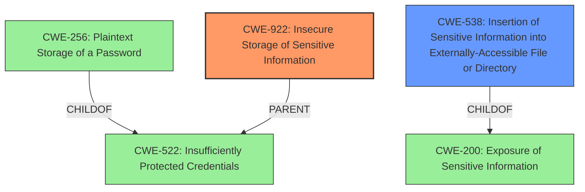

# Enhanced Analysis for CVE-2024-47197

# Summary
| CWE ID | CWE Name | Confidence | CWE Abstraction Level | CWE Vulnerability Mapping Label | CWE-Vulnerability Mapping Notes |
|---|---|---|---|---|---|
| CWE-922 | Insecure Storage of Sensitive Information | 0.9 | Class | Primary | Allowed-with-Review |
| CWE-538 | Insertion of Sensitive Information into Externally-Accessible File or Directory | 0.7 | Base | Secondary | Allowed |

## Evidence and Confidence

*   **Confidence Score:** 0.8
*   **Evidence Strength:** HIGH

## Relationship Analysis
The primary relationship that influenced the CWE selection was the parent-child relationship between CWE-522 (Insufficiently Protected Credentials) and CWE-256 (Plaintext Storage of a Password). However, CWE-922 (Insecure Storage of Sensitive Information) was chosen as a more encompassing and relevant classification. CWE-538 (Insertion of Sensitive Information into Externally-Accessible File or Directory) was selected as a secondary CWE, representing the specific way in which the sensitive information was exposed.



## Vulnerability Chain
The vulnerability chain starts with the **insecure storage of sensitive information** from the user's `~/.m2/settings.xml` file, which is then inserted into an externally accessible file, ultimately leading to the exposure of that sensitive information to unauthorized actors.
  - **Root Cause:** Insecure Storage of Sensitive Information (CWE-922)
  - **Mechanism:** Insertion of Sensitive Information into Externally-Accessible File or Directory (CWE-538)
  - **Impact:** Exposure of Sensitive Information to an Unauthorized Actor

## Summary of Analysis
The initial analysis focused on identifying the root cause of the vulnerability, which is the **insecure storage of sensitive information**. The evidence clearly points to the Maven Archetype Plugin copying the contents of the user's `~/.m2/settings.xml` file, which often contains credentials, into a file that could be unintentionally published.

The selection of CWE-922 (Insecure Storage of Sensitive Information) as the primary CWE is based on the **rootcause** and weakness phrases: "**insecure storage of sensitive information**". While other CWEs like CWE-522 (Insufficiently Protected Credentials) and CWE-256 (Plaintext Storage of a Password) were considered, they were deemed too specific. CWE-922 provides a broader classification that encompasses the general issue of sensitive data being stored **insecurely**, regardless of the specific method.

CWE-538 (Insertion of Sensitive Information into Externally-Accessible File or Directory) was selected as a secondary CWE to represent the specific mechanism by which the sensitive information was exposed. This CWE accurately describes how the contents of the `~/.m2/settings.xml` file were copied into the `archetype-settings.xml` file, making it accessible to unauthorized actors if the artifact was published.

The graph relationships influenced the final selection by highlighting the hierarchical connections between CWEs. While CWE-522 and CWE-256 are related to the vulnerability, they are more specific cases of **insecure storage**. CWE-922 sits higher in the hierarchy and provides a more general classification that encompasses the overall issue.

The selected CWEs are at the optimal level of specificity because they accurately represent both the **root cause (CWE-922)** and the mechanism of exposure (CWE-538) without being overly specific or focusing solely on the impact of the vulnerability.

Relevant CWE Information:
# Enhanced Context (25 CWEs)
The following CWEs were identified as potentially relevant to this vulnerability:

## CWE-538: Insertion of Sensitive Information into Externally-Accessible File or Directory
**Abstraction Level**: Base
**Similarity Score**: 0.73
**Source**: dense

**Description**:
The product places sensitive information into files or directories that are accessible to actors who are allowed to have access to the files, but not to the sensitive information.

**Mapping Guidance**:
- Usage: Allowed
- Rationale: This CWE entry is at the Base level of abstraction, which is a preferred level of abstraction for mapping to the root causes of vulnerabilities.

## CWE-497: Exposure of Sensitive System Information to an Unauthorized Control Sphere
**Abstraction Level**: Base
**Similarity Score**: 0.71
**Source**: dense

**Description**:
The product does not properly prevent sensitive system-level information from being accessed by unauthorized actors who do not have the same level of access to the underlying system as the product does.

**Mapping Guidance**:
- Usage: Allowed
- Rationale: This CWE entry is at the Base level of abstraction, which is a preferred level of abstraction for mapping to the root causes of vulnerabilities.

## CWE-212: Improper Removal of Sensitive Information Before Storage or Transfer
**Abstraction Level**: Base
**Similarity Score**: 0.71
**Source**: dense

**Description**:
The product stores, transfers, or shares a resource that contains sensitive information, but it does not properly remove that information before the product makes the resource available to unauthorized actors.

**Mapping Guidance**:
- Usage: Allowed
- Rationale: This CWE entry is at the Base level of abstraction, which is a preferred level of abstraction for mapping to the root causes of vulnerabilities.

## CWE-552: Files or Directories Accessible to External Parties
**Abstraction Level**: Base
**Similarity Score**: 0.70
**Source**: dense

**Description**:
The product makes files or directories accessible to unauthorized actors, even though they should not be.

**Mapping Guidance**:
- Usage: Allowed
- Rationale: This CWE entry is at the Base level of abstraction, which is a preferred level of abstraction for mapping to the root causes of vulnerabilities.

## CWE-522: Insufficiently Protected Credentials
**Abstraction Level**: Class
**Similarity Score**: 0.70
**Source**: dense

**Description**:
The product transmits or stores authentication credentials, but it uses an insecure method that is susceptible to unauthorized interception and/or retrieval.

**Mapping Guidance**:
- Usage: Allowed-with-Review
- Rationale: This CWE entry is a Class and might have Base-level children that would be more appropriate

## CWE-359: Exposure of Private Personal Information to an Unauthorized Actor
**Abstraction Level**: Base
**Similarity Score**: 0.70
**Source**: dense

**Description**:
The product does not properly prevent a person's private, personal information from being accessed by actors who either (1) are not explicitly authorized to access the information or (2) do not have the implicit consent of the person about whom the information is collected.

**Mapping Guidance**:
- Usage: Allowed
- Rationale: This CWE entry is at the Base level of abstraction, which is a preferred level of abstraction for mapping to the root causes of vulnerabilities.

## CWE-276: Incorrect Default Permissions
**Abstraction Level**: Base
**Similarity Score**: 0.69
**Source**: dense

**Description**:
During installation, installed file permissions are set to allow anyone to modify those files.

**Mapping Guidance**:
- Usage: Allowed
- Rationale: This CWE entry is at the Base level of abstraction, which is a preferred level of abstraction for mapping to the root causes of vulnerabilities.

## CWE-116: Improper Encoding or Escaping of Output
**Abstraction Level**: Class
**Similarity Score**: 0.69
**Source**: dense

**Description**:
The product prepares a structured message for communication with another component, but encoding or escaping of the data is either missing or done incorrectly. As a result, the intended structure of the message is not preserved.

**Mapping Guidance**:
- Usage: Allowed-with-Review
- Rationale: This CWE entry is a Class and might have Base-level children that would be more appropriate

## CWE-639: Authorization Bypass Through User-Controlled Key
**Abstraction Level**: Base
**Similarity Score**: 0.69
**Source**: dense

**Description**:
The system's authorization functionality does not prevent one user from gaining access to another user's data or record by modifying the key value identifying the data.

**Mapping Guidance**:
- Usage: Allowed
- Rationale: This CWE entry is at the Base level of abstraction, which is


## CWE Relationship Analysis

Current CWEs represent these abstraction levels: .


### Vulnerability Chain Analysis

**Chain starting from CWE-359:**
- 359 (Exposure of Private Personal Information to an Unauthorized Actor) - ROOT


**Chain starting from CWE-116:**
- 116 (Improper Encoding or Escaping of Output) - ROOT


### CWE Relationship Diagram

```mermaid
graph TD
    classDef primary fill:#f96,stroke:#333,stroke-width:2px
    classDef secondary fill:#69f,stroke:#333
    classDef tertiary fill:#9e9,stroke:#333
```