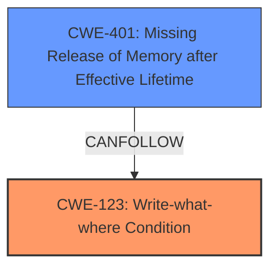

# Raw Analyzer Response for CVE-2024-47438

# Summary
| CWE ID  | CWE Name                                                     | Confidence | CWE Abstraction Level | CWE Vulnerability Mapping Label | CWE-Vulnerability Mapping Notes |
| :-------- | :----------------------------------------------------------- | :--------- | :---------------------- | :------------------------------ | :-------------------------------- |
| CWE-123   | Write-what-where Condition                                   | 1          | Base                    | Primary                         | Allowed                           |
| CWE-401   | Missing Release of Memory after Effective Lifetime | 0.75          | Variant                    | Secondary                         | Allowed                           |

## Evidence and Confidence

*   **Confidence Score:** 0.875
*   **Evidence Strength:** HIGH

## Relationship Analysis

The primary weakness is CWE-123, which directly describes the **Write-what-where Condition**. CWE-401, **Missing Release of Memory after Effective Lifetime**, is a potential secondary weakness given the **memory leak** impact. CWE-123 can potentially lead to memory corruption, which could lead to a **memory leak**, making CWE-401 a consequence. The relationship between CWE-123 and CWE-401 is a "Can Follow" relationship.

## Vulnerability Chain

The vulnerability chain starts with CWE-123 (**Write-what-where Condition**), which allows an attacker to write arbitrary values to arbitrary memory locations. This leads to memory corruption, which results in CWE-401 (**memory leak**) and potentially the disclosure of sensitive memory content.

CWE-123 (Root Cause) -> Memory Corruption -> CWE-401 (Impact)

## Summary of Analysis

The primary CWE is CWE-123 (**Write-what-where Condition**) because the vulnerability description and CVE summary explicitly state this condition. The description states "Substance3D - Painter versions 10.1.0 and earlier are affected by a **Write-what-where Condition** vulnerability...". The CVE Reference Links Content Summary also confirms this, stating ""vulnerability": "Write-what-where Condition", "cwe_id": "CWE-123"".

CWE-401 (**Missing Release of Memory after Effective Lifetime**) is a secondary consideration due to the mention of a **memory leak**. The description states that the "Write-what-where Condition" can lead to a **memory leak**, and the CVE summary also confirms this, stating ""impact": "Memory leak"". While the primary cause is the **Write-what-where Condition**, the **memory leak** suggests a failure to properly manage allocated memory after its use.

The other CWEs considered were less relevant. CWE-787 (**Out-of-bounds Write**) is related to CWE-123 but less specific. CWE-120 (**Buffer Copy without Checking Size of Input**) implies a buffer copy operation, which isn't explicitly mentioned. CWE-190 (**Integer Overflow or Wraparound**) and CWE-122 (**Heap-based Buffer Overflow**) are not directly supported by the provided vulnerability information.

The selected CWEs are at the optimal level of specificity, with CWE-123 being a base CWE that directly describes the root cause and CWE-401 being a variant CWE that describes the impact.

Relevant CWE Information:

# Enhanced Context (25 CWEs)

## CWE-123: Write-what-where Condition
**Abstraction Level**: Base
**Similarity Score**: 0.69
**Source**: dense

**Description**:
Any condition where the attacker has the ability to write an arbitrary value to an arbitrary location, often as the result of a buffer overflow.

**Mapping Guidance**:
- Usage: Allowed
- Rationale: This CWE entry is at the Base level of abstraction, which is a preferred level of abstraction for mapping to the root causes of vulnerabilities.

## CWE-401: Missing Release of Memory after Effective Lifetime
**Abstraction Level**: Variant
**Similarity Score**: 1.000
**Source**: alternate_terms

**Description**:
The product does not release memory after it has been used, which can lead to a denial of service (DoS) condition due to resource exhaustion.

**Mapping Guidance**:
- Usage: Allowed
- Rationale: This CWE entry is at the Variant level of abstraction, which is a preferred level of abstraction for mapping to the root causes of vulnerabilities.