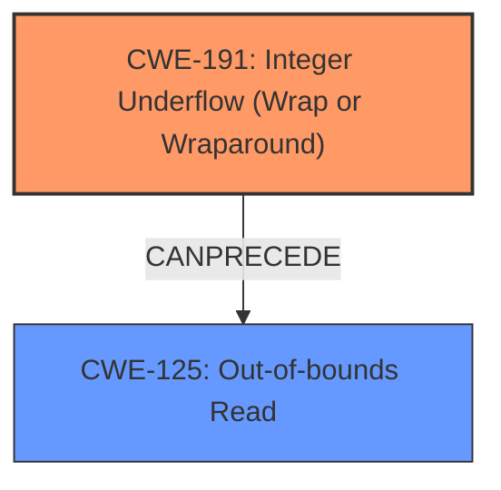

# Analysis Report for CVE-2024-47545

# Vulnerability Analysis Report: CVE-2024-47545

## Description

GStreamer is a library for constructing graphs of media-handling components. An **integer underflow** has been detected in qtdemux_parse_trak function within qtdemux.c. During the strf parsing case, the subtraction size -= 40 can lead to a negative **integer overflow** if it is less than 40. If this happens, the subsequent call to gst_buffer_fill will invoke memcpy with a large tocopy size, resulting in an OOB-read. This vulnerability is fixed in 1.24.10.

## Vulnerability Description Key Phrases

- **Rootcause:** integer underflow
- **Weakness:** integer overflow
- **Impact:** OOB-read
- **Product:** GStreamer
- **Version:** prior to 1.24.10
- **Component:** qtdemux_parse_trak function within qtdemux.c

## Analysis (with Relationship Data)

# Summary
| CWE ID | CWE Name | Confidence | CWE Abstraction Level | CWE Vulnerability Mapping Label | CWE-Vulnerability Mapping Notes |
|---|---|---|---|---|---|
| CWE-191 | Integer Underflow (Wrap or Wraparound) | 1.0 | Base | Primary | Allowed |
| CWE-125 | Out-of-bounds Read | 0.8 | Base | Secondary | Allowed |

## Evidence and Confidence

*   **Confidence Score:** 0.9
*   **Evidence Strength:** HIGH

## Relationship Analysis
The primary relationship is that **Integer Underflow** (CWE-191) can lead to an **Out-of-bounds Read** (CWE-125). CWE-191 is the root cause, and CWE-125 is the direct consequence. The abstraction levels are both Base, reflecting specific implementation flaws.



## Vulnerability Chain
The vulnerability chain starts with:
1.  **Integer Underflow (CWE-191):** The subtraction of `size -= 40` results in a negative integer value when `size` is less than 40.
2.  **Out-of-bounds Read (CWE-125):** This negative size is subsequently used in `gst_buffer_fill`, leading to `memcpy` with a large `tocopy` size, which results in an out-of-bounds read.

The chain is complete, showing the progression from the initial flaw to the final impact.

## Summary of Analysis
The analysis is strongly based on the provided evidence, particularly the "Vulnerability Description Key Phrases" and "CVE Reference Links Content Summary". The description clearly indicates an **integer underflow** as the root cause, leading to an **out-of-bounds read**.

The vulnerability description states: "An **integer underflow** has been detected in qtdemux_parse_trak function within qtdemux.c. During the strf parsing case, the subtraction size -= 40 can lead to a negative **integer overflow** if it is less than 40. If this happens, the subsequent call to gst_buffer_fill will invoke memcpy with a large tocopy size, resulting in an OOB-read."

The CVE Reference Links Content Summary further clarifies: "An integer underflow vulnerability exists in the `qtdemux_parse_trak` function within `qtdemux.c` when parsing the `strf` FOURCC. Specifically, the subtraction `size -= 40` can result in a negative integer value if `size` is less than 40. This negative value is then used in a subsequent call to `gst_buffer_fill`, leading to an out-of-bounds read."

The selected CWEs are at the optimal level of specificity because they accurately represent the technical details of the vulnerability.

Relevant CWE Information:

# Enhanced Context (25 CWEs)

## CWE-191: Integer Underflow (Wrap or Wraparound)
**Abstraction Level**: Base
**Similarity Score**: 0.73
**Source**: dense

**Description**:
The product subtracts one value from another, such that the result is less than the minimum allowable integer value, which produces a value that is not equal to the correct result.

**Mapping Guidance**:
- Usage: Allowed
- Rationale: This CWE entry is at the Base level of abstraction, which is a preferred level of abstraction for mapping to the root causes of vulnerabilities.

**Technical Explanation:** The `size -= 40` operation results in a value less than the minimum allowable integer value, leading to a wraparound.
**Security Implications:** This wraparound results in an unexpectedly large positive value, which is then used in a memory copy operation.
**Relationship Analysis:** This CWE is the root cause of the vulnerability and directly leads to the out-of-bounds read.
**Mapping Guidance Influence:** The mapping guidance supports this choice as it's a Base level and a root cause.

## CWE-125: Out-of-bounds Read
**Abstraction Level**: Base
**Similarity Score**: 0.72
**Source**: dense

**Description**:
The product reads data past the end, or before the beginning, of the intended buffer.

**Mapping Guidance**:
- Usage: Allowed
- Rationale: This CWE entry is at the Base level of abstraction, which is a preferred level of abstraction for mapping to the root causes of vulnerabilities.

**Technical Explanation:** The `gst_buffer_fill` function uses the wrapped-around size, causing it to read beyond the allocated buffer.
**Security Implications:** This can lead to information disclosure, denial of service (crash), or potentially arbitrary code execution.
**Relationship Analysis:** This CWE is a direct consequence of the integer underflow.
**Mapping Guidance Influence:** The mapping guidance supports this choice as it's a Base level.

**CWEs Considered but Not Used:**

*   **CWE-190: Integer Overflow or Wraparound:** While the initial description mentions integer overflow, the core issue is the underflow leading to a negative value, which then becomes a large positive value due to wraparound. Thus, CWE-191 is more precise.
*   **CWE-787: Out-of-bounds Write:** While an out-of-bounds write *could* occur as a result of reading sensitive memory which is then written elsewhere, the initial error is the read, so CWE-125 is more appropriate.
*   **CWE-120: Buffer Copy without Checking Size of Input ('Classic Buffer Overflow'):** The issue is not the lack of size checking, but the incorrect size calculation due to integer underflow.


## CWE Relationship Analysis

Current CWEs represent these abstraction levels: .


### Vulnerability Chain Analysis

**Chain starting from CWE-125:**
- 125 (Out-of-bounds Read) - ROOT


**Chain starting from CWE-191:**
- 191 (Integer Underflow (Wrap or Wraparound)) - ROOT


### CWE Relationship Diagram

```mermaid
graph TD
    classDef primary fill:#f96,stroke:#333,stroke-width:2px
    classDef secondary fill:#69f,stroke:#333
    classDef tertiary fill:#9e9,stroke:#333
```


*Report generated on 2025-07-13 18:16:44*
