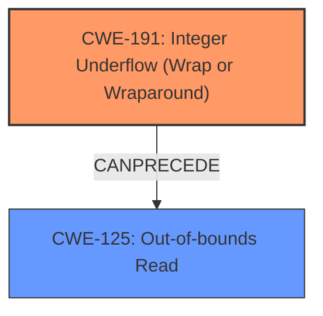

# Enhanced Analysis for CVE-2024-47546

# Summary
| CWE ID | CWE Name | Confidence | CWE Abstraction Level | CWE Vulnerability Mapping Label | CWE-Vulnerability Mapping Notes |
|---|---|---|---|---|---|
| CWE-191 | Integer Underflow (Wrap or Wraparound) | 1.0 | Base | Primary | Allowed |
| CWE-125 | Out-of-bounds Read | 0.9 | Base | Secondary | Allowed |

## Evidence and Confidence

*   **Confidence Score:** 0.95
*   **Evidence Strength:** HIGH

## Relationship Analysis
The primary weakness is **CWE-191** Integer Underflow (Wrap or Wraparound) which leads to **CWE-125** Out-of-bounds Read. These CWEs have a chain relationship where the integer underflow **CAN PRECEDE** the out-of-bounds read. Both are at the Base level of abstraction, providing sufficient specificity.



## Vulnerability Chain
The vulnerability chain starts with an **integer underflow** (CWE-191) when calculating the size of data to be read, specifically when `atom_length` is less than 8. This leads to `*cclen` becoming a large number. This large value is then used in `g_memdup2`, resulting in an out-of-bounds read (CWE-125).

## Summary of Analysis
The analysis is based on the provided vulnerability description and the CVE reference summary, which clearly state that an **integer underflow** leads to an out-of-bounds read.

The vulnerability description states: "An **integer underflow** has been detected in extract_cc_from_data function within qtdemux.c. In the FOURCC_c708 case, the subtraction atom_length - 8 may result in an underflow if atom_length is less than 8. When that subtraction underflows, *cclen ends up being a large number, and then cclen is passed to g_memdup2 leading to an out-of-bounds (OOB) read."

The CVE Reference Links Content Summary further confirms this: "An integer underflow vulnerability exists in the `extract_cc_from_data` function within `qtdemux.c`. Specifically, when processing CEA708 closed caption data (`FOURCC_c708`), the code calculates the data length by subtracting 8 from the atom length (`atom_length - 8`). If `atom_length` is less than 8, this operation underflows, resulting in a large positive value for `*cclen`...The **integer underflow** leads to an out-of-bounds read when `g_memdup2` is called with the underflowed size."

CWE-191 accurately captures the **integer underflow** condition. CWE-125 describes the resulting out-of-bounds read. Both CWEs are at the Base level, offering appropriate specificity. Other CWEs like CWE-190 (Integer Overflow or Wraparound) and CWE-193 (Off-by-one Error) were considered but deemed less relevant as the core issue is the underflow, not an overflow or a simple off-by-one error.

# Enhanced Context (25 CWEs)
The following CWEs were identified as potentially relevant to this vulnerability:

## CWE-191: Integer Underflow (Wrap or Wraparound)
**Abstraction Level**: Base
**Similarity Score**: 0.75
**Source**: dense

**Description**:
The product subtracts one value from another, such that the result is less than the minimum allowable integer value, which produces a value that is not equal to the correct result.

**Mapping Guidance**:
- Usage: Allowed
- Rationale: This CWE entry is at the Base level of abstraction, which is a preferred level of abstraction for mapping to the root causes of vulnerabilities.

**Technical Explanation:** The vulnerability occurs because `atom_length - 8` can result in a value less than the minimum allowable integer value, which leads to an incorrect result.
**Security Implications:** This can lead to unexpected behavior, such as an out-of-bounds read.

## CWE-125: Out-of-bounds Read
**Abstraction Level**: Base
**Similarity Score**: 0.74
**Source**: dense

**Description**:
The product reads data past the end, or before the beginning, of the intended buffer.

**Mapping Guidance**:
- Usage: Allowed
- Rationale: This CWE entry is at the Base level of abstraction, which is a preferred level of abstraction for mapping to the root causes of vulnerabilities.

**Technical Explanation:** Due to the integer underflow, `cclen` becomes a large number, leading to `g_memdup2` reading beyond the intended buffer.
**Security Implications:** An attacker can potentially read sensitive information or cause a denial-of-service (DoS) by crashing the application.

## CWE-190: Integer Overflow or Wraparound
**Abstraction Level**: Base
**Similarity Score**: 0.73
**Source**: dense

**Description**:
The product performs a calculation that can produce an integer overflow or wraparound when the logic assumes that the resulting value will always be larger than the original value. This occurs when an integer value is incremented to a value that is too large to store in the associated representation. When this occurs, the value may become a very small or negative number.

**Mapping Guidance**:
- Usage: Allowed
- Rationale: This CWE entry is at the Base level of abstraction, which is a preferred level of abstraction for mapping to the root causes of vulnerabilities.

**Why Not Selected:** While integer wraparound is related, the specific operation described in the vulnerability is subtraction resulting in a value smaller than the minimum, which is an underflow.

## CWE-131: Incorrect Calculation of Buffer Size
**Abstraction Level**: Base
**Similarity Score**: 0.72
**Source**: dense

**Description**:
The product does not correctly calculate the size to be used when allocating a buffer, which could lead to a buffer overflow.

**Mapping Guidance**:
- Usage: Allowed
- Rationale: This CWE entry is at the Base level of abstraction, which is a preferred level of abstraction for mapping to the root causes of vulnerabilities.

**Why Not Selected:** The buffer size calculation is incorrect due to the underflow, but CWE-191 more precisely captures the root cause.

## CWE-197: Numeric Truncation Error
**Abstraction Level**: Base
**Similarity Score**: 0.71
**Source**: dense

**Description**:
Truncation errors occur when a primitive is cast to a primitive of a smaller size and data is lost in the conversion.

**Mapping Guidance**:
- Usage: Allowed
- Rationale: This CWE entry is at the Base level of abstraction, which is a preferred level of abstraction for mapping to the root causes of vulnerabilities.

**Why Not Selected:** This CWE is not relevant as there is no mention of data type conversion causing truncation.

## CWE-681: Incorrect Conversion between Numeric Types
**Abstraction Level**: Base
**Similarity Score**: 0.71
**Source**: dense

**Description**:
When converting from one data type to another, such as long to integer, data can be omitted or translated in a way that produces unexpected values. If the resulting values are used in a sensitive context, then dangerous behaviors may occur.

**Mapping Guidance**:
- Usage: Allowed
- Rationale: This CWE entry is at the Base level of abstraction, which is a preferred level of abstraction for mapping to the root causes of vulnerabilities.

**Why Not Selected:** No data type conversion issues are described in the vulnerability.

## CWE-193: Off-by-one Error
**Abstraction Level**: Base
**Similarity Score**: 0.71
**Source**: dense

**Description**:
A product calculates or uses an incorrect maximum or minimum value that is 1 more, or 1 less, than the correct value.

**Mapping Guidance**:
- Usage: Allowed
- Rationale: This CWE entry is at the Base level of abstraction, which is a preferred level of abstraction for mapping to the root causes of vulnerabilities.

**Why Not Selected:** The error is not simply an off-by-one; it's a more severe underflow that results in a large positive number.

## CWE-126: Buffer Over-read
**Abstraction Level**: Variant
**Similarity Score**: 0.71
**Source**: dense

**Description**:
The product reads from a buffer using buffer access mechanisms such as indexes or pointers that reference memory locations after the targeted buffer.

**Mapping Guidance**:
- Usage: Allowed
- Rationale: This CWE entry is at the Variant level of abstraction, which is a preferred level of abstraction for mapping to the root causes of vulnerabilities.

**Why Not Selected:** While this describes the symptom, CWE-125 is more appropriate


## CWE Relationship Analysis

Current CWEs represent these abstraction levels: .


### Vulnerability Chain Analysis

**Chain starting from CWE-681:**
- 681 (Incorrect Conversion between Numeric Types) - ROOT


**Chain starting from CWE-125:**
- 125 (Out-of-bounds Read) - ROOT


### CWE Relationship Diagram

```mermaid
graph TD
    classDef primary fill:#f96,stroke:#333,stroke-width:2px
    classDef secondary fill:#69f,stroke:#333
    classDef tertiary fill:#9e9,stroke:#333
```