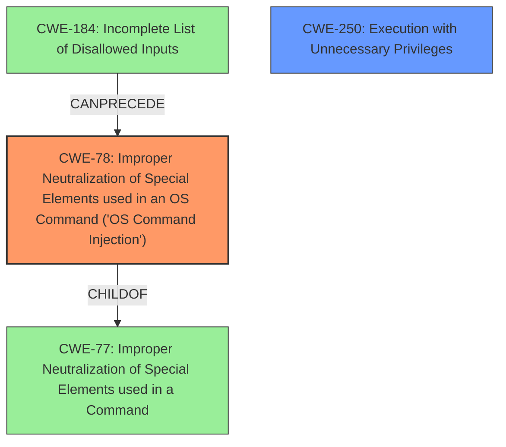

# Analysis Report for CVE-2024-47562

# Vulnerability Analysis Report: CVE-2024-47562

## Description

A vulnerability has been identified in Siemens SINEC Security Monitor (All versions < V4.9.0). The affected application does not properly neutralize special elements in user input to the ```ssmctl-client``` command. This could allow an authenticated, lowly privileged local attacker to execute privileged commands in the underlying OS.

## Vulnerability Description Key Phrases

- **Rootcause:** improper input sanitization
- **Impact:** execute privileged commands
- **Attacker:** authenticated lowly privileged local attacker
- **Product:** Siemens SINEC Security Monitor
- **Version:** All versions less than V4.9.0
- **Component:** ssmctl-client command

## Analysis (with Relationship Data)

# Summary
| CWE ID | CWE Name | Confidence | CWE Abstraction Level | CWE Vulnerability Mapping Label | CWE-Vulnerability Mapping Notes |
|---|---|---|---|---|---|
| CWE-78 | Improper Neutralization of Special Elements used in an OS Command ('OS Command Injection') | 1.0 | Base | Allowed | Primary CWE. The application fails to sanitize user-supplied input to the `ssmctl-client` command, which allows for the execution of arbitrary commands. |
| CWE-250 | Execution with Unnecessary Privileges | 0.7 | Base | Allowed | Secondary CWE. An authenticated, lowly privileged local attacker can execute privileged commands on the underlying OS. |

## Evidence and Confidence

*   **Confidence Score:** 0.9
*   **Evidence Strength:** HIGH

## Relationship Analysis
The primary relationship influencing the decision is the ChildOf relationship between CWE-78 and its parent CWE-77 (Improper Neutralization of Special Elements used in a Command). While CWE-77 is more general, CWE-78 specifically addresses OS command injection, which is the vulnerability described. CWE-78 also has a CanFollow relationship with CWE-184 (Incomplete List of Disallowed Inputs), suggesting that an incomplete list of disallowed inputs could lead to command injection.



## Vulnerability Chain
The vulnerability chain starts with **improper input sanitization** (the **root cause**) of user input to the `ssmctl-client` command (CWE-78), leading to the ability of an authenticated, lowly privileged local attacker to execute privileged commands on the underlying OS (CWE-250).

## Summary of Analysis
The initial assessment strongly suggests CWE-78 as the primary weakness due to the clear evidence of **improper input sanitization** leading to OS command injection. The vulnerability description and the CVE Reference Links Content Summary both explicitly mention this. The relationship analysis further supports this by showing how an incomplete list of disallowed inputs (CWE-184) can precede command injection (CWE-78). CWE-250 is a secondary factor because a command is being executed with elevated privileges.

The selection of CWE-78 is based on the following evidence:

*   Vulnerability Description Key Phrases: "**rootcause:** **improper input sanitization**"
*   CVE Reference Links Content Summary: "The application does not properly neutralize special elements in user input to the `ssmctl-client` command."
*   CVE Reference Links Content Summary: "Command injection (CWE-77). The application fails to sanitize user-supplied input to the `ssmctl-client` command, which allows for the execution of arbitrary commands."

The retriever results also list CWE-78 with a high score, further reinforcing this choice. The abstraction level is appropriate because CWE-78 is a Base level CWE, giving enough specificity.

Other CWEs Considered:

*   CWE-74 (Improper Neutralization of Special Elements in Output Used by a Downstream Component ('Injection')): While related to injection vulnerabilities, CWE-74 is a class-level CWE and less specific than CWE-78. It's also discouraged.
*   CWE-20 (Improper Input Validation): While **improper input sanitization** is a form of **improper input validation**, CWE-20 is a broad, class-level CWE. CWE-78 is more specific to the type of vulnerability (OS command injection).
*   CWE-94 (Improper Control of Generation of Code ('Code Injection')): This is related to code injection, but the vulnerability description specifically mentions command injection, making CWE-78 a better fit.
*   CWE-22 (Improper Limitation of a Pathname to a Restricted Directory ('Path Traversal')): This is not relevant as there's no mention of path traversal in the vulnerability description.
*   CWE-269 (Improper Privilege Management): While the impact involves executing privileged commands, the root cause is the command injection, not the privilege management itself.

CWE-78 is at the optimal level of specificity because it directly addresses the root cause of the vulnerability: **improper neutralization** leading to OS command injection. The other considered CWEs are either too general or not directly related to the vulnerability.


## CWE Relationship Analysis

Current CWEs represent these abstraction levels: .


### Vulnerability Chain Analysis

**Chain starting from CWE-94:**
- 94 (Improper Control of Generation of Code ('Code Injection')) - ROOT


**Chain starting from CWE-77:**
- 77 (Improper Neutralization of Special Elements used in a Command ('Command Injection')) - ROOT


### CWE Relationship Diagram

```mermaid
graph TD
    classDef primary fill:#f96,stroke:#333,stroke-width:2px
    classDef secondary fill:#69f,stroke:#333
    classDef tertiary fill:#9e9,stroke:#333
```


*Report generated on 2025-07-13 18:17:44*
