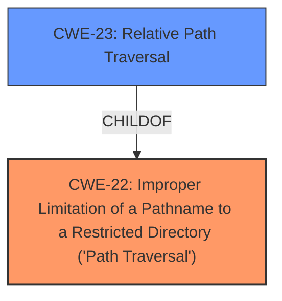

# Analysis Report for CVE-2024-47566

# Vulnerability Analysis Report: CVE-2024-47566

## Description

A **improper limitation of a pathname to a restricted directory (path traversal)** [CWE-23] in Fortinet FortiRecorder version 7.2.0 through 7.2.1 and before 7.0.4 allows a privileged attacker to delete files from the underlying filesystem via crafted CLI requests.

## Vulnerability Description Key Phrases

- **Rootcause:** improper limitation of a pathname to a restricted directory (path traversal)
- **Impact:** delete files from the underlying filesystem
- **Vector:** crafted CLI requests
- **Attacker:** privileged attacker
- **Product:** Fortinet FortiRecorder
- **Version:** 7.2.0 through 7.2.1 and before 7.0.4

## Analysis (with Relationship Data)

# Summary
| CWE ID | CWE Name | Confidence | CWE Abstraction Level | CWE Vulnerability Mapping Label | CWE-Vulnerability Mapping Notes |
|---|---|---|---|---|---|
| CWE-22 | Improper Limitation of a Pathname to a Restricted Directory ('Path Traversal') | 1.0 | Base | Allowed | Primary CWE. This is the root cause of the vulnerability. |
| CWE-23 | Relative Path Traversal | 0.7 | Base | Allowed | Secondary candidate. This is a more specific version of CWE-22, but the description does not provide enough details to confirm it.|
  
## Evidence and Confidence

*   **Confidence Score:** 0.9
*   **Evidence Strength:** HIGH

## Relationship Analysis
The primary weakness is CWE-22, which describes the **improper limitation of a pathname to a restricted directory**. CWE-23, **Relative Path Traversal**, is a child of CWE-22, representing a specific type of path traversal. While the description mentions "relative path traversal vulnerabilities," it also refers to a more general **improper limitation of a pathname**, suggesting that CWE-22 is a more fitting primary classification. The graph relationships in the Enhanced Context section confirm these hierarchical relationships.



## Vulnerability Chain
The vulnerability chain starts with **improper limitation of a pathname to a restricted directory** [CWE-22]. This leads to the ability for a privileged attacker to delete files from the underlying filesystem.

## Summary of Analysis
The initial assessment, based on the vulnerability description and the provided evidence, strongly suggests CWE-22 as the primary weakness. The description explicitly mentions "**improper limitation of a pathname to a restricted directory (path traversal)**", which is the definition of CWE-22. The CVE Reference Links Content Summary also points to **Path Traversal** [CWE-23] vulnerabilities.

The retriever results list CWE-22 as the top result and CWE-23 as a secondary possibility. CWE-23 is a child of CWE-22, representing a specific type of path traversal using relative paths. Given the information, CWE-22 is the better fit as the primary weakness, with CWE-23 as a secondary candidate.

Relevant CWE Information:

# Enhanced Context (25 CWEs)
The following CWEs were identified as potentially relevant to this vulnerability:

## CWE-23: Relative Path Traversal
**Abstraction Level**: Base
**Similarity Score**: 0.75
**Source**: dense

**Description**:
The product uses external input to construct a pathname that should be within a restricted directory, but it does not properly neutralize sequences such as ".." that can resolve to a location that is outside of that directory.

**Mapping Guidance**:
- Usage: Allowed
- Rationale: This CWE entry is at the Base level of abstraction, which is a preferred level of abstraction for mapping to the root causes of vulnerabilities.

## CWE-22: Improper Limitation of a Pathname to a Restricted Directory ('Path Traversal')
**Abstraction Level**: Base
**Similarity Score**: 858.08
**Source**: sparse

**Description**:
The product uses external input to construct a pathname that is intended to identify a file or directory that is located underneath a restricted parent directory, but the product does not properly neutralize special elements within the pathname that can cause the pathname to resolve to a location that is outside of the restricted directory.

**Mapping Guidance**:
- Usage: Allowed
- Rationale: This CWE entry is at the Base level of abstraction, which is a preferred level of abstraction for mapping to the root causes of vulnerabilities.

## CWE-73: External Control of File Name or Path
**Abstraction Level**: Base
**Similarity Score**: 0.74
**Source**: dense

**Description**:
The product allows user input to control or influence paths or file names that are used in filesystem operations.

**Mapping Guidance**:
- Usage: Allowed
- Rationale: This CWE entry is at the Base level of abstraction, which is a preferred level of abstraction for mapping to the root causes of vulnerabilities.

## CWE-59: Improper Link Resolution Before File Access ('Link Following')
**Abstraction Level**: Base
**Similarity Score**: 0.70
**Source**: dense

**Description**:
The product attempts to access a file based on the filename, but it does not properly prevent that filename from identifying a link or shortcut that resolves to an unintended resource.

**Mapping Guidance**:
- Usage: Allowed
- Rationale: This CWE entry is at the Base level of abstraction, which is a preferred level of abstraction for mapping to the root causes of vulnerabilities.


## CWE Relationship Analysis

Current CWEs represent these abstraction levels: .


### Vulnerability Chain Analysis

**Chain starting from CWE-59:**
- 59 (Improper Link Resolution Before File Access ('Link Following')) - ROOT


**Chain starting from CWE-73:**
- 73 (External Control of File Name or Path) - ROOT


### CWE Relationship Diagram

```mermaid
graph TD
    classDef primary fill:#f96,stroke:#333,stroke-width:2px
    classDef secondary fill:#69f,stroke:#333
    classDef tertiary fill:#9e9,stroke:#333
```


*Report generated on 2025-07-13 18:18:00*
