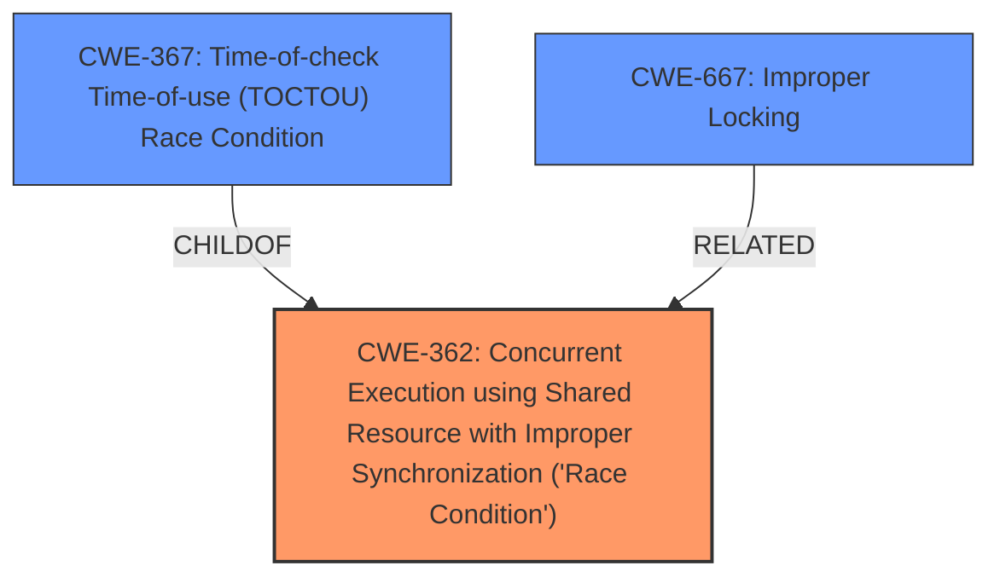

# Raw Analyzer Response for CVE-2024-47679

# Summary
| CWE ID | CWE Name | Confidence | CWE Abstraction Level | CWE Vulnerability Mapping Label | CWE-Vulnerability Mapping Notes |
|---|---|---|---|---|---|
| CWE-362 | Concurrent Execution using Shared Resource with Improper Synchronization ('Race Condition') | 1.0 | Class | Allowed-with-Review | Primary CWE. The vulnerability is fundamentally a race condition. |
| CWE-367 | Time-of-check Time-of-use (TOCTOU) Race Condition | 0.8 | Base | Allowed | Secondary Candidate. A specific type of race condition. |
| CWE-667 | Improper Locking | 0.7 | Class | Allowed-with-Review | Secondary Candidate. The race condition is caused by improper locking. |

## Evidence and Confidence

*   **Confidence Score:** 0.9
*   **Evidence Strength:** HIGH

## Relationship Analysis
The primary CWE is CWE-362 **Concurrent Execution using Shared Resource with Improper Synchronization ('Race Condition')**, which is a class-level CWE. A more specific type of race condition is CWE-367 **Time-of-check Time-of-use (TOCTOU) Race Condition**, which is a base-level CWE and a child of CWE-362. The race condition is caused by improper locking, which is CWE-667.

## Vulnerability Chain
The vulnerability chain starts with a **race condition** (CWE-362) due to **improper synchronization** when accessing inodes. Specifically, the `evict_inodes()` function and the `iput()` function are racing. This leads to a double eviction, which causes a kernel panic. The TOCTOU (CWE-367) aspect comes from the fact that the `i_count` is checked before acquiring the lock, but can change before the lock is acquired. The improper locking (CWE-667) is the cause of the race condition.

## Summary of Analysis
The analysis is based on the provided evidence, which includes the vulnerability description and the CVE reference links content summary. The key phrase "race condition" in the vulnerability description and the description of the interaction between `evict_inodes()` and `iput()` strongly support the selection of CWE-362 as the primary CWE.

The evidence includes:
> **Root Cause:** The root cause is a **race condition** in the Linux kernel's virtual file system (VFS) layer, specifically between the `evict_inodes()` function (which is called during superblock shutdown) and the combination of `find_inode()` and `iput()` functions when accessing an inode.

The retriever results also support the selection of CWE-362 as the primary CWE.

The relationships between the CWEs influenced the final selection. CWE-367 is a more specific type of race condition, but it is not as directly applicable as CWE-362. CWE-667 is a contributing factor to the race condition, but it is not the primary weakness.

The selected CWEs are at the optimal level of specificity. CWE-362 is a class-level CWE, but it is the most accurate representation of the vulnerability. CWE-367 and CWE-667 are more specific, but they are not as essential to understanding the vulnerability.

Relevant CWE Information:

# Enhanced Context (25 CWEs)
The following CWEs were identified as potentially relevant to this vulnerability:

## CWE-362: Concurrent Execution using Shared Resource with Improper Synchronization ('Race Condition')
**Abstraction Level**: Class
**Similarity Score**: 0.78
**Source**: dense

**Description**:
The product contains a concurrent code sequence that requires temporary, exclusive access to a shared resource, but a timing window exists in which the shared resource can be modified by another code sequence operating concurrently.

**Mapping Guidance**:
- Usage: Allowed-with-Review
- Rationale: This CWE entry is a Class and might have Base-level children that would be more appropriate

## CWE-367: Time-of-check Time-of-use (TOCTOU) Race Condition
**Abstraction Level**: Base
**Similarity Score**: 0.76
**Source**: dense

**Description**:
The product checks the state of a resource before using that resource, but the resource's state can change between the check and the use in a way that invalidates the results of the check. This can cause the product to perform invalid actions when the resource is in an unexpected state.

**Mapping Guidance**:
- Usage: Allowed
- Rationale: This CWE entry is at the Base level of abstraction, which is a preferred level of abstraction for mapping to the root causes of vulnerabilities.

## CWE-667: Improper Locking
**Abstraction Level**: Class
**Similarity Score**: 0.75
**Source**: dense

**Description**:
The product does not properly acquire or release a lock on a resource, leading to unexpected resource state changes and behaviors.

**Mapping Guidance**:
- Usage: Allowed-with-Review
- Rationale: This CWE entry is a Class and might have Base-level children that would be more appropriate

### CWE Considerations

*   CWE-775 **Missing Release of File Descriptor or Handle after Effective Lifetime**: This CWE is not appropriate because the vulnerability is not about failing to release a file descriptor or handle.
*   CWE-364 **Signal Handler Race Condition**: This CWE is not appropriate because the vulnerability is not related to signal handlers.
*   CWE-88 **Improper Neutralization of Argument Delimiters in a Command ('Argument Injection')**: This CWE is not appropriate because the vulnerability is not about argument injection.
*   CWE-476 **NULL Pointer Dereference**: This CWE is not appropriate because the vulnerability is not a null pointer dereference.
*   CWE-863 **Incorrect Authorization**: This CWE is not appropriate because the vulnerability is not about incorrect authorization.
*   CWE-363 **Race Condition Enabling Link Following**: This CWE is not appropriate because the vulnerability is not about link following.
*   CWE-609 **Double-Checked Locking**: This CWE is not appropriate because the vulnerability is not about double-checked locking.