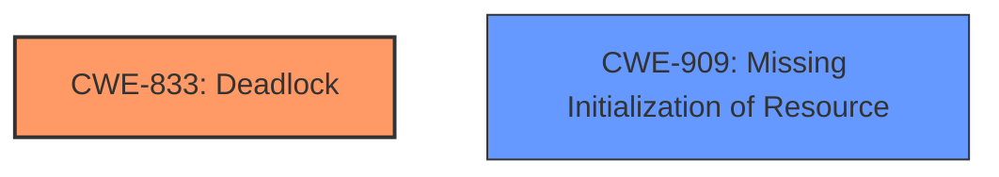

# Analysis Report for CVE-2024-47696

# Vulnerability Analysis Report: CVE-2024-47696

## Description

In the Linux kernel, the following vulnerability has been resolved RDMA/iwcm Fix WARNINGat_kernel/workqueue.c#check_flush_dependency In the commit aee2424246f9 (RDMA/iwcm Fix a use-after-free related to destroying CM IDs), the function flush_workqueue is invoked to flush the work queue iwcm_wq. But at that time, the work queue iwcm_wq was created via the function alloc_ordered_workqueue without the flag WQ_MEM_RECLAIM. Because the current process is trying to flush the whole iwcm_wq, if iwcm_wq doesnt have the flag WQ_MEM_RECLAIM, verify that the current process is not reclaiming memory or running on a workqueue which doesnt have the flag WQ_MEM_RECLAIM as that can break forward-progress guarantee leading to a deadlock. The call trace is as below [ 125.350876][ T1430] Call Trace [ 125.356281][ T1430] [ 125.361285][ T1430] ? __warn (kernel/panic.c693) [ 125.367640][ T1430] ? check_flush_dependency (kernel/workqueue.c3706 (discriminator 9)) [ 125.375689][ T1430] ? report_bug (lib/bug.c180 lib/bug.c219) [ 125.382505][ T1430] ? handle_bug (arch/x86/kernel/traps.c239) [ 125.388987][ T1430] ? exc_invalid_op (arch/x86/kernel/traps.c260 (discriminator 1)) [ 125.395831][ T1430] ? asm_exc_invalid_op (arch/x86/include/asm/idtentry.h621) [ 125.403125][ T1430] ? check_flush_dependency (kernel/workqueue.c3706 (discriminator 9)) [ 125.410984][ T1430] ? check_flush_dependency (kernel/workqueue.c3706 (discriminator 9)) [ 125.418764][ T1430] __flush_workqueue (kernel/workqueue.c3970) [ 125.426021][ T1430] ? __pfx___might_resched (kernel/sched/core.c10151) [ 125.433431][ T1430] ? destroy_cm_id (drivers/infiniband/core/iwcm.c375) iw_cm [ 125.441209][ T1430] ? __pfx___flush_workqueue (kernel/workqueue.c3910) [ 125.473900][ T1430] ? _raw_spin_lock_irqsave (arch/x86/include/asm/atomic.h107 include/linux/atomic/atomic-arch-fallback.h2170 include/linux/atomic/atomic-instrumented.h1302 include/asm-generic/qspinlock.h111 include/linux/spinlock.h187 include/linux/spinlock_api_smp.h111 kernel/locking/spinlock.c162) [ 125.473909][ T1430] ? __pfx__raw_spin_lock_irqsave (kernel/locking/spinlock.c161) [ 125.482537][ T1430] _destroy_id (drivers/infiniband/core/cma.c2044) rdma_cm [ 125.495072][ T1430] nvme_rdma_free_queue (drivers/nvme/host/rdma.c656 drivers/nvme/host/rdma.c650) nvme_rdma [ 125.505827][ T1430] nvme_rdma_reset_ctrl_work (drivers/nvme/host/rdma.c2180) nvme_rdma [ 125.505831][ T1430] process_one_work (kernel/workqueue.c3231) [ 125.515122][ T1430] worker_thread (kernel/workqueue.c3306 kernel/workqueue.c3393) [ 125.515127][ T1430] ? __pfx_worker_thread (kernel/workqueue.c3339) [ 125.531837][ T1430] kthread (kernel/kthread.c389) [ 125.539864][ T1430] ? __pfx_kthread (kernel/kthread.c342) [ 125.550628][ T1430] ret_from_fork (arch/x86/kernel/process.c147) [ 125.558840][ T1430] ? __pfx_kthread (kernel/kthread.c342) [ 125.558844][ T1430] ret_from_fork_asm (arch/x86/entry/entry_64.S257) [ 125.566487][ T1430] [ 125.566488][ T1430] ---[ end trace 0000000000000000 ]---

## Vulnerability Description Key Phrases

- **Rootcause:** The workqueue iwcm_wq was created without the WQ_MEM_RECLAIM flag, leading to a potential deadlock when trying to flush it during memory reclamation.
- **Weakness:** The workqueue iwcm_wq lacks the WQ_MEM_RECLAIM flag, which is necessary for safe flushing during memory reclamation.
- **Impact:** A deadlock can occur, causing the system to become unresponsive.
- **Vector:** The vulnerability is triggered when the function flush_workqueue is invoked to flush the work queue iwcm_wq during memory reclamation. The call chain includes destroy_cm_id which is part of the RDMA subsystem's connection management, and then nvme_rdma_free_queue which is part of the NVMe RDMA driver.
- **Attacker:** An attacker cannot directly trigger this vulnerability as it's a race condition related to memory reclamation and the workqueue flush. The attacker needs to somehow trigger the call chain.
- **Product:** Linux Kernel
- **Version:** Not specified in the provided text, but it's likely a version before the fix commit aee2424246f9 was applied.
- **Component:** RDMA/iwcm (InfiniBand Connection Manager), workqueue subsystem, and NVMe RDMA driver.

## Analysis (with Relationship Data)

# Summary
| CWE ID | CWE Name | Confidence | CWE Abstraction Level | CWE Vulnerability Mapping Label | CWE-Vulnerability Mapping Notes |
|---|---|---|---|---|---|
| CWE-833 | Deadlock | 0.9 | Base | Primary | Allowed |
| CWE-909 | Missing Initialization of Resource | 0.7 | Class | Secondary | Allowed-with-Review |

## Evidence and Confidence

*   **Confidence Score:** 0.8
*   **Evidence Strength:** HIGH

## Relationship Analysis
The primary relationship influencing the CWE selection is the root cause of the deadlock. The **missing** `WQ_MEM_RECLAIM` flag during workqueue creation is the **rootcause**. While `CWE-909` describes the **missing** initialization, `CWE-833` more accurately captures the resulting deadlock scenario directly described in the vulnerability. `CWE-833` is a Base level CWE, which is preferred. `CWE-909` is a Class level CWE, and although it describes the **missing** initialization of a resource, it does not fully capture the deadlock itself.



## Vulnerability Chain
The vulnerability chain starts with the **missing** initialization of the `WQ_MEM_RECLAIM` flag when the `iwcm_wq` workqueue is created (`CWE-909`). This leads to a situation where flushing the workqueue during memory reclamation can cause a deadlock (`CWE-833`).

`CWE-909` -> `CWE-833`

## Summary of Analysis
The analysis focuses on identifying the **rootcause** and the resulting impact. The **rootcause** is the **missing** `WQ_MEM_RECLAIM` flag, leading to a deadlock. The evidence provided in the vulnerability description clearly points to this sequence of events. The selection of `CWE-833` as the primary CWE is based on the direct evidence of a deadlock occurring.
The analysis is heavily based on the provided evidence, specifically the **Vulnerability Description Key Phrases** and the **CVE Reference Links Content Summary**.
```
**rootcause:** The workqueue iwcm_wq was created without the WQ_MEM_RECLAIM flag, leading to a potential deadlock when trying to flush it during memory reclamation.
**weakness:** The workqueue iwcm_wq lacks the WQ_MEM_RECLAIM flag, which is necessary for safe flushing during memory reclamation.
**impact:** A deadlock can occur, causing the system to become unresponsive.
```
The hierarchical relationships and retriever scores were considered, but the primary decision driver was the explicit mention of a deadlock and the **missing** flag. The selected CWEs are at the optimal level of specificity because `CWE-833` is a Base CWE and `CWE-909` captures the **missing** initialization aspect.

Relevant CWE Information:

# Enhanced Context (25 CWEs)
The following CWEs were identified as potentially relevant to this vulnerability:

## CWE-667: Improper Locking
**Abstraction Level**: Class
**Similarity Score**: 0.79
**Source**: dense

**Description**:
The product does not properly acquire or release a lock on a resource, leading to unexpected resource state changes and behaviors.

**Mapping Guidance**:
- Usage: Allowed-with-Review
- Rationale: This CWE entry is a Class and might have Base-level children that would be more appropriate

Technical Explanation for CWE-833: Deadlock
*   How the vulnerability's details match the CWE's characteristics: The vulnerability description explicitly mentions a deadlock caused by the workqueue `iwcm_wq` being flushed without the `WQ_MEM_RECLAIM` flag set, which is detected by `check_flush_dependency`.
*   The security implications and potential impact: The deadlock leads to a denial of service, causing the system to become unresponsive.
*   Any parent-child relationships or chain patterns that influenced your mapping: N/A
*   Whether the weakness is primary or secondary in the vulnerability: Primary
*   How the official MITRE mapping guidance influenced your decision: The MITRE mapping guidance allows the use of `CWE-833` with the rationale that it is at the Base level of abstraction.

Technical Explanation for CWE-909: Missing Initialization of Resource
*   How the vulnerability's details match the CWE's characteristics: The workqueue `iwcm_wq` is created without the `WQ_MEM_RECLAIM` flag, which can be considered as a **missing** initialization.
*   The security implications and potential impact: The **missing** initialization leads to a deadlock during memory reclamation.
*   Any parent-child relationships or chain patterns that influenced your mapping: N/A
*   Whether the weakness is primary or secondary in the vulnerability: Secondary
*   How the official MITRE mapping guidance influenced your decision: The MITRE mapping guidance allows the use of `CWE-909` with review because it is a Class-level CWE.

Other CWEs Considered but Not Used:

*   CWE-667: Improper Locking: While locking is involved in deadlocks, the **rootcause** is the **missing** flag and not directly an improper locking mechanism.
*   CWE-362: Concurrent Execution using Shared Resource with Improper Synchronization ('Race Condition'): While a race condition may contribute to the deadlock, the core issue is the **missing** `WQ_MEM_RECLAIM` flag.
*   CWE-416: Use After Free: Not applicable, as the issue is not related to use-after-free.
*   CWE-789: Memory Allocation with Excessive Size Value: Not applicable, as the issue is not about excessive memory allocation.
*   CWE-755: Improper Handling of Exceptional Conditions: While a deadlock is an exceptional condition, the **rootcause** is not the handling of the condition, but the **missing** flag.
*   CWE-476: NULL Pointer Dereference: Not applicable, as the issue is not related to null pointer dereference.
*   CWE-119: Improper Restriction of Operations within the Bounds of a Memory Buffer: Not applicable, as the issue is not related to buffer operations.
*   CWE-191: Integer Underflow (Wrap or Wraparound): Not applicable, as the issue is not related to integer underflow.
*   CWE-824: Access of Uninitialized Pointer: Not applicable, as the issue is not related to pointer access.


## CWE Relationship Analysis

Current CWEs represent these abstraction levels: .


### Vulnerability Chain Analysis

**Chain starting from CWE-416:**
- 416 (Use After Free) - ROOT


**Chain starting from CWE-476:**
- 476 (NULL Pointer Dereference) - ROOT


### CWE Relationship Diagram

```mermaid
graph TD
    classDef primary fill:#f96,stroke:#333,stroke-width:2px
    classDef secondary fill:#69f,stroke:#333
    classDef tertiary fill:#9e9,stroke:#333
```


*Report generated on 2025-07-13 18:21:27*
