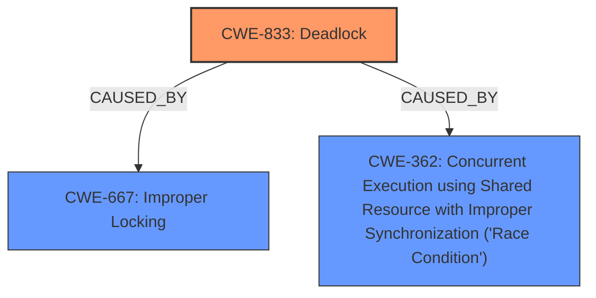

# Raw Analyzer Response for CVE-2024-47744

# Summary
| CWE ID | CWE Name | Confidence | CWE Abstraction Level | CWE Vulnerability Mapping Label | CWE-Vulnerability Mapping Notes |
|---|---|---|---|---|---|
| CWE-833 | Deadlock | 0.9 | Base | Primary | Allowed |
| CWE-667 | Improper Locking | 0.7 | Class | Secondary Candidate | Allowed-with-Review |
| CWE-362 | Concurrent Execution using Shared Resource with Improper Synchronization ('Race Condition') | 0.6 | Class | Secondary Candidate | Allowed-with-Review |

## Evidence and Confidence

*   **Confidence Score:** 0.8
*   **Evidence Strength:** HIGH

## Relationship Analysis
The primary CWE, CWE-833 (Deadlock), is caused by **improper locking** and **synchronization** issues, which are represented by the secondary CWEs CWE-667 (Improper Locking) and CWE-362 (Concurrent Execution using Shared Resource with Improper Synchronization ('Race Condition')).

## Vulnerability Chain
The vulnerability chain starts with **improper locking** and **synchronization**, leading to a **deadlock** condition that impacts system availability.
  - **Root Cause:** **Improper locking** (CWE-667) and **Improper Synchronization** (CWE-362)
  - **Weakness:** **Deadlock** (CWE-833)
  - **Impact:** Denial of Service (system unresponsiveness)

## Summary of Analysis
The primary weakness is a **potential deadlock** due to a **chain of locks and SRCU synchronizations** in the Linux kernel's KVM subsystem. The analysis focuses on identifying the root cause and how it leads to the deadlock condition.

The vulnerability description clearly states the root cause as a "**chain of locks and SRCU synchronizations**" leading to a "**potential deadlock**". The CVE Reference Links Content Summary confirms this, stating that the root cause is a "potential deadlock in the KVM (Kernel-based Virtual Machine) subsystem of the Linux kernel on x86 architectures" due to a "complex interaction of multiple locks".

The selected CWEs are at the optimal level of specificity because:
  - CWE-833 (Deadlock) directly represents the vulnerability's primary symptom and impact.
  - CWE-667 (Improper Locking) and CWE-362 (Concurrent Execution using Shared Resource with Improper Synchronization ('Race Condition')) explain the underlying causes contributing to the deadlock.

Relevant CWE Information:

# Enhanced Context (25 CWEs)
The following CWEs were identified as potentially relevant to this vulnerability:

## CWE-833: Deadlock
**Abstraction Level**: Base
**Similarity Score**: 0.80
**Source**: dense

**Description**:
The product contains multiple threads or executable segments that are waiting for each other to release a necessary lock, resulting in deadlock.

**Mapping Guidance**:
- Usage: Allowed
- Rationale: This CWE entry is at the Base level of abstraction, which is a preferred level of abstraction for mapping to the root causes of vulnerabilities.

*Analysis:* This is a strong candidate due to the explicit mention of "deadlock" in the vulnerability description and CVE summary.

## CWE-667: Improper Locking
**Abstraction Level**: Class
**Similarity Score**: 0.78
**Source**: dense

**Description**:
The product does not properly acquire or release a lock on a resource, leading to unexpected resource state changes and behaviors.

**Mapping Guidance**:
- Usage: Allowed-with-Review
- Rationale: This CWE entry is a Class and might have Base-level children that would be more appropriate

*Analysis:* This is relevant because the deadlock arises from issues with locking mechanisms.

## CWE-362: Concurrent Execution using Shared Resource with Improper Synchronization ('Race Condition')
**Abstraction Level**: Class
**Similarity Score**: 0.73
**Source**: dense

**Description**:
The product contains a concurrent code sequence that requires temporary, exclusive access to a shared resource, but a timing window exists in which the shared resource can be modified by another code sequence operating concurrently.

**Mapping Guidance**:
- Usage: Allowed-with-Review
- Rationale: This CWE entry is a Class and might have Base-level children that would be more appropriate

*Analysis:* This is relevant as the deadlock involves concurrent execution and synchronization issues related to shared resources and locks.

## CWE-367: Time-of-check Time-of-use (TOCTOU) Race Condition
**Abstraction Level**: Base
**Similarity Score**: 0.71
**Source**: dense

**Description**:
The product checks the state of a resource before using that resource, but the resource's state can change between the check and the use in a way that invalidates the results of the check. This can cause the product to perform invalid actions when the resource is in an unexpected state.

**Mapping Guidance**:
- Usage: Allowed
- Rationale: This CWE entry is at the Base level of abstraction, which is a preferred level of abstraction for mapping to the root causes of vulnerabilities.

*Analysis:* While race conditions can contribute to deadlocks, the description doesn't specifically point to a TOCTOU issue.

## CWE-413: Improper Resource Locking
**Abstraction Level**: Base
**Similarity Score**: 0.73
**Source**: dense

**Description**:
The product does not lock or does not correctly lock a resource when the product must have exclusive access to the resource.

**Mapping Guidance**:
- Usage: Allowed
- Rationale: This CWE entry is at the Base level of abstraction, which is a preferred level of abstraction for mapping to the root causes of vulnerabilities.

*Analysis:* This is a more specific version of CWE-667 and is relevant as the deadlock arises from issues with locking mechanisms.

**CWE Selection Justification:**

*   **CWE-833 (Deadlock):** This is the primary CWE because the vulnerability description explicitly mentions a "potential deadlock." The CVE summary further reinforces this by stating that the root cause is a deadlock in the KVM subsystem. Confidence: 0.9
*   **CWE-667 (Improper Locking):** This CWE is a secondary candidate because the deadlock results from incorrect lock acquisition or release. The CVE summary mentions "circular locking dependency" and "improper lock ordering," indicating improper locking practices. Confidence: 0.7
*   **CWE-362 (Concurrent Execution using Shared Resource with Improper Synchronization ('Race Condition'))**: This CWE is a secondary candidate because the deadlock involves concurrent execution of code sequences accessing shared resources with inadequate synchronization. The CVE summary refers to "Use of shared locks for unrelated resources" Confidence: 0.6

**CWEs Considered But Not Used:**

*   CWE-367 (Time-of-check Time-of-use (TOCTOU) Race Condition): While race conditions are present, the core issue is the deadlock itself, and a TOCTOU race condition is not explicitly described.
*   CWE-413 (Improper Resource Locking): The root cause is better represented by CWE-667 (Improper Locking), a more general class that covers the specific locking issues.
*   CWE-412 (Unrestricted Externally Accessible Lock), CWE-764 (Multiple Locks of a Critical Resource), CWE-765 (Multiple Unlocks of a Critical Resource): These are not selected because the provided vulnerability description doesn't provide evidence of these specific locking issues.
*   CWE-125 (Out-of-bounds Read): The vulnerability doesn't describe an out-of-bounds read scenario.
*   CWE-416 (Use After Free): The vulnerability doesn't describe a use-after-free scenario.