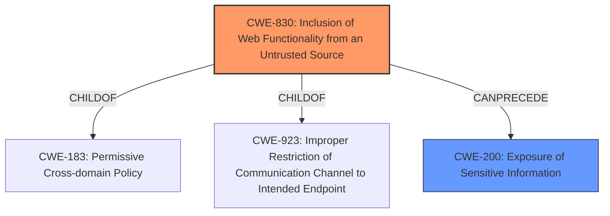

# Analysis for CVE-2024-47779

# Summary
| CWE ID    | CWE Name                                                      | Confidence | CWE Abstraction Level | CWE Vulnerability Mapping Label | CWE-Vulnerability Mapping Notes |
| --------- | ------------------------------------------------------------- | ---------- | --------------------- | ----------------------------- | ------------------------------- |
| CWE-830   | Inclusion of Web Functionality from an Untrusted Source       | 0.85       | Variant               | Primary CWE                   | Allowed                       |
| CWE-200   | Exposure of Sensitive Information When the product transmits or stores sensitive information, it does not properly protect the data from being accessed by unauthorized actors. | 0.75       | Class               | Secondary CWE                   | Allowed                       |

## Evidence and Confidence

*   **Confidence Score:** 0.80
*   **Evidence Strength:** MEDIUM

## Relationship Analysis
The primary CWE is CWE-830, a Variant of CWE-183 (Permissive Cross-domain Policy) and CWE-923 (Improper Restriction of Communication Channel to Intended Endpoint). The relationship indicates a focus on untrusted sources influencing web functionality. The secondary CWE, CWE-200, captures the impact of exposed sensitive information (access token). These CWEs are related, as the untrusted source leads to the exposure of the sensitive token.

## Vulnerability Chain
The vulnerability chain starts with the inclusion of web functionality from an untrusted source (CWE-830) via malicious widgets, leading to the exposure of sensitive information, specifically the access token (CWE-200).

## Summary of Analysis
The initial assessment focused on the fact that malicious widgets lead to access token exposure. The primary driver for CWE selection came from the description's focus on **untrusted widgets** leading to **access token exposure**.

CWE-830 (Inclusion of Web Functionality from an Untrusted Source) is selected as the primary CWE because the vulnerability arises from the inclusion and handling of untrusted widgets. The vulnerability description explicitly mentions "malicious widgets" as the vector and "avoid granting permissions to untrusted widgets" as a workaround. This directly aligns with CWE-830, which focuses on the risks associated with incorporating functionality from untrusted sources in web applications.

CWE-200 (Exposure of Sensitive Information) is included as a secondary CWE because the impact of the vulnerability is the exposure of the access token. This exposure is a direct consequence of the **improper handling of untrusted widgets**.

The relationship graph shows how CWE-830 can lead to CWE-200.

Other CWEs Considered but Not Used:

*   CWE-863 (Incorrect Authorization), CWE-287 (Improper Authentication), CWE-306 (Missing Authentication): Although authentication and authorization are related to access control, the core issue is not a failure in authentication or authorization logic itself, but rather the inclusion of untrusted code. Therefore these are not used.
*   CWE-668 (Exposure of Resource to Wrong Sphere): While the access token is exposed to the "wrong sphere," CWE-830 provides a more specific root cause, making it a better fit.
*   CWE-201 (Insertion of Sensitive Information Into Sent Data): This CWE is similar to CWE-200 but focuses more on the *insertion* of sensitive data, rather than the general *exposure*. Given the description, the issue is how the access token is handled when untrusted widgets are involved, not necessarily its insertion into data streams.

Relevant CWE Information:
# Enhanced Context (25 CWEs)
The following CWEs were identified as potentially relevant to this vulnerability:

## CWE-267: Privilege Defined With Unsafe Actions
**Abstraction Level**: Base
**Similarity Score**: 0.79
**Source**: dense

**Description**:
A particular privilege, role, capability, or right can be used to perform unsafe actions that were not intended, even when it is assigned to the correct entity.

**Mapping Guidance**:
- Usage: Allowed
- Rationale: This CWE entry is at the Base level of abstraction, which is a preferred level of abstraction for mapping to the root causes of vulnerabilities.

## CWE-668: Exposure of Resource to Wrong Sphere
**Abstraction Level**: Class
**Similarity Score**: 0.79
**Source**: dense

**Description**:
The product exposes a resource to the wrong control sphere, providing unintended actors with inappropriate access to the resource.

**Mapping Guidance**:
- Usage: Discouraged
- Rationale: CWE-668 is high-level and is often misused as a catch-all when lower-level CWE IDs might be applicable. It is sometimes used for low-information vulnerability reports [REF-1287]. It is a level-1 Class (i.e., a child of a Pillar). It is not useful for trend analysis.

## CWE-266: Incorrect Privilege Assignment
**Abstraction Level**: Base
**Similarity Score**: 0.78
**Source**: dense

**Description**:
A product incorrectly assigns a privilege to a particular actor, creating an unintended sphere of control for that actor.

**Mapping Guidance**:
- Usage: Allowed
- Rationale: This CWE entry is at the Base level of abstraction, which is a preferred level of abstraction for mapping to the root causes of vulnerabilities.

## CWE-451: User Interface (UI) Misrepresentation of Critical Information
**Abstraction Level**: Class
**Similarity Score**: 0.78
**Source**: dense

**Description**:
The user interface (UI) does not properly represent critical information to the user, allowing the information - or its source - to be obscured or spoofed. This is often a component in phishing attacks.

**Mapping Guidance**:
- Usage: Allowed-with-Review
- Rationale: This CWE entry is a Class and might have Base-level children that would be more appropriate

## CWE-472: External Control of Assumed-Immutable Web Parameter
**Abstraction Level**: Base
**Similarity Score**: 0.77
**Source**: dense

**Description**:
The web application does not sufficiently verify inputs that are assumed to be immutable but are actually externally controllable, such as hidden form fields.

**Mapping Guidance**:
- Usage: Allowed
- Rationale: This CWE entry is at the Base level of abstraction, which is a preferred level of abstraction for mapping to the root causes of vulnerabilities.

## CWE-497: Exposure of Sensitive System Information to an Unauthorized Control Sphere
**Abstraction Level**: Base
**Similarity Score**: 0.77
**Source**: dense

**Description**:
The product does not properly prevent sensitive system-level information from being accessed by unauthorized actors who do not have the same level of access to the underlying system as the product does.

**Mapping Guidance**:
- Usage: Allowed
- Rationale: This CWE entry is at the Base level of abstraction, which is a preferred level of abstraction for mapping to the root causes of vulnerabilities.

## CWE-41: Improper Resolution of Path Equivalence
**Abstraction Level**: Base
**Similarity Score**: 0.77
**Source**: dense

**Description**:
The product is vulnerable to file system contents disclosure through path equivalence. Path equivalence involves the use of special characters in file and directory names. The associated manipulations are intended to generate multiple names for the same object.

**Mapping Guidance**:
- Usage: Allowed
- Rationale: This CWE entry is at the Base level of abstraction, which is a preferred level of abstraction for mapping to the root causes of vulnerabilities.

## CWE-280: Improper Handling of Insufficient Permissions or Privileges 
**Abstraction Level**: Base
**Similarity Score**: 0.77
**Source**: dense

**Description**:
The product does not handle or incorrectly handles when it has insufficient privileges to access resources or functionality as specified by their permissions. This may cause it to follow unexpected code paths that may leave the product in an invalid state.

**Mapping Guidance**:
- Usage: Allowed
- Rationale: This CWE entry is at the Base level of abstraction, which is a preferred level of abstraction for mapping to the root causes of vulnerabilities.

## CWE-610: Externally Controlled Reference to a Resource in Another Sphere
**Abstraction Level**: Class
**Similarity Score**: 0.77
**Source**: dense

**Description**:
The product uses an externally controlled name or reference that resolves to a resource that is outside of the intended control sphere.

**Mapping Guidance**:
- Usage: Discouraged