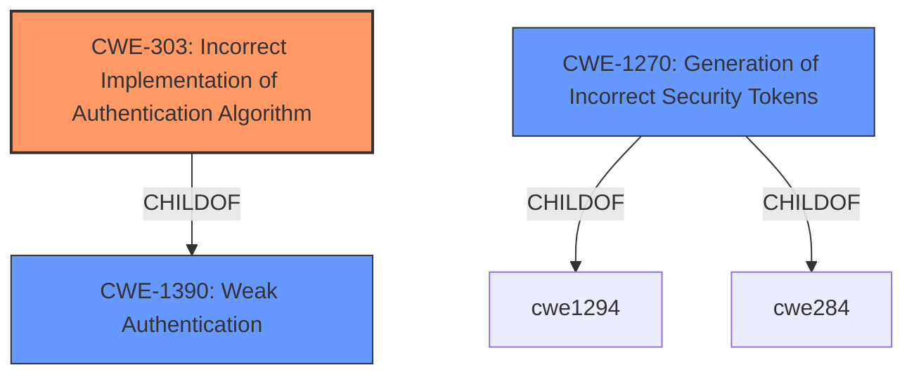

# Analysis for CVE-2024-47806

# Summary
| CWE ID | CWE Name | Confidence | CWE Abstraction Level | CWE Vulnerability Mapping Label | CWE-Vulnerability Mapping Notes |
|---|---|---|---|---|---|
| CWE-303 | Incorrect Implementation of Authentication Algorithm | 0.9 | Base | Allowed | Primary CWE |
| CWE-1270 | Generation of Incorrect Security Tokens | 0.7 | Base | Allowed | Secondary Candidate |

## Evidence and Confidence

*   **Confidence Score:** 0.8
*   **Evidence Strength:** HIGH

## Relationship Analysis
The primary relationship that influenced the decision was the parent-child relationship between CWE-1390 (Weak Authentication) and CWE-303 (Incorrect Implementation of Authentication Algorithm). Since the vulnerability is due to an incorrect implementation of the authentication algorithm rather than a general weakness in authentication, CWE-303 was chosen. CWE-1270 (Generation of Incorrect Security Tokens) is related to incorrect authentication mechanisms and shares characteristics with the vulnerability.

## Vulnerability Chain
The vulnerability chain starts with the **incorrect implementation of the authentication algorithm** (CWE-303), specifically the **failure to validate the `aud` claim in the ID Token**. This leads to the subversion of the authentication flow and potentially unauthorized access, including administrator access.
  - **Root Cause:** CWE-303 (**Incorrect Implementation of Authentication Algorithm**) - **does not check the aud (Audience) claim of an ID Token**
  - **Impact:** Subversion of authentication flow, potential unauthorized access.

## Summary of Analysis
The primary CWE is CWE-303, as it best describes the root cause of the vulnerability: the **incorrect implementation of the authentication algorithm** due to the **missing `aud` claim validation**. The retriever results and guidance on authentication vs authorization helped narrow down the choices. The evidence from the vulnerability description and CVE summary directly support this selection. The abstraction level is appropriate as it's a Base level CWE.

CWE-1270 (Generation of Incorrect Security Tokens) was considered as a secondary candidate because the vulnerability involves the generation and use of ID tokens. However, the **root cause** is more specifically related to the **incorrect implementation** of the validation process rather than the token generation itself, hence the primary focus on CWE-303.

Relevant CWE Information:

# Enhanced Context (25 CWEs)
The following CWEs were identified as potentially relevant to this vulnerability:

## CWE-303: Incorrect Implementation of Authentication Algorithm
**Abstraction Level**: Base
**Similarity Score**: 0.74
**Source**: dense

**Description**:
The requirements for the product dictate the use of an established authentication algorithm, but the implementation of the algorithm is incorrect.

**Mapping Guidance**:
- Usage: Allowed
- Rationale: This CWE entry is at the Base level of abstraction, which is a preferred level of abstraction for mapping to the root causes of vulnerabilities.

## CWE-1270: Generation of Incorrect Security Tokens
**Abstraction Level**: base
**Similarity Score**: 2.47
**Source**: graph

**Description**:
CWE-1270: Generation of Incorrect Security Tokens

**Mapping Guidance**:
- Usage: Allowed
- Rationale: This CWE entry is at the Base level of abstraction, which is a preferred level of abstraction for mapping to the root causes of vulnerabilities.

# Detailed Analysis

## CWE-303: Incorrect Implementation of Authentication Algorithm
*   **Technical Explanation:** The vulnerability arises because the Jenkins plugin **does not check the `aud` (Audience) claim of an ID Token**. This means that the authentication process **incorrectly implements** the OpenID Connect protocol, allowing tokens intended for other services to be used for authentication.
*   **Security Implications:** An attacker can exploit this by providing a crafted or re-used ID token, potentially gaining unauthorized access, including administrator privileges.
*   **Relationship:** CWE-303 is a child of CWE-1390 (Weak Authentication), indicating that it's a specific type of weak authentication due to an incorrect implementation.
*   **Mapping Guidance:** The CWE specifications state that this CWE entry is at the Base level of abstraction, which is a preferred level for mapping to root causes. The usage is "Allowed."
*   **Evidence:** The vulnerability description explicitly states that the plugin **does not check the `aud` claim**.

## CWE-1270: Generation of Incorrect Security Tokens
*   **Technical Explanation:** While the core issue is in validation, an attacker could potentially exploit a system that **generates tokens without proper audience restriction**. This means that the generated token could be used for unintended purposes.
*   **Security Implications:** An attacker could manipulate the token generation process, leading to privilege escalation or information disclosure.
*   **Relationship:** CWE-1270 is a child of CWE-1294 and CWE-284.
*   **Mapping Guidance:** The CWE specifications state that this CWE entry is at the Base level of abstraction, which is a preferred level for mapping to root causes. The usage is "Allowed."
*   **Justification:** This is a secondary consideration, as the primary issue is the lack of validation.

## CWEs Considered But Not Used:

*   **CWE-862 (Missing Authorization):** This CWE was considered but not used because the issue is not a lack of authorization checks *after* authentication, but rather a flaw in the authentication process itself. The system attempts to authenticate, but does so incorrectly.
*   **CWE-287 (Improper Authentication):** This CWE is too general. CWE-303 provides a more specific description of the authentication failure.
*   **CWE-306 (Missing Authentication for Critical Function):** This CWE was not used because authentication *is* attempted, but it's done incorrectly.