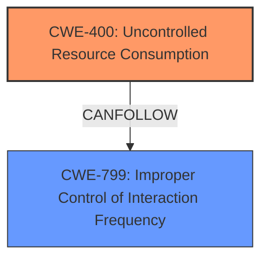

# Analysis Report for CVE-2024-4782

# Vulnerability Analysis Report: CVE-2024-4782

## Description

A denial-of-service vulnerability was reported in some Lenovo printers that could allow an unauthenticated attacker on a shared network to disrupt the printers functionality until a manual system reboot occurs.

## Vulnerability Description Key Phrases

- **Impact:** ['denial of service', 'system reboot']
- **Attacker:** unauthenticated attacker
- **Product:** Lenovo printers

## Analysis (with Relationship Data)

# Summary
| CWE ID | CWE Name | Confidence | CWE Abstraction Level | CWE Vulnerability Mapping Label | CWE-Vulnerability Mapping Notes |
|---|---|---|---|---|---|
| CWE-400 | Uncontrolled Resource Consumption | 0.6 | Base | Primary | Allowed |
| CWE-799 | Improper Control of Interaction Frequency | 0.4 | Class | Secondary Candidate | Allowed-with-Review |

## Evidence and Confidence

*   **Confidence Score:** 0.6
*   **Evidence Strength:** LOW

## Relationship Analysis
The primary CWE, CWE-400 [Uncontrolled Resource Consumption], is a base-level CWE. CWE-799 [Improper Control of Interaction Frequency] is a class-level CWE that could lead to uncontrolled resource consumption.



## Vulnerability Chain
The vulnerability chain starts with a potential lack of control over interaction frequency, leading to uncontrolled resource consumption and ultimately resulting in a denial of service.
  - **Root Cause:** **Improper Control of Interaction Frequency**
  - **Weakness:** **Uncontrolled Resource Consumption**
  - **Impact:** Denial of Service

## Summary of Analysis
The initial assessment focused on identifying the root cause of the denial-of-service vulnerability in Lenovo printers. The description indicates that an unauthenticated attacker on a shared network can disrupt the printer's functionality, requiring a manual system reboot.

Given the limited information, the primary candidate is CWE-400 [Uncontrolled Resource Consumption]. This aligns with the observed denial-of-service, which is a direct consequence of resource exhaustion. The vulnerability description suggests that the printer's resources are being consumed in an uncontrolled manner, leading to the disruption.

However, the description also hints at a potential **improper control of interaction frequency**, which could be the root cause leading to the resource consumption. Thus, CWE-799 [Improper Control of Interaction Frequency] is considered as a secondary candidate.

The selection of CWE-400 [Uncontrolled Resource Consumption] as the primary CWE is based on its direct alignment with the observed impact (denial of service). While CWE-799 [Improper Control of Interaction Frequency] could be a contributing factor, the available evidence is insufficient to definitively confirm it as the primary root cause. Therefore, CWE-400 [Uncontrolled Resource Consumption] is chosen as the primary CWE due to its direct relevance to the vulnerability's impact.

The analysis is heavily based on the limited evidence provided in the vulnerability description. A more detailed analysis would require further information about the specific mechanism used by the attacker to trigger the denial of service.

Relevant CWE Information:

# Enhanced Context (25 CWEs)
The following CWEs were identified as potentially relevant to this vulnerability:

## CWE-755: Improper Handling of Exceptional Conditions
**Abstraction Level**: Class
**Similarity Score**: 0.70

## CWE-497: Exposure of Sensitive System Information to an Unauthorized Control Sphere
**Abstraction Level**: Base
**Similarity Score**: 0.70

## CWE-824: Access of Uninitialized Pointer
**Abstraction Level**: Base
**Similarity Score**: 0.70

## CWE-345: Insufficient Verification of Data Authenticity
**Abstraction Level**: Class
**Similarity Score**: 0.69

## CWE-799: Improper Control of Interaction Frequency
**Abstraction Level**: Class
**Similarity Score**: 0.69

## CWE-119: Improper Restriction of Operations within the Bounds of a Memory Buffer
**Abstraction Level**: Class
**Similarity Score**: 0.68

## CWE-303: Incorrect Implementation of Authentication Algorithm
**Abstraction Level**: Base
**Similarity Score**: 0.68

## CWE-200: Exposure of Sensitive Information to an Unauthorized Actor
**Abstraction Level**: Class
**Similarity Score**: 0.68

## CWE-1391: Use of Weak Credentials
**Abstraction Level**: Class
**Similarity Score**: 0.68

## CWE-248: Uncaught Exception
**Abstraction Level**: Base
**Similarity Score**: 0.68

## CWE-1284: Improper Validation of Specified Quantity in Input
**Abstraction Level**: Base
**Similarity Score**: 427.45

## CWE-667: Improper Locking
**Abstraction Level**: Class
**Similarity Score**: 424.65

## CWE-362: Concurrent Execution using Shared Resource with Improper Synchronization ('Race Condition')
**Abstraction Level**: Class
**Similarity Score**: 419.82

## CWE-125: Out-of-bounds Read
**Abstraction Level**: Base
**Similarity Score**: 418.09

## CWE-367: Time-of-check Time-of-use (TOCTOU) Race Condition
**Abstraction Level**: Base
**Similarity Score**: 405.22

## CWE-843: Access of Resource Using Incompatible Type ('Type Confusion')
**Abstraction Level**: base
**Similarity Score**: 5.03

## CWE-787: Out-of-bounds Write
**Abstraction Level**: base
**Similarity Score**: 4.33

## CWE-125: Out-of-bounds Read
**Abstraction Level**: base
**Similarity Score**: 4.33

## CWE-1287: Improper Validation of Specified Type of Input
**Abstraction Level**: base
**Similarity Score**: 3.64

## CWE-1284: Improper Validation of Specified Quantity in Input
**Abstraction Level**: base
**Similarity Score**: 3.00

## CWE-824: Access of Uninitialized Pointer
**Abstraction Level**: Base
**Similarity Score**: 2.88

## CWE-390: Detection of Error Condition Without Action
**Abstraction Level**: base
**Similarity Score**: 2.87

## CWE-825: Expired Pointer Dereference
**Abstraction Level**: base
**Similarity Score**: 2.87

## CWE-823: Use of Out-of-range Pointer Offset
**Abstraction Level**: base
**Similarity Score**: 2.87

## CWE-822: Untrusted Pointer Dereference
**Abstraction Level**: base
**Similarity Score**: 2.87


## CWE Relationship Analysis

Current CWEs represent these abstraction levels: .


### Vulnerability Chain Analysis

**Chain starting from CWE-390:**
- 390 (Detection of Error Condition Without Action) - ROOT


**Chain starting from CWE-400:**
- 400 (Uncontrolled Resource Consumption) - ROOT


### CWE Relationship Diagram

```mermaid
graph TD
    classDef primary fill:#f96,stroke:#333,stroke-width:2px
    classDef secondary fill:#69f,stroke:#333
    classDef tertiary fill:#9e9,stroke:#333
```


*Report generated on 2025-07-13 18:31:08*
