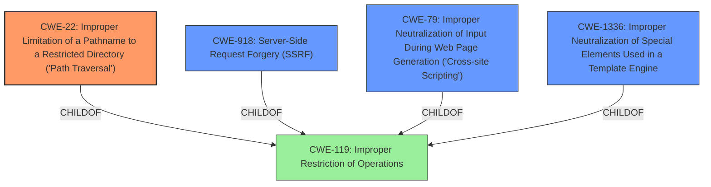

# Analysis for CVE-2024-47883

# Summary

| CWE ID  | CWE Name                                                                                | Confidence | CWE Abstraction Level | CWE Vulnerability Mapping Label | CWE-Vulnerability Mapping Notes |
| :------- | :--------------------------------------------------------------------------------------- | :--------- | :---------------------- | :------------------------------ | :------------------------------ |
| CWE-22   | Improper Limitation of a Pathname to a Restricted Directory ('Path Traversal')         | 0.9        | Base                    | Primary CWE                    | Allowed                       |
| CWE-918  | Server-Side Request Forgery (SSRF)                                                      | 0.8        | Base                    | Secondary Candidate           | Allowed                       |
| CWE-79   | Improper Neutralization of Input During Web Page Generation ('Cross-site Scripting')     | 0.7        | Base                    | Secondary Candidate           | Allowed                       |
| CWE-1336 | Improper Neutralization of Special Elements Used in a Template Engine                   | 0.6        | Base                    | Secondary Candidate           | Allowed                       |

## Evidence and Confidence

*   **Confidence Score:** 0.8
*   **Evidence Strength:** HIGH

## Relationship Analysis

The primary weakness is **CWE-22** Improper Limitation of a Pathname to a Restricted Directory ('Path Traversal'). This is because the application **does not properly neutralize special elements** within the pathname that can cause the pathname to resolve to a location that is outside of the restricted directory.

The secondary weaknesses are:

*   **CWE-918** Server-Side Request Forgery (SSRF) because the application fetches a file from a remote machine as if it was a trusted part of the app's codebase.
*   **CWE-79** Improper Neutralization of Input During Web Page Generation ('Cross-site Scripting') because an attacker can cause arbitrary attacker-controlled JavaScript to be loaded in the victims browser.
*   **CWE-1336** Improper Neutralization of Special Elements Used in a Template Engine because an attacker can influence the resource name used for a template, that attacker could cause the app to fetch and execute an attacker-controlled template.

## Vulnerability Chain

The vulnerability chain starts with **CWE-22** Improper Limitation of a Pathname to a Restricted Directory ('Path Traversal'). This leads to:

1.  An attacker gaining access to files on the server's filesystem or shared by nearby machines (**CWE-22**, **CWE-918**).
2.  An attacker causing arbitrary attacker-controlled JavaScript to be loaded in the victims browser (**CWE-79**).
3.  An attacker causing the app to fetch and execute an attacker-controlled template (**CWE-1336**), leading to remote code execution.

## Summary of Analysis

The analysis is based on the provided evidence, which includes the vulnerability description and keyphrase-specific CWE analysis. The vulnerability description clearly states that the application **does not properly neutralize special elements** within the pathname, which is a key characteristic of **CWE-22**. The description also mentions the possibility of server-side request forgery, cross-site scripting, and remote code execution, which are related to **CWE-918**, **CWE-79**, and **CWE-1336**, respectively.

The graph relationships confirm that **CWE-22** is the primary weakness, as it is the root cause of the other vulnerabilities. The other CWEs are secondary weaknesses that result from the **improper limitation of a pathname**.

The selected CWEs are at the optimal level of specificity, as they accurately represent the weaknesses described in the vulnerability description.

The other CWEs from **Complete CWE Specifications** were considered but not used because they were not as directly related to the vulnerability description. For example, **CWE-502** Deserialization of Untrusted Data was considered, but it was not selected because the vulnerability description does not mention deserialization.

**CWE-41** Improper Resolution of Path Equivalence was not selected because the vulnerability is not related to path equivalence.

**CWE-74** Improper Neutralization of Special Elements in Output Used by a Downstream Component ('Injection') was not selected because it is high-level and **CWE-22** is more appropriate.

**CWE-184** Incomplete List of Disallowed Inputs was not selected because the vulnerability is not related to an incomplete list of disallowed inputs.

**CWE-138** Improper Neutralization of Special Elements was not selected because it is a Class and **CWE-22** is more appropriate.

**CWE-80** Improper Neutralization of Script-Related HTML Tags in a Web Page (Basic XSS) was not selected because the description refers to arbitrary javascript injection, meaning it's not basic XSS.

**CWE-23** Relative Path Traversal was not selected because **CWE-22** is more general and includes relative path traversal.

**CWE-451** User Interface (UI) Misrepresentation of Critical Information was not selected because the vulnerability is not related to UI misrepresentation.

**CWE-113** Improper Neutralization of CRLF Sequences in HTTP Headers ('HTTP Request/Response Splitting') was not selected because the vulnerability is not related to CRLF sequences in HTTP headers.

**CWE-668** Exposure of Resource to Wrong Sphere was not selected because it is high-level and **CWE-22** is more appropriate.

**CWE-472** External Control of Assumed-Immutable Web Parameter was not selected because the vulnerability is not related to external control of assumed-immutable web parameters.

**CWE-28** Path Traversal: '..\filedir' was not selected because **CWE-22** is more general and includes this specific type of path traversal.

**CWE-24** Path Traversal: '../filedir' was not selected because **CWE-22** is more general and includes this specific type of path traversal.

**CWE-29** Path Traversal: '\..\filename' was not selected because **CWE-22** is more general and includes this specific type of path traversal.

**CWE-78** Improper Neutralization of Special Elements used in an OS Command ('OS Command Injection') was not selected because the vulnerability is not directly related to OS command injection.

**CWE-98** Improper Control of Filename for Include/Require Statement in PHP Program ('PHP Remote File Inclusion') was not selected because the vulnerability is not specific to PHP.

**CWE-94** Improper Control of Generation of Code ('Code Injection') was not selected because **CWE-1336** is more appropriate.

**CWE-427** Uncontrolled Search Path Element was not selected because it is less directly related to the vulnerability than other candidates, although a case could be made for its inclusion.