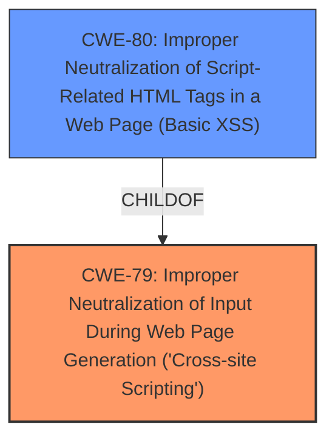

# Analysis Report for CVE-2024-47918

# Vulnerability Analysis Report: CVE-2024-47918

## Description

Tiki Wiki CMS CWE-80 **Improper Neutralization of Script-Related HTML Tags** in a Web Page (Basic **XSS**)

## Vulnerability Description Key Phrases

- **Rootcause:** Improper Neutralization of Script-Related HTML Tags
- **Weakness:** XSS
- **Product:** Tiki Wiki CMS

## Analysis (with Relationship Data)

# Summary
| CWE ID | CWE Name | Confidence | CWE Abstraction Level | CWE Vulnerability Mapping Label | CWE-Vulnerability Mapping Notes |
|---|---|---|---|---|---|
| CWE-79 | Improper Neutralization of Input During Web Page Generation ('Cross-site Scripting') | 1.0 | Base | Primary | Allowed |
| CWE-80 | Improper Neutralization of Script-Related HTML Tags in a Web Page (Basic XSS) | 0.7 | Variant | Secondary Candidate | Allowed |

## Evidence and Confidence

*   **Confidence Score:** 0.9
*   **Evidence Strength:** HIGH

## Relationship Analysis
The primary CWE is CWE-79, which represents the broad category of cross-site scripting vulnerabilities. CWE-80 is a more specific variant focusing on the improper neutralization of script-related HTML tags. Given the description explicitly mentions "Improper Neutralization of Script-Related HTML Tags," both CWE-79 and CWE-80 are relevant. CWE-79 is the general case of **Improper Neutralization of Input During Web Page Generation ('Cross-site Scripting')**, while CWE-80 is a specific type of **Improper Neutralization of Script-Related HTML Tags** that leads to XSS.



## Vulnerability Chain
The vulnerability chain starts with the **Improper Neutralization of Script-Related HTML Tags**, which leads to the **XSS** vulnerability.
- The Root Cause is the **Improper Neutralization of Script-Related HTML Tags**
- The weakness is the resulting **XSS** vulnerability.

## Summary of Analysis
The vulnerability description clearly states the **Improper Neutralization of Script-Related HTML Tags** leading to Cross-Site Scripting (XSS). The phrase "**Improper Neutralization of Script-Related HTML Tags**" from the vulnerability description key phrases provides strong evidence for CWE-79 and CWE-80.

CWE-79 is selected as the primary because it's the fundamental weakness, and CWE-80 is a more specific variant. The evidence directly supports these classifications. The relationship (CWE-80 ChildOf CWE-79) guided the decision to include both, with CWE-79 as primary.

The retriever results support these choices, with CWE-79 having the highest score. The abstraction levels are appropriate, with CWE-79 as a Base and CWE-80 as a Variant.

Other CWEs considered but not used:

*   CWE-82, CWE-83, CWE-84: These are related to XSS but focus on specific contexts like IMG tags or URI schemes. Since the description doesn't specify these contexts, they are not selected.
*   CWE-116: This relates to improper encoding/escaping of output, which is a broader category. The description is more specific about neutralization, so CWE-79 and CWE-80 are more appropriate.
*   CWE-184: This involves an incomplete list of disallowed inputs. While this might be a contributing factor, the primary issue is the **improper neutralization**, making CWE-79 and CWE-80 more relevant.

Relevant CWE Information:

# Enhanced Context (25 CWEs)
The following CWEs were identified as potentially relevant to this vulnerability:

## CWE-80: Improper Neutralization of Script-Related HTML Tags in a Web Page (Basic XSS)
**Abstraction Level**: Variant
**Similarity Score**: 0.81
**Source**: dense

**Description**:
The product receives input from an upstream component, but it does not neutralize or incorrectly neutralizes special characters such as "<", ">", and "&" that could be interpreted as web-scripting elements when they are sent to a downstream component that processes web pages.

**Mapping Guidance**:
- Usage: Allowed
- Rationale: This CWE entry is at the Variant level of abstraction, which is a preferred level of abstraction for mapping to the root causes of vulnerabilities.


## CWE-83: Improper Neutralization of Script in Attributes in a Web Page
**Abstraction Level**: Variant
**Similarity Score**: 0.73
**Source**: dense

**Description**:
The product does not neutralize or incorrectly neutralizes "javascript:" or other URIs from dangerous attributes within tags, such as onmouseover, onload, onerror, or style.

**Mapping Guidance**:
- Usage: Allowed
- Rationale: This CWE entry is at the Variant level of abstraction, which is a preferred level of abstraction for mapping to the root causes of vulnerabilities.


## CWE-84: Improper Neutralization of Encoded URI Schemes in a Web Page
**Abstraction Level**: Variant
**Similarity Score**: 0.72
**Source**: dense

**Description**:
The web application improperly neutralizes user-controlled input for executable script disguised with URI encodings.

**Mapping Guidance**:
- Usage: Allowed
- Rationale: This CWE entry is at the Variant level of abstraction, which is a preferred level of abstraction for mapping to the root causes of vulnerabilities.


## CWE-96: Improper Neutralization of Directives in Statically Saved Code ('Static Code Injection')
**Abstraction Level**: Base
**Similarity Score**: 0.72
**Source**: dense

**Description**:
The product receives input from an upstream component, but it does not neutralize or incorrectly neutralizes code syntax before inserting the input into an executable resource, such as a library, configuration file, or template.

**Mapping Guidance**:
- Usage: Allowed
- Rationale: This CWE entry is at the Base level of abstraction, which is a preferred level of abstraction for mapping to the root causes of vulnerabilities.


## CWE-82: Improper Neutralization of Script in Attributes of IMG Tags in a Web Page
**Abstraction Level**: Variant
**Similarity Score**: 0.72
**Source**: dense

**Description**:
The web application does not neutralize or incorrectly neutralizes scripting elements within attributes of HTML IMG tags, such as the src attribute.

**Mapping Guidance**:
- Usage: Allowed
- Rationale: This CWE entry is at the Variant level of abstraction, which is a preferred level of abstraction for mapping to the root causes of vulnerabilities.


## CWE-116: Improper Encoding or Escaping of Output
**Abstraction Level**: Class
**Similarity Score**: 0.71
**Source**: dense

**Description**:
The product prepares a structured message for communication with another component, but encoding or escaping of the data is either missing or done incorrectly. As a result, the intended structure of the message is not preserved.

**Mapping Guidance**:
- Usage: Allowed-with-Review
- Rationale: This CWE entry is a Class and might have Base-level children that would be more appropriate


## CWE-97: Improper Neutralization of Server-Side Includes (SSI) Within a Web Page
**Abstraction Level**: Variant
**Similarity Score**: 0.71
**Source**: dense

**Description**:
The product generates a web page, but does not neutralize or incorrectly neutralizes user-controllable input that could be interpreted as a server-side include (SSI) directive.

**Mapping Guidance**:
- Usage: Allowed
- Rationale: This CWE entry is at the Variant level of abstraction, which is a preferred level of abstraction for mapping to the root causes of vulnerabilities.


## CWE-472: External Control of Assumed-Immutable Web Parameter
**Abstraction Level**: Base
**Similarity Score**: 0.70
**Source**: dense

**Description**:
The web application does not sufficiently verify inputs that are assumed to be immutable but are actually externally controllable, such as hidden form fields.

**Mapping Guidance**:
- Usage: Allowed
- Rationale: This CWE entry is at the Base level of abstraction, which is a preferred level of abstraction for mapping to the root causes of vulnerabilities.


## CWE-184: Incomplete List of Disallowed Inputs
**Abstraction Level**: Base
**Similarity Score**: 0.70
**Source**: dense

**Description**:
The product implements a protection mechanism that relies on a list of inputs (or properties of inputs) that are not allowed by policy or otherwise require other action to neutralize before additional processing takes place, but the list is incomplete.

**Mapping Guidance**:
- Usage: Allowed
- Rationale: This CWE entry is at the Base level of abstraction, which is a preferred level of abstraction for mapping to the root causes of vulnerabilities.


## CWE-1289: Improper Validation of Unsafe Equivalence in Input
**Abstraction Level**: Base
**Similarity Score**: 0.70
**Source**: dense

**Description**:
The product receives an input value that is used as a resource identifier or other type of reference, but it does not validate or incorrectly validates that the input is equivalent to a potentially-unsafe value.

**Mapping Guidance**:
- Usage: Allowed
- Rationale: This CWE entry is at the Base


## CWE Relationship Analysis

Current CWEs represent these abstraction levels: .


### Vulnerability Chain Analysis

**Chain starting from CWE-97:**
- 97 (Improper Neutralization of Server-Side Includes (SSI) Within a Web Page) - ROOT


**Chain starting from CWE-116:**
- 116 (Improper Encoding or Escaping of Output) - ROOT


### CWE Relationship Diagram

```mermaid
graph TD
    classDef primary fill:#f96,stroke:#333,stroke-width:2px
    classDef secondary fill:#69f,stroke:#333
    classDef tertiary fill:#9e9,stroke:#333
```


*Report generated on 2025-07-13 18:36:31*
