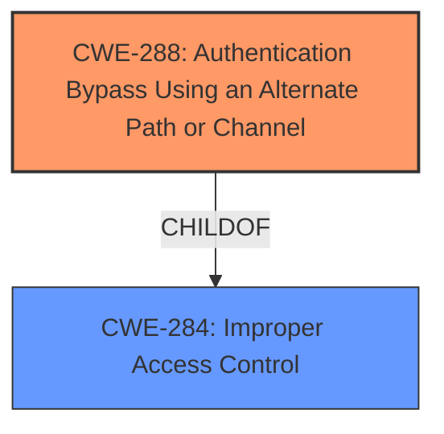

# Enhanced Analysis for CVE-2024-47976

# Summary
| CWE ID | CWE Name | Confidence | CWE Abstraction Level | CWE Vulnerability Mapping Label | CWE-Vulnerability Mapping Notes |
|---|---|---|---|---|---|
| CWE-288 | Authentication Bypass Using an Alternate Path or Channel | 0.8 | Base | Allowed | Primary CWE |
| CWE-284 | Improper Access Control | 0.6 | Pillar | Discouraged | Secondary Candidate |

## Evidence and Confidence

*   **Confidence Score:** 0.7
*   **Evidence Strength:** MEDIUM

## Relationship Analysis
The primary CWE is CWE-288, which is a base-level weakness. It falls under the broader category of CWE-284, Improper Access Control, a pillar-level weakness. The vulnerability involves physical access, which can be viewed as an alternate channel.



## Vulnerability Chain
The vulnerability chain starts with **improper access removal handling**, leading to an authentication bypass via physical access, and ultimately resulting in unauthorized access to the system.

## Summary of Analysis
The vulnerability description states "**Improper access removal handling** in firmware of some Solidigm DC Products may allow an attacker with physical access to gain unauthorized access." The key phrase here is "**Improper access removal handling**" combined with "attacker with physical access". This suggests that an attacker can bypass the intended access controls through a physical channel, potentially due to a failure to properly remove or invalidate access credentials/permissions.

The Retriever Results list CWE-288 (Authentication Bypass Using an Alternate Path or Channel) as a strong candidate. This CWE aligns well with the description, as physical access constitutes an alternate channel that bypasses normal authentication procedures. CWE-284 (Improper Access Control) is a higher-level class that is too broad, and its use is discouraged when a more specific CWE is available.

CWE-288 is preferred because it directly addresses the scenario where an alternate path (physical access) is used to bypass authentication. The description explicitly mentions "physical access," making CWE-288 a more precise fit than the more general CWE-284. My assessment is primarily based on the vulnerability description and supported by the retriever results.

Relevant CWE Information:
*   CWE-288: Authentication Bypass Using an Alternate Path or Channel:
    *   This CWE describes a scenario where authentication is bypassed by using an alternate path or channel. The vulnerability description states that an attacker with physical access can gain unauthorized access, which aligns with this CWE.
*   CWE-284: Improper Access Control:
    *   This CWE is a more general category that encompasses various access control issues. While the vulnerability does involve unauthorized access, CWE-288 is more specific and accurately reflects the root cause.

CWEs considered but not used:
*   CWE-693: Protection Mechanism Failure - too generic.
*   CWE-287: Improper Authentication - does not fit as the bypass uses an alternate channel.
*   CWE-269: Improper Privilege Management - doesn't specifically address the bypass mechanism.
*   CWE-119: Improper Restriction of Operations within the Bounds of a Memory Buffer - not relevant to access control issues.
*   CWE-1191: On-Chip Debug and Test Interface With Improper Access Control - This is a more specific case that might be related, but the description doesn't provide enough information to confirm this.
*   CWE-1299: Missing Protection Mechanism for Alternate Hardware Interface - similar to above, not enough information.


## CWE Relationship Analysis

Current CWEs represent these abstraction levels: .


### Vulnerability Chain Analysis

**Chain starting from CWE-288:**
- 288 (Authentication Bypass Using an Alternate Path or Channel) - ROOT


**Chain starting from CWE-1299:**
- 1299 (Missing Protection Mechanism for Alternate Hardware Interface) - ROOT


### CWE Relationship Diagram

```mermaid
graph TD
    classDef primary fill:#f96,stroke:#333,stroke-width:2px
    classDef secondary fill:#69f,stroke:#333
    classDef tertiary fill:#9e9,stroke:#333
```