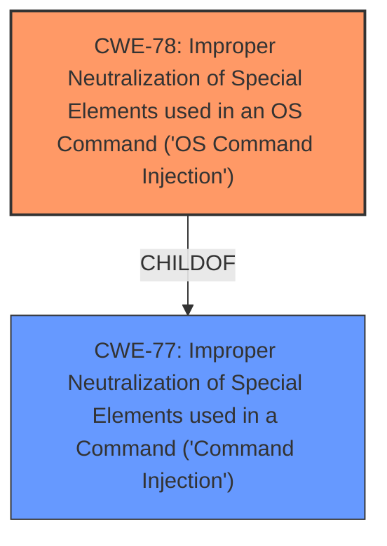

# Raw Analyzer Response for CVE-2024-48017

# Summary
| CWE ID | CWE Name | Confidence | CWE Abstraction Level | CWE Vulnerability Mapping Label | CWE-Vulnerability Mapping Notes |
|---|---|---|---|---|---|
| CWE-78 | Improper Neutralization of Special Elements used in an OS Command ('OS Command Injection') | 1.0 | Base | Allowed | Primary CWE |
| CWE-77 | Improper Neutralization of Special Elements used in a Command ('Command Injection') | 0.7 | Class | Allowed-with-Review | Secondary Candidate |

## Evidence and Confidence

*   **Confidence Score:** 0.9
*   **Evidence Strength:** HIGH

## Relationship Analysis
The primary relationship is that CWE-78 **Improper Neutralization of Special Elements used in an OS Command ('OS Command Injection')** is a more specific child of CWE-77 **Improper Neutralization of Special Elements used in a Command ('Command Injection')**. Since the vulnerability specifically mentions OS commands, the more specific CWE-78 is chosen.

## Vulnerability Chain
The chain of events is as follows:
1.  **Root Cause:** **Improper Neutralization of Special Elements used in a Command** (specifically for OS commands) - CWE-78
2.  **Impact:** Code execution

## Summary of Analysis
The vulnerability description explicitly mentions **Improper Neutralization of Special Elements used in a Command (Command Injection)**, which is the root cause of the vulnerability. The CVE Reference Links Content Summary also states: "Root cause of vulnerability: Improper Neutralization of Special Elements used in a Command ('Command Injection')". The term "OS command" appears in the CWE-78 description, which is more specific than the general command injection (CWE-77). Therefore, CWE-78 is the primary CWE. The retriever results also list CWE-78 as a candidate. While CWE-77 is also a good match, CWE-78 is a more specific instance of command injection, focusing on OS commands.

Relevant CWE Information:

# Enhanced Context (25 CWEs)
The following CWEs were identified as potentially relevant to this vulnerability:

## CWE-74: Improper Neutralization of Special Elements in Output Used by a Downstream Component ('Injection')
**Abstraction Level**: Class
**Similarity Score**: 0.78
**Source**: dense

**Description**:
The product constructs all or part of a command, data structure, or record using externally-influenced input from an upstream component, but it does not neutralize or incorrectly neutralizes special elements that could modify how it is parsed or interpreted when it is sent to a downstream component.

**Mapping Guidance**:
- Usage: Discouraged
- Rationale: CWE-74 is high-level and often misused when lower-level weaknesses are more appropriate.

## CWE-78: Improper Neutralization of Special Elements used in an OS Command ('OS Command Injection')
**Abstraction Level**: Base
**Similarity Score**: 839.76
**Source**: sparse

**Description**:
The product constructs all or part of an OS command using externally-influenced input from an upstream component, but it does not neutralize or incorrectly neutralizes special elements that could modify the intended OS command when it is sent to a downstream component.

**Mapping Guidance**:
- Usage: Allowed
- Rationale: This CWE entry is at the Base level of abstraction, which is a preferred level of abstraction for mapping to the root causes of vulnerabilities.

## CWE-77: Improper Neutralization of Special Elements used in a Command ('Command Injection')
**Abstraction Level**: Class
**Similarity Score**: 1.00
**Source**: alternate_terms

**Description**:
The product constructs all or part of a command using externally-influenced input from an upstream component, but it does not neutralize or incorrectly neutralizes special elements that could modify the intended command when it is sent to a downstream component.

**Mapping Guidance**:
- Usage: Allowed-with-Review
- Rationale: This is a Class-level CWE that should be mapped to when a more specific Base-level CWE is not available. When mapping to this CWE, be sure to record the specific type of command being constructed.

## CWE-78: Improper Neutralization of Special Elements used in an OS Command ('OS Command Injection')
**Abstraction Level**: Base
**Similarity Score**: 0.70
**Source**: alternate_terms

**Description**:
The product constructs all or part of an OS command using externally-influenced input from an upstream component, but it does not neutralize or incorrectly neutralizes special elements that could modify the intended OS command when it is sent to a downstream component.

**Mapping Guidance**:
- Usage: Allowed
- Rationale: This CWE entry is at the Base level of abstraction, which is a preferred level of abstraction for mapping to the root causes of vulnerabilities.

## CWE-74: Improper Neutralization of Special Elements in Output Used by a Downstream Component ('Injection')
**Abstraction Level**: Class
**Similarity Score**: 0.36
**Source**: sparse

**Description**:
The product constructs all or part of a command, data structure, or record using externally-influenced input from an upstream component, but it does not neutralize or incorrectly neutralizes special elements that could modify how it is parsed or interpreted when it is sent to a downstream component.

**Mapping Guidance**:
- Usage: Discouraged
- Rationale: CWE-74 is high-level and often misused when lower-level weaknesses are more appropriate.

CWE-74 **Improper Neutralization of Special Elements in Output Used by a Downstream Component ('Injection')** and CWE-20 **Improper Input Validation** are too general and discouraged. CWE-89 **Improper Neutralization of Special Elements used in an SQL Command ('SQL Injection')**, CWE-1236 **Improper Neutralization of Formula Elements in a CSV File**, and CWE-1336 **Improper Neutralization of Special Elements Used in a Template Engine** are all too specific as the vulnerability doesn't involve SQL commands, CSV files, or Template Engines, respectively.
CWE-120 **Buffer Copy without Checking Size of Input ('Classic Buffer Overflow')** is not relevant as the issue is command injection, not a buffer overflow.
CWE-269 **Improper Privilege Management** doesn't seem to be present in the description.