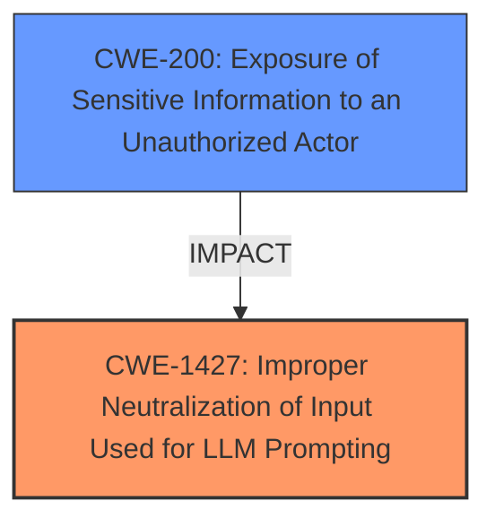

# Enhanced Analysis for CVE-2024-48140

# Summary
| CWE ID | CWE Name | Confidence | CWE Abstraction Level | CWE Vulnerability Mapping Label | CWE-Vulnerability Mapping Notes |
|---|---|---|---|---|---|
| CWE-1427 | Improper Neutralization of Input Used for LLM Prompting | 1.0 | Base | Allowed | Primary CWE - This is the **root cause** because the LLM prompt is not properly neutralized. |
| CWE-200 | Exposure of Sensitive Information to an Unauthorized Actor | 0.7 | Class | Discouraged | Secondary Candidate - This is an impact of the **prompt injection** where sensitive information is exposed. |

## Evidence and Confidence

*   **Confidence Score:** 1.0
*   **Evidence Strength:** HIGH

## Relationship Analysis
The primary relationship that influenced the decision was that CWE-1427 is a Base level CWE, which is preferred. CWE-200 is a Class level CWE and represents the impact of the primary weakness.



## Vulnerability Chain
The vulnerability chain starts with the **improper neutralization of input used for LLM prompting** (CWE-1427). This leads to the **exposure of sensitive information to an unauthorized actor** (CWE-200) as the attacker can access and exfiltrate chat data.

## Summary of Analysis
The initial analysis identified CWE-1427 as the primary weakness due to the **prompt injection** vulnerability. The vulnerability description clearly states a **prompt injection** vulnerability, which aligns directly with CWE-1427's description of **improper neutralization of input used for LLM prompting**. The impact, which is the access and exfiltration of chat data, is represented by CWE-200, **exposure of sensitive information to an unauthorized actor**.

The evidence for CWE-1427 is derived from the "Vulnerability Description Key Phrases" section, which explicitly mentions "**rootcause: prompt injection**". This aligns with the definition of CWE-1427.

CWE-200 is a secondary consideration as it represents the impact.

The final selection is based on the evidence provided and the relationships between the CWEs, specifically the root cause and impact relationship. The selected CWEs are at the optimal level of specificity, with CWE-1427 being a Base level CWE and CWE-200 representing the resulting impact.

Relevant CWE Information:

# Enhanced Context (25 CWEs)
The following CWEs were identified as potentially relevant to this vulnerability:

## CWE-1427: Improper Neutralization of Input Used for LLM Prompting
**Abstraction Level**: Base
**Similarity Score**: 0.72
**Source**: dense

**Description**:
The product uses externally-provided data to build prompts provided to
large language models (LLMs), but the way these prompts are constructed
causes the LLM to fail to distinguish between user-supplied inputs and
developer provided system directives.

**Mapping Guidance**:
- Usage: Allowed
- Rationale: This CWE entry is at the Base level of abstraction, which is a preferred level of abstraction for mapping to the root causes of vulnerabilities.

## CWE-200: Exposure of Sensitive Information to an Unauthorized Actor
**Abstraction Level**: Class
**Similarity Score**: 0.199
**Source**: sparse

**Description**:
The software exposes sensitive information to an actor that is not explicitly authorized to have that information.

**Mapping Guidance**:
- Usage: Discouraged
- Rationale: Information exposure is a consequence, not a root cause.


## CWE Relationship Analysis

Current CWEs represent these abstraction levels: .


### Vulnerability Chain Analysis

**Chain starting from CWE-200:**
- 200 (Exposure of Sensitive Information to an Unauthorized Actor) - ROOT


**Chain starting from CWE-1427:**
- 1427 (Improper Neutralization of Input Used for LLM Prompting) - ROOT


### CWE Relationship Diagram

```mermaid
graph TD
    classDef primary fill:#f96,stroke:#333,stroke-width:2px
    classDef secondary fill:#69f,stroke:#333
    classDef tertiary fill:#9e9,stroke:#333
```