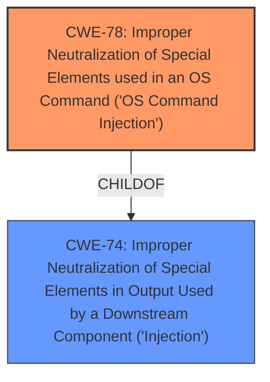

# Analysis for CVE-2024-48153

# Summary
| CWE ID | CWE Name | Confidence | CWE Abstraction Level | CWE Vulnerability Mapping Label | CWE-Vulnerability Mapping Notes |
|---|---|---|---|---|---|
| CWE-78 | Improper Neutralization of Special Elements used in an OS Command ('OS Command Injection') | 0.9 | Base | Primary | Allowed |

## Evidence and Confidence

*   **Confidence Score:** 0.9
*   **Evidence Strength:** MEDIUM

## Relationship Analysis
The primary relationship considered was the ChildOf relationship, particularly within the context of Command Injection. CWE-78 is a specific type of injection related to OS commands, making it a better fit than its parent class CWE-74. The Retriever Results also support this selection. The chain relationship wasn't explicitly defined in the description, but the nature of command injection suggests a progression from initial **improper neutralization** to arbitrary command execution. Abstraction levels were considered to pinpoint the most specific and relevant CWE.

## Vulnerability Chain
The vulnerability chain starts with the **improper neutralization** of special elements within the input, leading to OS Command Injection, and ultimately resulting in the ability to execute arbitrary commands.

## Summary of Analysis
The initial analysis focused on identifying the root cause of the vulnerability. The description clearly states that attackers can "inject malicious commands into mainfunction.cgi and execute arbitrary commands." The key phrase is "inject malicious commands," which strongly suggests an injection vulnerability.

The Retriever Results highlighted CWE-78 as the top candidate, with a description that aligns well with the vulnerability: "The product constructs all or part of an OS command using externally-influenced input from an upstream component, but it does not neutralize or incorrectly neutralizes special elements that could modify the intended OS command." This is a direct match to the vulnerability description, where attackers inject commands.

The relationship graph further solidified the choice of CWE-78 due to its specificity as a Base level CWE and its direct relevance to OS commands.

The decision is based on the evidence provided in the vulnerability description and supported by the Retriever Results and relationship analysis. CWE-78 is at the optimal level of specificity because it directly addresses the **improper neutralization** leading to OS command execution, rather than a more general injection weakness.

Relevant CWE Information:

# Enhanced Context (25 CWEs)
The following CWEs were identified as potentially relevant to this vulnerability:

## CWE-78: Improper Neutralization of Special Elements used in an OS Command ('OS Command Injection')
**Abstraction Level**: Base
**Similarity Score**: 0.72
**Source**: dense

**Description**:
The product constructs all or part of an OS command using externally-influenced input from an upstream component, but it does not neutralize or incorrectly neutralizes special elements that could modify the intended OS command when it is sent to a downstream component.

**Mapping Guidance**:
- Usage: Allowed
- Rationale: This CWE entry is at the Base level of abstraction, which is a preferred level of abstraction for mapping to the root causes of vulnerabilities.