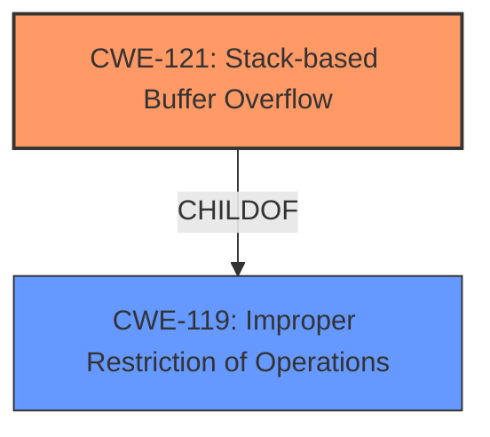

# Analysis for CVE-2024-48168

# Summary
| CWE ID | CWE Name | Confidence | CWE Abstraction Level | CWE Vulnerability Mapping Label | CWE-Vulnerability Mapping Notes |
|---|---|---|---|---|---|
| CWE-121 | Stack-based Buffer Overflow | 1.0 | Variant | Allowed | Primary CWE |
| CWE-119 | Improper Restriction of Operations within the Bounds of a Memory Buffer | 0.5 | Class | Discouraged | Secondary Candidate |

## Evidence and Confidence

*   **Confidence Score:** 0.9
*   **Evidence Strength:** HIGH

## Relationship Analysis
The primary relationship impacting the decision is the hierarchical parent-child relationship between CWE-119 and CWE-121. CWE-121 is a specific variant of CWE-119. Because the vulnerability description explicitly mentions a **stack overflow**, using the more specific CWE-121 is more appropriate than using its parent, CWE-119.

## Vulnerability Chain
The vulnerability chain starts with a **stack overflow** in the `sub_402280` function, which leads to the ability to execute arbitrary code.

## Summary of Analysis
The vulnerability description clearly states a **stack overflow** vulnerability exists in the `sub_402280` function of the HNAP service, allowing an attacker to execute arbitrary code.

The primary CWE selected is CWE-121 (Stack-based Buffer Overflow), which is a Variant-level CWE. The retriever results list CWE-121 as the top candidate. This CWE accurately reflects the described vulnerability, where a buffer on the stack is overwritten, leading to the execution of arbitrary code. The evidence is strong, as the vulnerability description explicitly mentions a **stack overflow**.

CWE-119 (Improper Restriction of Operations within the Bounds of a Memory Buffer) was considered because it is a parent of CWE-121. However, since the description specifies "stack overflow," CWE-121 is a more precise and appropriate choice. The usage for CWE-119 is discouraged as a lower level CWE is available.

Relevant CWE Information:

# Enhanced Context (25 CWEs)
The following CWEs were identified as potentially relevant to this vulnerability:

## CWE-121: Stack-based Buffer Overflow
**Abstraction Level**: Variant
**Similarity Score**: 0.72
**Source**: dense

**Description**:
A stack-based buffer overflow condition is a condition where the buffer being overwritten is allocated on the stack (i.e., is a local variable or, rarely, a parameter to a function).

**Mapping Guidance**:
- Usage: Allowed
- Rationale: This CWE entry is at the Variant level of abstraction, which is a preferred level of abstraction for mapping to the root causes of vulnerabilities.

## CWE-119: Improper Restriction of Operations within the Bounds of a Memory Buffer
**Abstraction Level**: Class
**Similarity Score**: 0.68
**Source**: dense

**Description**:
The product performs operations on a memory buffer, but it reads from or writes to a memory location outside the buffer's intended boundary. This may result in read or write operations on unexpected memory locations that could be linked to other variables, data structures, or internal program data.

**Mapping Guidance**:
- Usage: Discouraged
- Rationale: CWE-119 is commonly misused in low-information vulnerability reports when lower-level CWEs could be used instead, or when more details about the vulnerability are available.