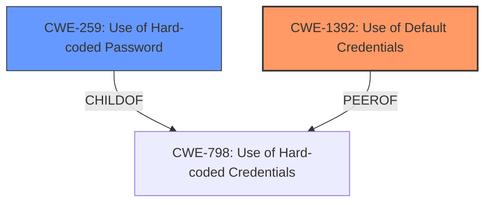

# Analysis for CVE-2024-48271

# Summary
| CWE ID  | CWE Name                                                  | Confidence | CWE Abstraction Level | CWE Vulnerability Mapping Label | CWE-Vulnerability Mapping Notes |
| :-------- | :-------------------------------------------------------- | :--------- | :-------------------- | :------------------------------ | :------------------------------ |
| CWE-1392 | Use of Default Credentials                                | 0.9        | Base                  | Primary                         | Allowed                       |
| CWE-259 | Use of Hard-coded Password                                | 0.7        | Variant                  | Secondary                       | Allowed                       |

## Evidence and Confidence

*   **Confidence Score:** 0.8
*   **Evidence Strength:** HIGH

## Relationship Analysis
The primary CWE is CWE-1392 Use of Default Credentials, which directly addresses the use of **insecure default credentials**. CWE-259 Use of Hard-coded Password is a related variant of CWE-798 Use of Hard-coded Credentials. The vulnerability involves default credentials which are more specific than just weak credentials.

## Vulnerability Chain
The **root cause** is the use of **insecure default credentials** (CWE-1392). This leads to bypassing authentication, escalating privileges, and potential unauthorized access.
- **Root Cause:** CWE-1392 (Use of Default Credentials)
- **Impact:** Bypass Authentication and Escalate Privileges

## Summary of Analysis
The vulnerability description clearly states the use of **insecure default credentials**, making CWE-1392 the most appropriate primary CWE. The CVE Reference Links Content Summary provides additional details that support this classification.
I am confident in this assessment due to the explicit mention of default credentials and the supporting details in the CVE reference. The selection of CWE-1392 is at the optimal level of specificity as it directly addresses the **root cause** of the vulnerability.

Relevant CWE Information:

# Enhanced Context (25 CWEs)
The following CWEs were identified as potentially relevant to this vulnerability:

## CWE-1391: Use of Weak Credentials
**Abstraction Level**: Class
**Similarity Score**: 0.75
**Source**: dense

**Description**:
The product uses weak credentials (such as a default key or hard-coded password) that can be calculated, derived, reused, or guessed by an attacker.

**Mapping Guidance**:
- Usage: Allowed-with-Review
- Rationale: This CWE entry is a Class and might have Base-level children that would be more appropriate

## CWE-1392: Use of Default Credentials
**Abstraction Level**: Base
**Similarity Score**: 0.74
**Source**: dense

**Description**:
The product uses default credentials (e.g., a common username/password combination) that are the same for all installations, versions, or deployments.

**Mapping Guidance**:
- Usage: Allowed
- Rationale: This CWE entry is at the Base level of abstraction, which is a preferred level of abstraction for mapping to the root causes of vulnerabilities.

## CWE-259: Use of Hard-coded Password
**Abstraction Level**: variant
**Similarity Score**: 3.38
**Source**: graph

**Description**:
CWE-259: Use of Hard-coded Password

**Mapping Guidance**:
- Usage: Allowed
- Rationale: This CWE entry is at the Variant level of abstraction, which is a preferred level of abstraction for mapping to the root causes of vulnerabilities.

**Relationships**:
- CANFOLLOW -> CWE-656
- PEEROF -> CWE-257
- PEEROF -> CWE-321
- CHILDOF -> CWE-798
- CHILDOF -> CWE-798

## CWE-798: Use of Hard-coded Credentials
**Abstraction Level**: Base
**Similarity Score**: 0.73
**Source**: dense

**Description**:
The product contains hard-coded credentials, such as a password or cryptographic key.

**Mapping Guidance**:
- Usage: Allowed
- Rationale: This CWE entry is at the Base level of abstraction, which is a preferred level of abstraction for mapping to the root causes of vulnerabilities.

### CWE Considerations:

*   **CWE-1391 Use of Weak Credentials:** While the vulnerability involves weak credentials, the credentials are **default** credentials. Therefore, CWE-1392 is a more precise fit.
*   **CWE-259 Use of Hard-coded Password:** The passwords are not necessarily hard-coded in the traditional sense. They are generated based on a predictable algorithm. This could be considered a hardcoded algorithm, but the password is not literally hardcoded as a string.
*   **CWE-798 Use of Hard-coded Credentials:** This is a more general case that would include both **default credentials** and hardcoded passwords. Because the vulnerability is specifically with **default credentials**, CWE-1392 is the best choice.

The final conclusion is to use CWE-1392 as the primary CWE, as it directly addresses the **root cause** of the vulnerability, which is the use of **insecure default credentials**. CWE-259 is included as a secondary issue as the credentials are not simply hardcoded, but generated based on a predictable algorithm.