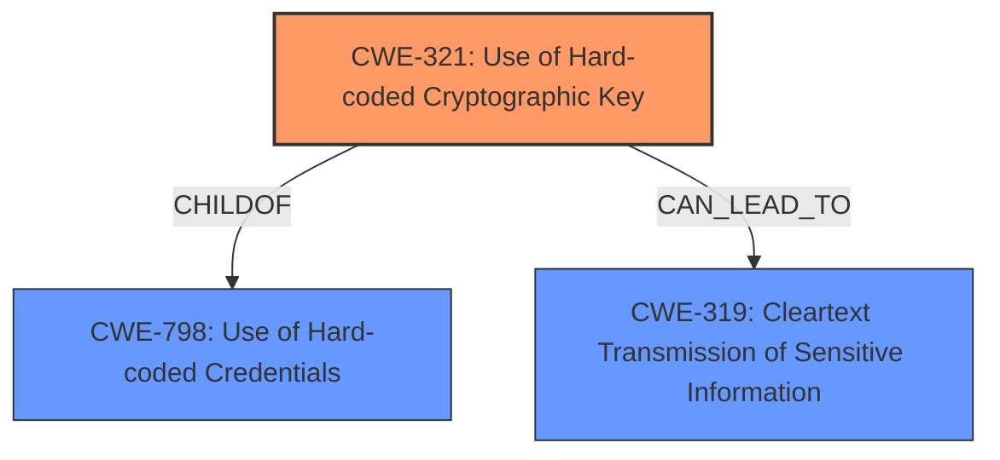

# Enhanced Analysis for CVE-2024-48539

# Summary

| CWE ID | CWE Name | Confidence | CWE Abstraction Level | CWE Vulnerability Mapping Label | CWE-Vulnerability Mapping Notes |
|---|---|---|---|---|---|
| CWE-321 | Use of Hard-coded Cryptographic Key | 1.0 | Variant | Allowed | Primary CWE.  Directly reflects the **hardcoded encryption key** vulnerability. |
| CWE-319 | Cleartext Transmission of Sensitive Information | 0.7 | Base | Allowed |  Secondary candidate due to the potential for sensitive data to be transmitted without adequate protection because the encryption is weak due to the **hardcoded encryption key**. |
| CWE-798 | Use of Hard-coded Credentials | 0.6 | Base | Allowed | Secondary candidate because an encryption key is a type of credential. |

## Evidence and Confidence

*   **Confidence Score:** 0.9
*   **Evidence Strength:** HIGH

## Relationship Analysis
The primary CWE is CWE-321, which is a Variant of CWE-798 (Use of Hard-coded Credentials). CWE-319 (Cleartext Transmission of Sensitive Information) is considered as a potential impact, as the **hardcoded encryption key** makes the encryption weak and therefore the data is effectively transmitted in cleartext. The relationship analysis indicates that a specific variant (CWE-321) is more appropriate than its base (CWE-798).



## Vulnerability Chain
The vulnerability chain starts with the **hardcoded encryption key** (CWE-321), which leads to the possibility of decrypting sensitive information and manipulating parameters. This can lead to unauthorized firmware access and potentially malicious firmware injection. The weak encryption can also be viewed as leading to cleartext transmission of data (CWE-319).

## Summary of Analysis
The primary weakness is the use of a **hardcoded encryption key** (CWE-321). This is supported by the vulnerability description, which states that "Neye3C v4.5.2.0 was discovered to contain a **hardcoded encryption key** in the firmware update mechanism." The CVE Reference Links Content Summary confirms this, stating that "The vulnerability stems from the use of a **hard-coded encryption key** ("Goolink2014")". This evidence is strong and directly supports the selection of CWE-321.

The retriever results also support this, with CWE-321 being the top-ranked CWE. The MITRE mapping guidance for CWE-321 allows for its usage, as it is at the Variant level of abstraction.

CWE-319 is a potential secondary weakness, as the **hardcoded encryption key** makes the encryption easily breakable, effectively leading to the transmission of sensitive information in cleartext.

CWE-798 was considered because a cryptographic key is a credential. However, CWE-321 is a more specific variant and therefore a better fit.

Other CWEs considered but not used:

*   CWE-259: Use of Hard-coded Password - While related, the vulnerability description specifically mentions an encryption key, making CWE-321 a more precise match.
*   CWE-327: Use of a Broken or Risky Cryptographic Algorithm - While the **hardcoded encryption key** weakens the encryption, the description doesn't explicitly state that the algorithm itself is broken or risky. Thus, CWE-321 is more accurate.
*   CWE-1391: Use of Weak Credentials - This is a broader class. CWE-321 is a more specific variant.
*   CWE-311: Missing Encryption of Sensitive Data - The data is encrypted, but with a **hardcoded encryption key**. So this is not missing encryption but weak encryption due to the hardcoded key.
*   CWE-330: Use of Insufficiently Random Values - Not applicable as the issue is with the **hardcoded encryption key**, not the randomness of values.


## CWE Relationship Analysis

Current CWEs represent these abstraction levels: .


### Vulnerability Chain Analysis

**Chain starting from CWE-321:**
- 321 (Use of Hard-coded Cryptographic Key) - ROOT


**Chain starting from CWE-327:**
- 327 (Use of a Broken or Risky Cryptographic Algorithm) - ROOT


### CWE Relationship Diagram

```mermaid
graph TD
    classDef primary fill:#f96,stroke:#333,stroke-width:2px
    classDef secondary fill:#69f,stroke:#333
    classDef tertiary fill:#9e9,stroke:#333
```