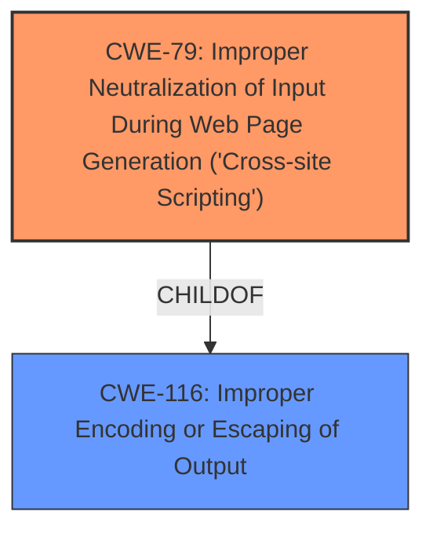

# Raw Analyzer Response for CVE-2024-4869

# Summary
| CWE ID | CWE Name | Confidence | CWE Abstraction Level | CWE Vulnerability Mapping Label | CWE-Vulnerability Mapping Notes |
|---|---|---|---|---|---|
| CWE-79 | Improper Neutralization of Input During Web Page Generation ('Cross-site Scripting') | 1.0 | Base | Allowed | Primary CWE - Addresses the root cause of the vulnerability. |
| CWE-116 | Improper Encoding or Escaping of Output | 0.7 | Class | Allowed-with-Review | Secondary CWE - Could be related, but CWE-79 is more specific. |

## Evidence and Confidence

*   **Confidence Score:** 1.0
*   **Evidence Strength:** HIGH

## Relationship Analysis
The primary relationship that influenced the decision was the parent-child relationship between CWE-116 and CWE-79. CWE-79 is a more specific case of **improper neutralization** that leads to Cross-Site Scripting, making it a better fit than the more general CWE-116. While CWE-116 describes a broader class of **improper encoding or escaping**, CWE-79 directly addresses the vulnerability of **improper neutralization** in the context of web page generation, which aligns precisely with the vulnerability description.

## Vulnerability Chain
The vulnerability chain starts with the **insufficient input sanitization and output escaping** of the Client-IP header. This leads to the storage of malicious script in the database, and finally to the execution of that script in the user's browser, resulting in Cross-Site Scripting.

1.  **Root Cause:** **Insufficient input sanitization and output escaping** of the Client-IP header.
2.  **Weakness:** CWE-79: Improper Neutralization of Input During Web Page Generation ('Cross-site Scripting')
3.  **Impact:** Execution of arbitrary web scripts in the user's browser.

## Summary of Analysis
The analysis is based on the vulnerability description, which clearly states that the WP Cookie Consent plugin is vulnerable to Stored Cross-Site Scripting due to **insufficient input sanitization and output escaping**. The "CVE Reference Links Content Summary" confirms this by stating: "The root cause is **insufficient input sanitization and output escaping** within the plugin's code. Specifically, the plugin fails to properly sanitize the value of the `Client-IP` header before storing it in the database, and it does not escape the output when displaying the stored value." This aligns directly with CWE-79, which describes the **improper neutralization** of user-controllable input before it is placed in output that is used as a web page. The retriever results also list CWE-79 as a relevant CWE.

CWE-116 was considered because it relates to **improper encoding or escaping**, which is part of the root cause. However, CWE-79 is more specific and directly addresses the XSS vulnerability, making it a better fit.

The selected CWEs are at the optimal level of specificity. CWE-79 is a Base level CWE, which is preferred for mapping to the root causes of vulnerabilities.